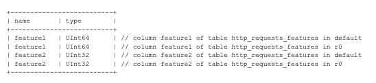
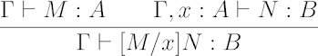
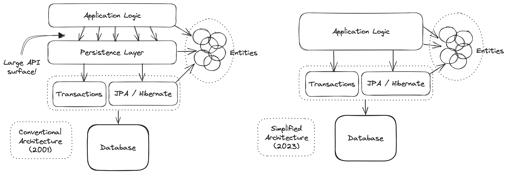
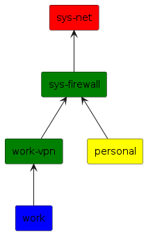
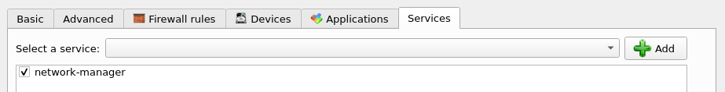

#+TITLE: eduardo's website title
#+bibliography: ./refs.bib
#+options: broken-links:mark toc:nil
#+HUGO_BASE_DIR: ../
#+HUGO_PAIRED_SHORTCODES: alert image
#+AUTHOR: Eduardo Bellani

* Pages
:PROPERTIES:
:EXPORT_HUGO_SECTION: /
:END:

** Home
:PROPERTIES:
:EXPORT_TITLE: Agere sequitur esse
:EXPORT_FILE_NAME: _index
:EXPORT_HUGO_TYPE: homepage
:END:

# metadata for [[https://www.freecodecamp.org/news/what-is-open-graph-and-how-can-i-use-it-for-my-website/][open graph]] metadata
#+begin_description
eduardo's blog description
#+end_description

I'm Eduardo Bellani. This space is where I explore the intersections of
computer science, programming, classical philosophy (especially from a
moderate realist perspective), and leadership.

Over the past 15+ years, I've worked across the tech landscape --- as a
developer, engineering manager, director, and founder --- primarily in
research-driven environments and with a strong emphasis on functional
programming and relational theory. Much of my writing reflects a
critical stance toward mainstream industry practices, often questioning
received wisdom in both technology and management.

*Disclaimer*: The views expressed here are solely my own and do not
reflect those of any past or present employer.

* Blog                                                                :@blog:
:PROPERTIES:
:EXPORT_HUGO_SECTION: blog
:END:

** All you need is PostgreSQL  
:PROPERTIES:
:EXPORT_HUGO_CUSTOM_FRONT_MATTER: :slug all-you-need-is-postgresql
:EXPORT_FILE_NAME: all-you-need-is-postgresql
:CUSTOM_ID: all-you-need-is-postgresql
:EXPORT_DATE: 2026-06-25
:END:

#+toc: headlines 2 local

*** Introduction

There is a deep cultural reflex in modern engineering: whenever a
problem appears, reach for a packaged solution instead of thinking from
first principles. The result is architectural cargo culting and lots of
missed opportunities. Some intentionally absurd-but-familiar examples:

#+begin_quote
We need an audit trail, let's use {temporal/event sourcing DBMS}

Our application is slow, let's cache that using {in-memory key-value database}
#+end_quote

And since a relational database like PostgreSQL is still considered
mandatory,thanks mostly to its unmatched reputation, companies end up
stacking product on top of product on top of PostgreSQL. They inflate the
number of moving parts, operational risk, headcount demand, and overall
system entropy. Complexity[fn:1] grows, not because the problems demand it,
but because someone reached for a tool they saw in a conference talk.

In this post, I'll walk through a set of common misconceptions that
drive teams to introduce new infrastructure when they don't need to. All
of these can be solved with vanilla PostgreSQL 18 using standard
extensions available on RDS, with no special infrastructure and no
distributed-systems cosplay.

The goal in this article is not to argue that specialized systems are
never appropriate, but to show that the default assumption for your data
problems should be that *my company can do fine with just PostgreSQL*.

*** The setup

Here is a list of arguments that people put forth to reach for other
tools besides PostgreSQL, based on my experience:

- I'll need auditing and reconstructing state
- Write throughput is too low
- The transactional queries are too slow
- The analytical queries are too slow
- My app will be coupled to the Database

To address these, I'm going to use a variation of the /Drosophila
melanogaster/ of the database field: [[https://en.wikipedia.org/wiki/Suppliers_and_Parts_database][the classic Supplier and Parts]]
database[cite:@10.5555/861613]. I'll update it to be more in line with
the usual problematic tables: Financial Transaction and their
originating transfers.

For the rest of this article we will be constructing a database design
based on modern PostgreSQL that will achieve the general goals listed
above and specific business requirements. Here is a requirements snippet
from a very popular banking API company:

#+begin_quote
Transactions: are immutable records of financial interactions with
Increase. You can think of them as the line items on your bank
statement. A Transaction with a positive amount means there's more money
in your account. A Transaction with a negative amount means there's less
money in your account. You can't directly create a Transaction, and they
never change after they are made. Anything that causes money to move
around your Increase account results in a Transaction - initiated or
received transfers, card payments, earned interest, and more.

Transfers: which includes ACH Transfers, Wire Transfers, etc - are the
most common way to initiate money movement over external networks with
Increase. Transfers are one-to-many with Transactions, which they create
as side-effects. Unlike Transactions, Transfers are stateful and
transition through a lifecycle of different statuses as they move across
the network.

Pending Transactions: represent potential future credits or debits of
money into your account and are a separate resource from Transactions
(despite their similar name). Notably, while Transactions are immutable,
Pending Transactions are not, as they don't guarantee the movement of
money. For example, Pending Transactions are created for card
authorizations (which can mutate or timeout) and also when placing a
hold on an account (which can be removed). Pending Transactions do not
affect your current balance (which is the balance you earn interest on),
but do affect your available balance (which is the amount you're able to
move out of Increase).  [cite:@increase_transactions_and_transfers]
#+end_quote

Below are 2 screenshots from increase's sandbox dashboard that showcase
the requirements:

#+caption: Increase account dashboard
#+attr_html: :width 150%
[[./increase.account_dashboard.png]]

#+caption: Increase details
#+attr_html: :width 150%
[[./increase.transfer_details.png]]

From these 2 images, here is a list of requirements (functional and not)
that I have extracted, which I consider to be common in financial
systems like increase:

<<full_list>>
1. <<act>>Accounts are defined by immutable routing numbers and account numbers
   and have a status that can vary.
2. <<acct_discrimination>> Accounts are discriminated between external
   and managed, and one account must be one or the other
   exclusively. Transfers are made only between external and managed
   accounts.
3. <<lst>>Transactions and transfers are listed, paginated by their
   respective creation times.
4. <<blc>>Current and available balance are shown, both their present and
   historical daily values
5. <<trf>>Transfers behave like a state machine where the progression
   between states are exposed to the user. The user can see the full
   state history of a transfer and some of these states are linked to
   pending/settled transactions.
6. <<txn>> The user can also see the details of a transaction, and see
   the transfer that generated it.
7. <<perf>> We should maximize write throughput of transactions and
   transfers. Transfers are editable, and so we should be able to update
   them fast too.

*** Laying the foundation

In this section we build the core tables[fn:2] and the role necessary to
restraint updates and achieve the immutability mentioned on the
requirements (requirement [[act]] for example).

**** The foundation: schemas and user roles for modularity

Modularity, defined by the capacity to have a many-to-many relation
between implementations and
interfaces[cite:@koppel23:_modul_matter_most_masses_acces], is crucial
for software development[cite:@yourdon1979structured]. Part of the base
tools we have for that on SQL are schemas and roles. In particular, a
proper role[fn:3] can be used for defining very precise interfaces on top of
database objects[cite:@swart19:_row_level_secur].

#+name: the_schema_and_roles
#+begin_src sql :tangle only_postgres_code.sql :comments link
  create schema finance;

  create role finance;
  grant usage on schema finance to finance;
  alter default privileges in schema finance
    grant select, insert, update, delete on tables to finance;

  alter default privileges in schema finance
    grant usage, select on sequences to finance;
#+end_src

**** Domains

Database domains are usually scoffed at by practitioners, but that is a
big mistake. Properly seen, they are

#+begin_quote
an application of the abstract data type to database management. [cite:@pascal2019domains]
#+end_quote

As such, domains are the core building blocks for logical design.

#+name: the_domains
#+begin_src sql :tangle only_postgres_code.sql :comments link
  create domain finance.routing_number as text
  check (value ~ '^[0-9]{9}$');

  create domain finance.account_number as text
    check (value ~ '^[0-9]{12}$');

  create domain finance.transfer_status as text
    check(value in ('pending',
    	          'returned',
    		  'completed'));
#+end_src

The ~transfer_status~ in particular is crucial, since it represents the
valid states that a state machine can have.

**** Accounts, managed and external

Managed Accounts are the accounts that are owned by the our system. When
receiving a transfer, we control only one side of the transfer, and that
is the managed account side.

Managed accounts can be deactivated and reactivated. This falls neatly
within the set of temporal features introduced in SQL
2011[cite:@10.1145/2380776.2380786], in particular application time,
recently introduced in PostgreSQL 18[cite:@postgresql_temporal_pk]. This
feature allows us to represent accounts going in and out of activity
without overlapping.[fn:4]

#+name: the_account
#+begin_src sql :tangle only_postgres_code.sql :comments link
  -- To use temporal constraints, you need to install the btree_gist extension, which provides the necessary operator classes for creating GiST indexes on scalar data types:
  create extension if not exists btree_gist;

  create table finance.managed_active_account(
    routing_number  finance.routing_number not null,
    account_number  finance.account_number not null,
    account_name    text not null,
    account_active_period tstzrange not null default tstzrange(now(), 'infinity', '[)'),
    primary key (routing_number,
                 account_number,
                 account_active_period without overlaps)
  );

  comment on table finance.managed_active_account is
    'Managed Accounts are what transactions are performed against. Think of your bank account. They store money, receive transfers, and send payments. They earn interest and have depository insurance. This relation holds the accounts that are active. No transfer may be created for accounts in the period that they were inactive.';

  create table finance.external_account(
    routing_number  finance.routing_number not null,
    account_number  finance.account_number not null,
    account_name    text not null,
    primary key (routing_number, account_number)
  );

  comment on table finance.external_account is
    'External accounts represent counterparty accounts at other institutions. They are the other side of a transfer. Unlike managed accounts, they have no temporal active period since we do not control their lifecycle.';
#+end_src

And below we finish the accounts by making sure a managed account and an
external account can't be the same. We need to use ~alter table~ instead
of adding these ~check~ constraints on the table definitions because of
the circular dependency (one table depends on the other, and vice
versa).

#+name: the_account_constraints
#+begin_src sql :tangle only_postgres_code.sql :comments link
  -- Ensure managed and external accounts never share the same identity
  create or replace function finance.not_external_account(
    p_routing_number finance.routing_number,
    p_account_number finance.account_number
  )
    returns boolean language sql stable as $$
    select not exists (
      select 1
        from finance.external_account
       where routing_number = p_routing_number
         and account_number = p_account_number
    );
  $$;

  create or replace function finance.not_managed_account(
    p_routing_number finance.routing_number,
    p_account_number finance.account_number
  )
    returns boolean language sql stable as $$
    select not exists (
      select 1
        from finance.managed_active_account
       where routing_number = p_routing_number
         and account_number = p_account_number
    );
  $$;

  alter table finance.managed_active_account
    add constraint managed_not_external
    check (finance.not_external_account(routing_number, account_number));

  alter table finance.external_account
    add constraint external_not_managed
  check (finance.not_managed_account(routing_number, account_number));
#+end_src

**** Transfers, constrained by  a state machine and temporal periods

Below are the transfers, which represents the movement of money between
managed accounts and external accounts. They can be seen as a state
machine progressing over the transfer_status domain ~pending ->
(completed | returned)~.

Another crucial point here is the ~period~ keyword in the references
section. This makes a transfer period be consistent with active managed
accounts, implementing a core financial safety requirement declaratively
in the most deepest level one can.

#+name: laying_foundation_table_transfer
#+begin_src sql :tangle only_postgres_code.sql :comments link
  create table finance.transfer (
    transfer_period             tstzrange not null default tstzrange(now(), 'infinity', '[)'),
    transfer_created_at         timestamptz
                                generated always as (lower(transfer_period)) stored,
    account_number              finance.account_number not null,
    routing_number              finance.routing_number not null,
    counterparty_account_number finance.account_number not null,
    counterparty_routing_number finance.routing_number not null,
    amount                      bigint not null,
    status                      finance.transfer_status not null default 'pending',
    -- Natural order: account identity, then time, then counterparty
    -- This enables efficient time-range queries on account transfers
    primary key (
      routing_number,
      account_number,
      transfer_created_at,
      counterparty_routing_number,
      counterparty_account_number
    ),  
    foreign key (
      counterparty_routing_number,
      counterparty_account_number
    ) references finance.external_account (
      routing_number,
      account_number    
    ),
    -- temporal foreign key: ensure managed account exists during transfer period
    foreign key (
      routing_number,
      account_number,
      period transfer_period
    ) references finance.managed_active_account (
      routing_number,
      account_number,
      period account_active_period
    )
  );

  comment on table finance.transfer is
    'Transfers represent money movement between an external account and a managed account. Status follows state machine: pending -> (completed | returned). Period closes on terminal state. transfer_created_at is a stored generated column derived from lower(transfer_period), eliminating redundancy while remaining usable in primary keys and foreign key references.';

  revoke insert on finance.transfer from finance;
  revoke update on finance.transfer from finance;
  -- transfer_period will be managed based on the status
  grant insert (routing_number,
                account_number,
                counterparty_routing_number,
                counterparty_account_number,
                amount) on finance.transfer to finance;
  grant update (status) on finance.transfer to finance;
#+end_src

Note that ~transfer_created_at~ is a stored generated column:
~lower(transfer_period)~ is an immutable function, and the lower bound
of ~transfer_period~ never changes (the state machine trigger only
closes the upper bound). This eliminates the redundancy between
~transfer_created_at~ and ~lower(transfer_period)~ while keeping the
column usable in primary keys and as a foreign key target.

**** Transfer state history
:PROPERTIES:
:CUSTOM_ID: transfer-state-history
:END:

In order to implement feature [[trf]], we need system-time temporal
tables[fn:5]. PostgreSQL supports several approaches for temporal tables.
For simplicity and portability (including RDS), we use the temporal_tables
extension [cite:@nearform_temporal_tables].

The extension automatically writes old versions of each row to a history
table on every ~UPDATE~ or ~DELETE~. Together with a tstzrange period,
this gives you a full history suitable for ~AS OF~ queries and state
reconstruction. We create a focused history table that only tracks what
we need: the transfer identity, status, and system-time period.

#+name: transfer_temporal
#+begin_src sql :tangle "only_postgres_code.sql" :comments yes
  -- Add system-time period column to transfer table
  alter table finance.transfer add column if not exists sys_period tstzrange default tstzrange(current_timestamp, null);
  alter table finance.transfer alter column sys_period set not null;

  -- Focused history table - only what we need for status transitions
  create table if not exists finance.transfer_status_log (
    like finance.transfer
  );

  comment on table finance.transfer_status_log is 
    'Automatic log of all transfer status transitions via temporal_tables extension. Shows complete state machine history.';

  alter table finance.transfer_status_log
    add primary key (
      routing_number,
      account_number,
      transfer_created_at,
      counterparty_routing_number,
      counterparty_account_number,
      sys_period
    );
  
  -- Use temporal_tables versioning procedure
  create trigger transfer_save_status_history
    before insert or update or delete
    on finance.transfer
    for each row
    execute procedure versioning('sys_period', 'finance.transfer_status_log', true);
#+end_src

Once applied, ~finance.transfer_status_log~ will contain every past version
of every transfer's status, from which you can reconstruct the state machine
history over time.[fn:6]

**** Account auditing

Since we are on the subject of temporal tables, we might as well add
support for auditing accounts. It lies outside our [[full_list][list of features]], but
I think account disabling is a major event that should have strong
auditing behind it, so we might as well add it.

#+name: account_temporal
#+begin_src sql :tangle "only_postgres_code.sql" :comments yes
  -- Add system-time period column to the account table
  alter table finance.managed_active_account add column if not exists sys_period tstzrange default tstzrange(current_timestamp, null);
  alter table finance.managed_active_account alter column sys_period set not null;

  create table if not exists finance.managed_active_account_log (
    like finance.managed_active_account
  );

  comment on table finance.managed_active_account_log is 
    'Automatic log of all account activity via temporal_tables extension.';

  create index on finance.managed_active_account_log (sys_period);
  create index on finance.managed_active_account_log (routing_number, account_number);

  -- Use temporal_tables versioning procedure
  create trigger account_save_history
    before insert or update or delete
    on finance.managed_active_account
    for each row
    execute procedure versioning('sys_period', 'finance.managed_active_account_log', true);
#+end_src

**** Transactions, the immutable events

Contrasted with the above, below we have transactions, which represent
changes in the balances (current and available) of an account and are
therefore immutable.

Transactions reference their originating transfer by identity (the
transfer's natural key including ~transfer_created_at~), not by
period. There is no ~transfer_period~ stored on transactions --- the
transfer's temporal state is queried from the transfer table when
needed.

#+name: laying_foundation_table_txn
#+begin_src sql :tangle only_postgres_code.sql :comments link
  create table finance.settled_transaction (
    transaction_created_at      timestamptz not null default now(),
    account_number              finance.account_number not null,
    routing_number              finance.routing_number not null,
    counterparty_account_number finance.account_number not null,
    counterparty_routing_number finance.routing_number not null,
    transfer_created_at         timestamptz not null,
    amount                      bigint not null,
    primary key (
      account_number,
      routing_number,
      transaction_created_at
    ),
    foreign key (
      routing_number,
      account_number,
      transfer_created_at,
      counterparty_routing_number,
      counterparty_account_number
    )
    references finance.transfer (
      routing_number,
      account_number,
      transfer_created_at,
      counterparty_routing_number,
      counterparty_account_number
    )
  );

  comment on table finance.settled_transaction is
    'Settled transactions affect both your available balance and your current balance. They are immutable events --- no updates or deletes permitted.';

  revoke update, delete on finance.settled_transaction from finance;

  create table finance.pending_transaction (
    like finance.settled_transaction including all,
    foreign key (
      routing_number,
      account_number,
      transfer_created_at,
      counterparty_routing_number,
      counterparty_account_number
    )
    references finance.transfer (
      routing_number,
      account_number,
      transfer_created_at,
      counterparty_routing_number,
      counterparty_account_number
    )
  );

  comment on table finance.pending_transaction is
    'Pending transactions represent potential future credits or debits. They affect available balance but not current balance. Immutable once created.';

  revoke update, delete on finance.pending_transaction from finance;
#+end_src

*** On maintaining business rules via meaningful constraints

Constraints should really be part of the foundation, but I have made
them a separate section because they are usually seen as something apart
from defining tables. In reality, a proper mathematical relation should
embrace both intentionality (constraints) and extensionality (rows).

#+begin_quote
It is impossible to design and interrogate a database sensibly, and
ensure semantic consistency of results ... it is intended to represent
without ... DBMS knowledge of the meaning assigned to the
database...[cite:@pascal2026meaning]
#+end_quote

In our case, several business rules must hold across tables. In the
absence of SQL's ~assert~[fn:7] we rely on constraint triggers keeping
them as declarative as possible.

**** The transfer state machine

#+name: state_machine
#+begin_src sql :tangle only_postgres_code.sql :comments link
  create or replace function finance.enforce_transfer_state_machine()
    returns trigger language plpgsql as $$
  begin
    if OLD.status = NEW.status then
      return NEW;
    end if;
  
    if OLD.status = 'pending' then
      if NEW.status not in ('completed', 'returned') then
        raise exception 'Invalid state transition: pending can only transition to completed or returned, not %', NEW.status;
      end if;
      NEW.transfer_period := tstzrange(lower(OLD.transfer_period), now(), '[]');
    
    elsif OLD.status in ('completed', 'returned') then
      raise exception 'Invalid state transition: % is a terminal state and cannot transition to %', OLD.status, NEW.status;
    end if;
  
    return NEW;
  end;
  $$;

  create trigger transfer_z_enforce_state_machine
    before update of status on finance.transfer
    for each row
    when (OLD.status <> NEW.status)
    execute function finance.enforce_transfer_state_machine();
#+end_src

**** Transactions must fall within the transfer period

A transaction's ~transaction_created_at~ must fall within the
originating transfer's ~transfer_period~. This prevents creating
transactions against transfers that haven't started yet or have already
closed:

#+name: constraint_within_period
#+begin_src sql :tangle only_postgres_code.sql :comments link
  create or replace function finance.transaction_within_transfer_period()
    returns trigger language plpgsql as $$
  declare
    v_transfer_period tstzrange;
  begin
    select transfer_period into v_transfer_period
      from finance.transfer
     where routing_number              = NEW.routing_number
       and account_number              = NEW.account_number
       and transfer_created_at         = NEW.transfer_created_at
       and counterparty_routing_number = NEW.counterparty_routing_number
       and counterparty_account_number = NEW.counterparty_account_number;

    if not found then
      raise exception 'Transfer not found for transaction';
    end if;

    if not (v_transfer_period @> NEW.transaction_created_at) then
      raise exception
        'Transaction created_at % is outside transfer period %',
        NEW.transaction_created_at, v_transfer_period;
    end if;

    return NEW;
  end;
  $$;

  create constraint trigger settled_transaction_within_transfer_period
    after insert on finance.settled_transaction
    deferrable initially deferred
    for each row
    execute function finance.transaction_within_transfer_period();

  create constraint trigger pending_transaction_within_transfer_period
    after insert on finance.pending_transaction
    deferrable initially deferred
    for each row
    execute function finance.transaction_within_transfer_period();
#+end_src

**** Pending transactions require a pending transfer

A pending transaction can only be created against a transfer that is
still in the ~pending~ state. Settled transactions, conversely, can only
be created against transfers that have left the ~pending~ state
(i.e. ~completed~ or ~returned~):

#+name: constraint_status_match
#+begin_src sql :tangle only_postgres_code.sql :comments link
  create or replace function finance.is_pending_transfer(
    p_routing_number finance.routing_number,
    p_account_number finance.account_number,
    p_transfer_created_at timestamptz,
    p_counterparty_routing_number finance.routing_number,
    p_counterparty_account_number finance.account_number
  )
    returns boolean language sql stable as $$
    select exists (
      select 1
        from finance.transfer t
       where t.routing_number              = p_routing_number
         and t.account_number              = p_account_number
         and t.transfer_created_at         = p_transfer_created_at
         and t.counterparty_routing_number = p_counterparty_routing_number
         and t.counterparty_account_number = p_counterparty_account_number
         and t.status                      = 'pending'
    );
  $$;

  create or replace function finance.ensure_pending_transfer()
    returns trigger language plpgsql as $$
  begin
    if not finance.is_pending_transfer(
      NEW.routing_number,
      NEW.account_number,
      NEW.transfer_created_at,
      NEW.counterparty_routing_number,
      NEW.counterparty_account_number
    ) then
      raise exception
        'Must reference a pending transfer (%, %, %, %, %)',
        NEW.routing_number, NEW.account_number, NEW.transfer_created_at,
        NEW.counterparty_routing_number, NEW.counterparty_account_number;
    end if;
    return NEW;
  end;
  $$;

  create or replace function finance.ensure_non_pending_transfer()
    returns trigger language plpgsql as $$
  begin
    if finance.is_pending_transfer(
      NEW.routing_number,
      NEW.account_number,
      NEW.transfer_created_at,
      NEW.counterparty_routing_number,
      NEW.counterparty_account_number
    ) then
      raise exception
        'Cannot reference a pending transfer (%, %, %, %, %)',
        NEW.routing_number, NEW.account_number, NEW.transfer_created_at,
        NEW.counterparty_routing_number, NEW.counterparty_account_number;
    end if;
    return NEW;
  end;
  $$;

  create constraint trigger pending_transaction_requires_pending_transfer
    after insert on finance.pending_transaction
    deferrable initially deferred
    for each row
    execute function finance.ensure_pending_transfer();

  create constraint trigger settled_transaction_requires_non_pending_transfer
    after insert on finance.settled_transaction
    deferrable initially deferred
    for each row
    execute function finance.ensure_non_pending_transfer();
#+end_src

**** No future transactions when closing a transfer

A transfer cannot transition to ~completed~ or ~returned~ if any of its
transactions have a ~transaction_created_at~ that falls after the
moment of closure. This prevents the state machine from closing a
transfer's period and stranding transactions in the future:

#+name: constraint_no_future_txns
#+begin_src sql :tangle only_postgres_code.sql :comments link
  create or replace function finance.no_future_transactions_on_close()
    returns trigger language plpgsql as $$
  begin
    if exists (
      select 1 from finance.settled_transaction
       where routing_number              = NEW.routing_number
         and account_number              = NEW.account_number
         and transfer_created_at         = NEW.transfer_created_at
         and counterparty_routing_number = NEW.counterparty_routing_number
         and counterparty_account_number = NEW.counterparty_account_number
         and transaction_created_at > now()
      union all
      select 1 from finance.pending_transaction
       where routing_number              = NEW.routing_number
         and account_number              = NEW.account_number
         and transfer_created_at         = NEW.transfer_created_at
         and counterparty_routing_number = NEW.counterparty_routing_number
         and counterparty_account_number = NEW.counterparty_account_number
         and transaction_created_at > now()
    ) then
      raise exception
        'Cannot close transfer (%, %, %): transaction(s) exist after current time',
        NEW.routing_number, NEW.account_number, NEW.transfer_created_at;
    end if;

    return NEW;
  end;
  $$;

  create constraint trigger transfer_no_future_transactions_on_close
    after update of status on finance.transfer
    deferrable initially deferred
    for each row
    when (NEW.status in ('completed', 'returned'))
    execute function finance.no_future_transactions_on_close();
#+end_src

These three constraint groups --- temporal containment, status matching,
and future-transaction prevention --- together enforce the full lifecycle
invariant: transactions can only exist within the temporal and logical
boundaries of their originating transfer. In application code, this
would typically require a coordination framework spanning multiple
services. Here it is enforced declaratively at the deepest possible
level.

*** On capacity planning

In order to be able to efficiently modify transfers and run the
constraints needed to keep transactions consistent with the business
rules we should keep in the working set 2 days of
transfers/transactions. The number 2 is chosen because wire transfers
typically settle within one business day and while international
transfers take one to five days, with most completing within
two[cite:@paystand_wire_transfer_time] we.

Taking ~finance.transfer~ as a reference (the widest row), we estimate
the per-row size (ignoring alignment[cite:@thomas2018rocksandsand]):

| Name                        | Type        | Size (bytes) |
|-----------------------------+-------------+--------------|
| transfer_period             | tstzrange   |           32 |
| transfer_created_at         | timestamptz |            8 |
| account_number              | text(12)    |           13 |
| routing_number              | text(9)     |           10 |
| counterparty_account_number | text(12)    |           13 |
| counterparty_routing_number | text(9)     |           10 |
| amount                      | bigint      |            8 |
| status                      | text(10)    |           11 |
| sys_period                  | tstzrange   |           32 |
|-----------------------------+-------------+--------------|
| Total (plus 24 row header)  |             |          161 |
#+TBLFM: @>$>=vsum(@I..@II)+24

So roughly 160 bytes per row. The log tables have the same width. The
transaction tables are slightly narrower (no ~transfer_period~, no
~status~), around 120 bytes per row.

**** Working set estimation

The working set is the data that must be in ~shared_buffers~ for the
system to perform well. As stated above, the working set will consist of
2 days of transfers transactions.

Let's assume that a transfer row corresponds to 2 rows in
~transfer_status_log~ (the initial insert plus a state change) and 3
transactions (2 pending transactions and a settled transaction). That
gives us 3 transfer like rows + 3 transaction rows.

Each index entry carries ~8 bytes of overhead plus the indexed
data[cite:@StackOverflowAlbe2020indexsize]. In our design, most tables
have one index: the B-tree backing the primary key (the temporal table
has 2, but lets ignore that for the sake of simplicity). The primary key
for ~finance.transfer~ indexes 5 columns totalling ~54 bytes, so each
index entry is ~62 bytes. This amounts to roughly 40% of the row
size. So, a safe rule of thumb: add a 1.4 multiplier to the table sizes
to account for for index overhead.

This whole argument boils down to the byte sum of:

#+name: daily_size
#+begin_src calc :exports both
  ((3 * 160) + (3 * 120)) * 1.4
#+end_src

#+results: daily_size
: 1176.

| Scale                                  | Transfers/day | Working set size for 2 days |
|----------------------------------------+---------------+-----------------------------|
| Startup                                | 10,000        | 22M                         |
| Mid/large bank[cite:@nubank2022pix]    | 50,000,000    | 110G                        |
| Global processor[cite:@visa2025annual] | 900,000,000   | 1.9T                        |
#+TBLFM: $3='(file-size-human-readable (string-to-number (calc-eval (format "2 * (%s * %s)" (string-replace "," "" $2) (org-sbe daily_size)))))

Up to a mid level bank one can fit the working set comfortably in modern
cloud database servers. AWS RDS, for instance, supports up to 4TiB of
memory per instance for PostgreSQL-compatible
instances[cite:@aws_rds_instance_types].

*** On write throughput
:PROPERTIES:
:CUSTOM_ID: on-write-throughput
:END:

If you want to maintain semantic enforcement of your data (which in our
model is done via fkeys and constraint triggers) about the best thing
you can do to optimize write throughput is to lower the write
amplification, specifically to use indexes in a smart way. After all,
~indexes, if not carefully chosen, can kill performance in a write-heavy
application~[cite:@gerogiannakis_postgres_index_queries_2019]

**** Enabling HOT Updates for Transfers

By keeping the primary key of the ~finance.transfer~ table aligned with
the immutable columns, we enable Heap-Only Tuple
(HOT)[cite:@postgresql18_hot_2025] updates for that table. Such HOT
updates are important because status transitions (pending to
completed/returned) are common operations and we want to minimize write
amplification.

What happens is that, because neither the transfer's ~status~ nor its
~transfer_period~ participate in any indexes, PostgreSQL can write the
new tuple version to the same page (if space permits) and also skip the
index update entirely.

We therefore need to make sure there is enough page space in the table:

#+begin_src sql
  alter table finance.transfer set (fillfactor = 70);
#+end_src

This reserves 30% free space per page, allowing updated tuples to fit on
the same page. Combined with no indexes on ~status~ or ~transfer_period~,
status updates become HOT-eligible, providing:

- 2-3x faster updates compared to non-HOT updates[cite:@samuel_hot_benchmark]
- No table and index bloat from status changes[cite:@adyen_hot_updates]
- Simpler vacuum maintenance on the table[cite:@adyen_hot_updates]
- Smaller WAL, since there is less write activity overall[cite:@adyen_hot_updates]

**** Making sure there are no Unused indexes

A common problem is to have a bunch of unused indexes for critical
tables, since they are not visible directly and experiments can be
forgotten. So, make sure all indexes are being used (see
[cite:@gerogiannakis_postgres_index_queries_2019][cite:@postgresql_pg_stat_all_indexes] for a solution based on
PostgreSQL internal statistics):

#+begin_src sql
  SELECT schemaname, relname, indexrelname, idx_scan, idx_tup_read, idx_tup_fetch FROM pg_stat_user_indexes where schemaname='finance' ORDER BY idx_scan;

   schemaname │         relname          │              indexrelname               │ idx_scan │ idx_tup_read │ idx_tup_fetch
  ════════════╪══════════════════════════╪═════════════════════════════════════════╪══════════╪══════════════╪═══════════════
   finance    │ settled_transaction      │ settled_transaction_pkey                │        0 │            0 │             0
   finance    │ transfer_status_log      │ transfer_status_log_sys_period_idx      │        0 │            0 │             0
   finance    │ account                  │ account_pkey                            │      100 │           80 │            60
   finance    │ pending_transaction      │ pending_transaction_pkey                │  1220000 │       120000 │        120000
   finance    │ transfer                 │ transfer_pkey                           │  2210002 │      1110002 │       1110000
#+end_src

- idx_scan :: How many times the index has been scanned (used). This can
     be either directly by a application query e.g.

     #+begin_src sql
       select * from finance.transfer where
       (transfer_created_at, transaction_account, counterparty_account) =
       ('2025-11-25 18:04:26.298329+00'::timestamptz, 'acc_8', 'acc_15');
     #+end_src

     or indirectly due to a JOIN. For example, the primary key index
     transfer_pkey has been scanned over 2210002 times.

- idx_tup_read :: This is the number of index entries returned as a result
     of an index scan. An easy-to-understand example is the primary key
     (e.g. ~select * from finance.transfer where (transfer_created_at,
       transaction_account, counterparty_account) = ('2025-11-25
       18:04:26.298329+00'::timestamptz, 'acc_8', 'acc_15');~). If there is
     such transfer, then idx_tup_read will increase by 1. Modifying slightly
     the query

     #+begin_src sql
       select * from finance.transfer
        where (transfer_created_at, transaction_account, counterparty_account) in
              (('2025-11-25 18:04:26.298329+00'::timestamptz, 'acc_8', 'acc_15'),
              ('2025-11-25 01:39:36.594342+00'::timestamptz, 'acc_11', 'acc_9'));
     #+end_src
     idx_tup_read will increase by 2 (if both transfers exist). In both of
     these queries, idx_scan will increase by 1.

- idx_tup_fetch :: These are the number of rows fetched from the table
     as a result of an index scan.  This is increased as a result of both
     positive and false positive results.  For example, if both ids exist,
     the query
     #+begin_src sql
       select * from finance.transfer
        where (transfer_created_at, transaction_account, counterparty_account) in
              (('2025-11-25 18:04:26.298329+00'::timestamptz, 'acc_8', 'acc_15'),
              ('2025-11-25 01:39:36.594342+00'::timestamptz, 'acc_11', 'acc_9'))
        and transfer_status='completed';
     #+end_src
      will increase idx_tup_fetch by 2 even if only one tuple is returned
     to the client. The reason is that the tuples will need to be loaded
     from disk to examine the value of ‘transfer_status’.

*** OLTP

In OLTP workloads, the DBMS needs to quickly read and write individual
rows of data while ensuring data
integrity[cite:@cdata_transactional_vs_analytical].

Below we showcase some interesting OLTP workflows on the [[full_list][feature list]]:

1. [[lst][Listing with pagination]]
2. [[txn][Display details of a transfer, including the transactions that were generated]]

**** Listing

Listing should be simple enough, but it contains traps for if one uses
the naive ~OFFSET~ approach[cite:@winand_fetch_next_page]:

#+begin_quote
1. the pages drift when inserting new sales because the numbering is always done from scratch;
2. the response time increases when browsing further back.
#+end_quote

***** Proper pagination
In order to avoid the problems above, we need to leverage the primary
key index directly by using values instead of offsets. Given that we are
listing all transfers/transactions for a given account sorted by time,
this maps directly to the composite primary key index, allowing PostgreSQL
to do an equality match on the first two columns and then a backward
index scan from the cursor position on ~transfer_created_at~:

#+begin_src sql
  select *
    from finance.transfer
   where routing_number = ?
     and account_number = ?
     and transfer_created_at < ?
   order by transfer_created_at desc
   fetch first 10 rows only;  
#+end_src

***** Primary Key Column Order

In order to enable the listing above, the primary key definition needs
to reflect the access pattern:

1. ~routing_number, account_number~ - identifies the account (most selective)
2. ~transfer_created_at~ - enables efficient time-range queries on account transfers, which enables the pagination
3. ~counterparty_routing_number, counterparty_account_number~ - completes the transfer identity

**** The history of a transfer

In order to implement feature [[trf]], we need to query the full state
history of transfers intermingling it with the proper transactions. We
define this as a view, since it represents a derived relation that will
be reused throughout the system:

#+name: finance_transfer_activity_view
#+begin_src sql :tangle "only_postgres_code.sql" :comments yes
  create or replace view finance.transfer_activity as
  select 'transfer' as kind,
         t.routing_number,
         t.account_number,
         t.counterparty_routing_number,
         t.counterparty_account_number,
         t.amount,
         t.status,
         t.transfer_created_at as created_at
    from finance.transfer t

  union all

  select 'transfer_history' as kind,
         h.routing_number,
         h.account_number,
         h.counterparty_routing_number,
         h.counterparty_account_number,
         h.amount,
         h.status,
         h.transfer_created_at as created_at
    from finance.transfer_status_log h

  union all

  select 'pending_transaction' as kind,
         pt.routing_number,
         pt.account_number,
         pt.counterparty_routing_number,
         pt.counterparty_account_number,
         pt.amount,
         'pending' as status,
         pt.transaction_created_at as created_at
    from finance.pending_transaction pt

  union all

  select 'settled_transaction' as kind,
         st.routing_number,
         st.account_number,
         st.counterparty_routing_number,
         st.counterparty_account_number,
         st.amount,
         'settled' as status,
         st.transaction_created_at as created_at
    from finance.settled_transaction st;

  comment on view finance.transfer_activity is
    'Unified view of the full history of transfers and their associated
     transactions. Each row is tagged with a kind discriminator. Used for
     transfer history display and as the foundation for the updatable
     interface defined in the On decoupling section.';
#+end_src

Querying the full history of a specific transfer is now a simple filter
on the view:

#+begin_src sql
  select *
    from finance.transfer_activity
   where routing_number = ?
     and account_number = ?
     and counterparty_routing_number = ?
     and counterparty_account_number = ?
   order by created_at;
#+end_src

*** OLAP

In OLAP workloads, the DBMS needs manage large volumes of data while
allowing for quick query response
times[cite:@cdata_transactional_vs_analytical]. Calculating account
balances, which is what we need to do in order to implement requirement
[[blc]], fit squarely into that category.

As a reminder, we need to compute two balances per account, queryable at
any point in time:

- Current balance :: the balance you earn interest on, derived from
     settled transactions only.
- Available balance :: the amount you're able to move out, derived from
     both settled and pending transactions.

Obviously scanning the full transaction history and computing the sum
using a row oriented DBMS like PostgreSQL would yield correct results,
but it would certainly not be ~quick~. Worse, as the transaction table
grows, every balance query becomes a range scan over an ever-larger set
of rows.

One solution is to maintain a *balance ledger* incrementally via
triggers. The principle is the same one behind incremental view
maintenance: the cost of keeping derived data up to date is borne by the
process changing the base data, with the extra operations added to the
execution plan of the original
insert[cite:@white15:_index_view_maint]. We shift work from read time to
write time.

In our case, this trade-off is acceptable: transactions are append-only
(no updates or deletes), and per account, we don't expect a swarm of
concurrent transactions. The write overhead of maintaining the balance
ledger is small compared to the read savings of never having to
aggregate the full transaction history.

**** Balance ledger

The ~finance.balance_ledger~ table stores a snapshot of both balances
after every transaction. Each row records the cumulative totals as of
that transaction's timestamp, enabling queries like "what was the
balance at close of business yesterday?" via a single index-backed
lookup.

#+name: olap_balance_ledger
#+begin_src sql :tangle "only_postgres_code.sql" :comments yes
  create table finance.balance_ledger (
    routing_number  finance.routing_number not null,
    account_number  finance.account_number not null,
    as_of           timestamptz not null,
    current_total   bigint not null,
    available_total bigint not null,
    primary key (routing_number, account_number, as_of)
  );

  comment on table finance.balance_ledger is
    'Running balance snapshots per account. Each row records the cumulative
     current and available totals as of a given transaction timestamp.
     Maintained incrementally by triggers on settled and pending transaction
     inserts. Current total reflects settled transactions only. Available
     total reflects both settled and pending transactions.';

  revoke update, delete on finance.balance_ledger from finance;
#+end_src

**** Incremental maintenance via triggers

When a settled transaction is inserted, both the current and available
totals change. When a pending transaction is inserted, only the
available total changes. Each trigger fetches the most recent ledger row
for the account and appends a new snapshot with the updated running
totals.

#+name: olap_balance_triggers
#+begin_src sql :tangle "only_postgres_code.sql" :comments yes
  create or replace function finance.update_balance_on_settled()
    returns trigger language plpgsql as $$
  declare
    v_current   bigint;
    v_available bigint;
  begin
    select current_total, available_total
      into v_current, v_available
      from finance.balance_ledger
     where routing_number = NEW.routing_number
       and account_number = NEW.account_number
     order by as_of desc
     limit 1;

    if not found then
      v_current   := 0;
      v_available := 0;
    end if;

    insert into finance.balance_ledger
      (routing_number, account_number, as_of, current_total, available_total)
    values
      (NEW.routing_number, NEW.account_number, NEW.transaction_created_at,
       v_current + NEW.amount, v_available + NEW.amount);

    return NEW;
  end;
  $$;

  create trigger settled_update_balance
    after insert on finance.settled_transaction
    for each row
    execute function finance.update_balance_on_settled();

  create or replace function finance.update_balance_on_pending()
    returns trigger language plpgsql as $$
  declare
    v_current   bigint;
    v_available bigint;
  begin
    select current_total, available_total
      into v_current, v_available
      from finance.balance_ledger
     where routing_number = NEW.routing_number
       and account_number = NEW.account_number
     order by as_of desc
     limit 1;

    if not found then
      v_current   := 0;
      v_available := 0;
    end if;

    insert into finance.balance_ledger
      (routing_number, account_number, as_of, current_total, available_total)
    values
      (NEW.routing_number, NEW.account_number, NEW.transaction_created_at,
       v_current, v_available + NEW.amount);

    return NEW;
  end;
  $$;

  create trigger pending_update_balance
    after insert on finance.pending_transaction
    for each row
    execute function finance.update_balance_on_pending();
#+end_src

With this design, querying the balance at any point in time is a simple
index-backed lookup:

#+begin_src sql
  -- Balance as of a specific timestamp
  select current_total, available_total
    from finance.balance_ledger
   where routing_number = ?
     and account_number = ?
     and as_of <= ?
   order by as_of desc
   fetch first 1 row only;

  -- Latest balance
  select current_total, available_total
    from finance.balance_ledger
   where routing_number = ?
     and account_number = ?
   order by as_of desc
   fetch first 1 row only;
#+end_src

*** On serializable isolation

The constraint triggers in [[*On maintaining business rules via meaningful constraints][the constraints section]] and the balance
ledger triggers in [[*OLAP][the OLAP section]] share a common vulnerability under
PostgreSQL's default ~READ COMMITTED~ isolation level: they all follow a
read-then-write pattern. A transaction reads some state (a transfer's
status, a transfer's period bounds, the latest balance row), makes a
decision based on that state, and then writes. Under ~READ COMMITTED~,
concurrent transactions can each read a snapshot that does not reflect
the other's uncommitted changes, and both proceed to write, producing an
inconsistent result.

Concrete examples:

- *Lost balance updates*: Two concurrent inserts into
  ~settled_transaction~ for the same account both read the latest
  ~balance_ledger~ row as ~current_total = 1000~. Both insert a new
  ledger row with ~current_total = 1000 + amount~, when the second
  should have been ~1000 + amount_A + amount_B~. The running total is
  silently corrupted.

- *Pending transaction against a closing transfer*:
  ~ensure_pending_transfer~ reads the transfer as ~status = 'pending'~
  and allows the insert. Concurrently, another transaction updates the
  transfer to ~completed~. Both commit, and a pending transaction now
  references a completed transfer.

- *Transaction outside transfer period*:
  ~transaction_within_transfer_period~ reads the transfer period as open
  and allows the insert. Concurrently, the transfer's period is being
  closed by a status transition. Both commit, and a transaction exists
  outside its transfer's period.

- *Future transaction slipping past closure*:
  ~no_future_transactions_on_close~ checks for future transactions and
  finds none. Concurrently, another transaction inserts one. Both
  commit, and the transfer is closed with a transaction stranded after
  the closure time.

All of these are instances of the same fundamental problem: write skew
under snapshot isolation. The solution is ~SERIALIZABLE~ isolation:

#+name: serializable_isolation
#+begin_src sql :tangle "only_postgres_code.sql" :comments yes
  alter role finance set default_transaction_isolation = 'serializable';
#+end_src

Under PostgreSQL's Serializable Snapshot Isolation (SSI), the engine
tracks read-write dependencies between concurrent transactions. When it
detects a dependency cycle that could produce a result impossible under
any serial execution, it aborts one of the transactions with a
serialization failure. The application must be prepared to retry aborted
transactions, but the data invariants are never violated.

This is a global setting because the problem is global: every
read-then-write constraint trigger and every incremental balance update
is vulnerable. Setting isolation per-transaction would require the
application to know which transactions touch which tables, and a single
missed annotation would silently open a consistency hole. The database
default eliminates that risk.

The cost is that some transactions will be aborted and must be retried.
In our case, this cost is low: the serialization conflicts occur only
between concurrent writes to the /same account/, and per account, we
don't expect a swarm of concurrent transactions. The application can use
straightforward retry logic such as exponential
backoff[cite:@brooker15:_expon_backof_and_jitter]. The alternative of
risking silent data corruption is certainly not acceptable in a
financial system.

*** On decoupling

Views are the canonical way to implement modularity in SQL DBMSes like
PostgreSQL[cite:@bellani24:_how_decoupled]. As Codd originally
envisioned, views provide logical data independence: application
programs and terminal activities remain unaffected when the internal
representation of data changes[cite:@10.1145/362384.362685]. In
non-alien language: the relation between interfaces (views) and
implementations (base tables) is many-to-many, which is precisely the
definition of modularity[cite:@koppel23:_modul_matter_most_masses_acces].

This means that instead of reaching for microservices to achieve
decoupling --- with all their attendant costs in serialization overhead,
distributed consistency problems, and operational
complexity[cite:@10.1145/3593856.3595909] --- we can achieve the same
logical property using views over a single PostgreSQL instance.

The ~finance.transfer_activity~ view defined in [[*The history of a transfer][the history of a
transfer]] section already provides a stable read interface. Now we make
it updatable, turning it into the single interface through which
applications insert transfers and transactions, and update transfer
status:

#+name: decoupling_transfer_activity_triggers
#+begin_src sql :tangle "only_postgres_code.sql" :comments yes
  create or replace function finance.transfer_activity_insert()
    returns trigger language plpgsql as $$
  begin
    case NEW.kind
      when 'transfer' then
        insert into finance.transfer
          (routing_number, account_number,
           counterparty_routing_number, counterparty_account_number,
           amount)
        values
          (NEW.routing_number, NEW.account_number,
           NEW.counterparty_routing_number, NEW.counterparty_account_number,
           NEW.amount);

      when 'pending_transaction' then
        insert into finance.pending_transaction
          (routing_number, account_number,
           counterparty_routing_number, counterparty_account_number,
           transfer_created_at, amount)
        values
          (NEW.routing_number, NEW.account_number,
           NEW.counterparty_routing_number, NEW.counterparty_account_number,
           NEW.created_at, NEW.amount);

      when 'settled_transaction' then
        insert into finance.settled_transaction
          (routing_number, account_number,
           counterparty_routing_number, counterparty_account_number,
           transfer_created_at, amount)
        values
          (NEW.routing_number, NEW.account_number,
           NEW.counterparty_routing_number, NEW.counterparty_account_number,
           NEW.created_at, NEW.amount);

      else
        raise exception 'Unknown kind: %. Must be transfer, pending_transaction, or settled_transaction', NEW.kind;
    end case;

    return NEW;
  end;
  $$;

  create trigger transfer_activity_insert_trigger
    instead of insert on finance.transfer_activity
    for each row
    execute function finance.transfer_activity_insert();

  create or replace function finance.transfer_activity_update()
    returns trigger language plpgsql as $$
  begin
    if OLD.kind <> 'transfer' then
      raise exception 'Only current transfers can be updated, not %', OLD.kind;
    end if;

    update finance.transfer
       set status = NEW.status
     where routing_number              = OLD.routing_number
       and account_number              = OLD.account_number
       and transfer_created_at         = OLD.created_at
       and counterparty_routing_number = OLD.counterparty_routing_number
       and counterparty_account_number = OLD.counterparty_account_number;

    return NEW;
  end;
  $$;

  create trigger transfer_activity_update_trigger
    instead of update on finance.transfer_activity
    for each row
    execute function finance.transfer_activity_update();
#+end_src

Applications interact with ~finance.transfer_activity~ as a single
unified stream. They can:

- *Read* the full history of a transfer and its transactions, filtered
  by account and transfer identity, ordered by time.
- *Insert* new transfers (~kind = 'transfer'~), pending transactions
  (~kind = 'pending_transaction'~), or settled transactions (~kind =
  'settled_transaction'~). The ~INSTEAD OF~ trigger routes each insert
  to the correct underlying table, where all constraint triggers,
  temporal foreign keys, and balance ledger maintenance fire as usual.
  For transactions, ~created_at~ identifies the originating transfer.
- *Update* a transfer's status by updating a row where ~kind =
  'transfer'~. The ~INSTEAD OF~ trigger routes the status change to
  ~finance.transfer~, where the state machine trigger and all constraint
  triggers fire as usual.

If the underlying table structure changes --- columns are renamed, new
columns are added, tables are split or merged --- the view definition is
updated once, and every application continues to work unchanged.

This is decoupling achieved at the data level, with no network hops, no
serialization overhead, and no distributed consistency problems. The
view /is/ the interface, and the base tables are the implementation.

*** Benchmarking the startup scenario
:PROPERTIES:
:CUSTOM_ID: benchmarking
:END:

To validate the design under realistic conditions, we use ~pgbench~ with
custom scripts that exercise the full write and read paths through the
~finance.transfer_activity~ view. The scenario models the startup tier
from [[*On capacity planning][the capacity planning section]]: 10,000 transfers per day with an
80/20 read/write split.

**** Seed data

First, we seed 100 managed and 100 external accounts:

#+name: pgbench_setup
#+begin_src sql :tangle "pgbench_setup.sql" :comments yes
  -- Seed external accounts
  insert into finance.external_account (routing_number, account_number, account_name)
  select lpad(i::text, 9, '0'),
         lpad(i::text, 12, '0'),
         'External Account ' || i
    from generate_series(1, 100) as i
  on conflict do nothing;

  -- Seed managed accounts
  insert into finance.managed_active_account (routing_number, account_number, account_name)
  select lpad((i + 100)::text, 9, '0'),
         lpad((i + 100)::text, 12, '0'),
         'Managed Account ' || i
    from generate_series(1, 100) as i
  on conflict do nothing;
#+end_src

**** Write script: full transfer lifecycle

Each invocation of this script exercises the complete lifecycle through
the updatable view: create a transfer, insert a pending transaction,
then complete the transfer and insert a settled transaction. Transfer
creation and the pending transaction each run in their own transaction,
mirroring how a real application would process these at different points
in time. The completion and settled transaction are grouped in a single
transaction because the state machine closes the transfer period with
~now()~, and the settled transaction's ~transaction_created_at~ (which
also defaults to ~now()~) must fall within that period. Every constraint
trigger, the state machine, the temporal foreign key, and the balance
ledger triggers all fire on each run.

#+name: pgbench_write
#+begin_src sql :tangle "pgbench_write.sql" :comments yes
  \set managed_id random(1, 100)
  \set external_id random(1, 100)
  \set amount random(100, 100000)

  -- 1. Create transfer via the view
  insert into finance.transfer_activity
    (kind, routing_number, account_number,
     counterparty_routing_number, counterparty_account_number, amount)
  values
    ('transfer',
     lpad((:managed_id + 100)::text, 9, '0'),
     lpad((:managed_id + 100)::text, 12, '0'),
     lpad(:external_id::text, 9, '0'),
     lpad(:external_id::text, 12, '0'),
     :amount);

  -- 2. Retrieve the transfer we just created
  select created_at as xfer_ts
    from finance.transfer_activity
   where kind = 'transfer'
     and routing_number = lpad((:managed_id + 100)::text, 9, '0')
     and account_number = lpad((:managed_id + 100)::text, 12, '0')
     and counterparty_routing_number = lpad(:external_id::text, 9, '0')
     and counterparty_account_number = lpad(:external_id::text, 12, '0')
     and status = 'pending'
   order by created_at desc
   fetch first 1 row only
  \gset

  -- 3. Insert pending transaction via the view (transfer is still pending)
  insert into finance.transfer_activity
    (kind, routing_number, account_number,
     counterparty_routing_number, counterparty_account_number,
     created_at, amount)
  values
    ('pending_transaction',
     lpad((:managed_id + 100)::text, 9, '0'),
     lpad((:managed_id + 100)::text, 12, '0'),
     lpad(:external_id::text, 9, '0'),
     lpad(:external_id::text, 12, '0'),
     ':xfer_ts', :amount);

  -- 4. Complete the transfer and insert settled transaction atomically.
  --    This ensures now() is the same for the period close and the
  --    settled transaction's transaction_created_at.
  begin;

  update finance.transfer_activity
     set status = 'completed'
   where kind = 'transfer'
     and routing_number = lpad((:managed_id + 100)::text, 9, '0')
     and account_number = lpad((:managed_id + 100)::text, 12, '0')
     and counterparty_routing_number = lpad(:external_id::text, 9, '0')
     and counterparty_account_number = lpad(:external_id::text, 12, '0')
     and created_at = ':xfer_ts';

  insert into finance.transfer_activity
    (kind, routing_number, account_number,
     counterparty_routing_number, counterparty_account_number,
     created_at, amount)
  values
    ('settled_transaction',
     lpad((:managed_id + 100)::text, 9, '0'),
     lpad((:managed_id + 100)::text, 12, '0'),
     lpad(:external_id::text, 9, '0'),
     lpad(:external_id::text, 12, '0'),
     ':xfer_ts', :amount);

  commit;
#+end_src

**** Read script: activity stream and balance

Each invocation queries the transfer activity stream for a random
account (paginated) and its latest balance:

#+name: pgbench_read
#+begin_src sql :tangle "pgbench_read.sql" :comments yes
  \set managed_id random(1, 100)

  -- Read transfer activity stream (latest 20 entries)
  select *
    from finance.transfer_activity
   where routing_number = lpad((:managed_id + 100)::text, 9, '0')
     and account_number = lpad((:managed_id + 100)::text, 12, '0')
   order by created_at desc
   fetch first 20 rows only;

  -- Read latest balance
  select current_total, available_total
    from finance.balance_ledger
   where routing_number = lpad((:managed_id + 100)::text, 9, '0')
     and account_number = lpad((:managed_id + 100)::text, 12, '0')
   order by as_of desc
   fetch first 1 row only;
#+end_src

**** Running the benchmark

#+begin_src bash :exports code
  # 1. Apply the full schema (Appendix A)
  psql -f only_postgres_code.sql

  # 2. Seed accounts
  psql -f pgbench_setup.sql

  # 3. Run 80/20 read/write mix for 60 seconds
  #    @4 = weight 4 (80%), @1 = weight 1 (20%)
  #    -c 10: 10 concurrent clients
  #    -j 4:  4 worker threads
  #    -P 5:  progress every 5 seconds
  #    -T 60: run for 60 seconds
  pgbench -h localhost -p 54321 -U admin -d blog \
          --no-vacuum \
          -f pgbench_read.sql@4 \
          -f pgbench_write.sql@1 \
          -c 10 -j 4 -T 60 -P 5
#+end_src

**** Results

#+begin_src
pgbench (18.4)
transaction type: multiple scripts
scaling factor: 1
query mode: simple
number of clients: 10
number of threads: 4
maximum number of tries: 1
duration: 60 s
number of transactions actually processed: 45985
number of failed transactions: 0 (0.000%)
latency average = 13.044 ms
latency stddev = 12.449 ms
initial connection time = 17.840 ms
tps = 766.151693 (without initial connection time)
SQL script 1: pgbench_read.sql
 - weight: 4 (targets 80.0% of total)
 - 36793 transactions (80.0% of total)
 - latency average = 8.080 ms
 - latency stddev = 6.135 ms
SQL script 2: pgbench_write.sql
 - weight: 1 (targets 20.0% of total)
 - 9191 transactions (20.0% of total)
 - latency average = 32.915 ms
 - latency stddev = 11.455 ms
#+end_src

Key takeaways:

- *766 TPS overall* with 0 failed transactions. The startup target of
  10,000 transfers/day is ~0.12 TPS. We exceed that by over 6,000x,
  confirming massive headroom on modest hardware.
- *0 serialization failures*: Despite 10 concurrent clients writing to
  100 accounts under ~SERIALIZABLE~ isolation, no transactions were
  aborted. The working set is distributed across enough accounts that
  write contention is negligible at this scale.
- *8ms average read latency*: The ~UNION ALL~ view over 4 tables plus
  the balance ledger lookup completes well within interactive response
  time, even as the tables grow throughout the 60-second run.
- *33ms average write latency*: Each write transaction exercises the
  full constraint set that implements complex business logic (audit
  trails, time constraints, balances, etc) all within 33ms. This is the
  true cost of enforcing every business rule at the data level, and it
  is more than acceptable.

These results were obtained on a development laptop, not production
hardware. On an RDS instance sized for the working set (as described in
[[*On capacity planning][the capacity planning section]]), performance would be significantly
better.

*** Conclusion

We set out to show that the default assumption for your data problems
should be that your company can do fine with just PostgreSQL. Let's
revisit each objection from [[*The setup][the setup]] and see how it was addressed:

- *I'll need auditing and reconstructing state* :: System-time temporal
  tables ([[#transfer-state-history][transfer state history]]) give you a complete, automatic audit
  trail of every transfer status transition. No event store, no
  append-only log infrastructure --- just a history table maintained by a
  trigger.

- *Write throughput is too low* :: By keeping the [[*On capacity planning][working set]] (2 days
  of transfers and transactions) sized to fit in ~shared_buffers~, and
  by aligning indexes with immutable columns to enable [[#on-write-throughput][HOT updates]] that
  eliminate write amplification on transfer status transitions, we
  maximize write performance without any external caching layer.

- *The transactional queries are too slow* :: Keyset pagination over
  composite primary keys, as shown in the [[*OLTP][OLTP section]], gives stable,
  index-backed listing performance that doesn't degrade as you page
  deeper. Transfer history queries are a single ~UNION ALL~ over
  indexed tables.

- *The analytical queries are too slow* :: The [[*OLAP][balance ledger]]
  maintains running balance snapshots incrementally via triggers,
  turning what would be a full-table aggregation into a single
  index-backed lookup at any point in time.

- *My app will be coupled to the Database* :: The [[*On decoupling][updatable view]]
  ~finance.transfer_activity~ serves as a stable interface for reading
  activity, inserting transfers and transactions, and updating transfer
  status through a single unified stream. If the underlying tables
  change, the view definition is updated once and every application
  continues to work unchanged. This is modularity achieved at the data
  level[cite:@bellani24:_how_decoupled], with no network hops, no
  serialization overhead, and no distributed consistency
  problems[cite:@10.1145/3593856.3595909].

All of this runs on a single vanilla PostgreSQL 18 instance with
standard extensions available on RDS. No distributed-systems cosplay, no
infrastructure proliferation, no operational complexity tax. We have
only scratched the surface of what is available both in PostgreSQL as a
SQL engine and in relational theory properly understood.

#+caption: 1936 fire in the Sagrada Familia, set by communist revolutionaries

*** Appendix A: Full code suite
:PROPERTIES:
:CUSTOM_ID: appendix-a-full-code-suite
:END:

#+caption: Full code listing
#+name: full_code
#+begin_src sql :noweb yes :exports code  :tangle "full_code.sql" :comments yes
<<the_schema_and_roles>>
<<the_domains>>
<<the_account>>
<<the_account_constraints>>
<<laying_foundation_table_transfer>>
<<transfer_temporal>>
<<account_temporal>>
<<laying_foundation_table_txn>>
<<state_machine>>
<<constraint_within_period>>
<<constraint_status_match>>
<<constraint_no_future_txns>>
<<finance_transfer_activity_view>>
<<olap_balance_ledger>>
<<olap_balance_triggers>>
<<serializable_isolation>>
<<decoupling_transfer_activity_triggers>>
#+end_src

#+print_bibliography:

** Cloudflare's outage should not have happened, and they seem to be missing the point on how to avoid it in the future 
:PROPERTIES:
:EXPORT_DATE: 2025-11-26
:EXPORT_HUGO_CUSTOM_FRONT_MATTER: :slug cloudflare-outage-should-not-have-happened-and-they-seem-to-be-missing-the-point-on-how-to-avoid-it-in-the-future
:EXPORT_FILE_NAME: cloudflare-outage-should-not-have-happened-and-they-seem-to-be-missing-the-point-on-how-to-avoid-it-in-the-future
:CUSTOM_ID: cloudflare-outage-should-not-have-happened-and-they-seem-to-be-missing-the-point-on-how-to-avoid-it-in-the-future
:END:

[[#google-cloud-s-outage-should-not-have-happened-and-they-seem-to-be-missing-the-point-on-how-to-avoid-it-in-the-future][Yet again]], another global IT outage happened (dèjá vu strikes again in our
industry). This time at
cloudflare[cite:@prince25:cloudflare_2025_outage]. Again, taking down
large swaths of the internet with
it[cite:@booth25:what_is_cloudflare_and_why_did_its_outage_take_down_so_many_websites].

And yes, like my previous analysis of the GCP and CrowdStrike's outages,
this post critiques Cloudflare's root cause analysis (RCA), which ---
despite providing a great overview of what happened --- misses the real
lesson.

Here's the key section of their RCA:

#+begin_quote
Unfortunately, there were assumptions made in the past, that the list of
columns returned by a query like this would only include the “default”
database:

SELECT
  name,
  type
FROM system.columns
WHERE
  table = 'http_requests_features'
order by name;

Note how the query does not filter for the database name. With us
gradually rolling out the explicit grants to users of a given ClickHouse
cluster, after the change at 11:05 the query above started returning
“duplicates” of columns because those were for underlying tables stored
in the r0 database.

This, unfortunately, was the type of query that was performed by the Bot
Management feature file generation logic to construct each input
“feature” for the file mentioned at the beginning of this section.

The query above would return a table of columns like the one displayed
(simplified example):

However, as part of the additional permissions that were granted to the
user, the response now contained all the metadata of the r0 schema
effectively more than doubling the rows in the response ultimately
affecting the number of rows (i.e. features) in the final file output.
#+end_quote

A central database query didn't have the right constraints to express
business rules. Not only it missed the database name, but it clearly
needs a distinct and a limit, since these seem to be crucial business
rules.

So, a new underlying security work manifested the (unintended) potential
already there in the query. Since this was by definition unintended, the
application code didn't expect that value to be what it was, and reacted
poorly. This caused a crash loop across seemingly all of cloudflare's
core systems. This bug wasn't caught during rollout because the faulty
code path required data that was assumed to be impossible to be
generated.

Sounds familiar? It should. Any senior engineer has seen this pattern
before. This is classic database/application mismatch. With this in
mind, let's review how Cloudflare is planning to prevent this from happening
again:

  #+begin_quote
  - Hardening ingestion of Cloudflare-generated configuration files in the same way we would for user-generated input
  - Enabling more global kill switches for features
  - Eliminating the ability for core dumps or other error reports to overwhelm system resources
  - Reviewing failure modes for error conditions across all core proxy modules
  #+end_quote

These are all solid, reasonable steps. But here's the problem: they
already do most of this—and the outage happened anyway.

Why? Because they seem to mistake physical replication with not
having a single point of failure. This mistakes the physical layer with
the logical layer. One can have a logical single point of failure
without having any physical one, which was the case in this
situation.

I base my paragraph on their choice of abandoning PostgreSQL and
adopting
ClickHouse[cite:@bocharov18:cloudflare_http_analytics_clickhouse]. The
whole post is a great overview on trying to process data fast, without a
single line on how to guarantee its logical correctness/consistency in
the face of changes.

*They are treating a logical problem as if it was a physical problem*

I'll repeat the [[#google-cloud-s-outage-should-not-have-happened-and-they-seem-to-be-missing-the-point-on-how-to-avoid-it-in-the-future][same advice]] I offered in my previous article on GCP's outage:

*** The real cause

These kinds of outages stem from the uncontrolled interaction between
application logic and database schema. You can't reliably catch that
with more tests or rollouts or flags. You prevent it by
construction—through analytical design.

1. No nullable fields.
2. (as a corollary of 1) full normalization of the database ([[#the-principles-of-database-design-or-the-truth-is-out-there][The principles of database design, or, the Truth is out there]])
3. formally verified application code[cite:@10.1145/3624728]

*** Conclusion

FAANG-style companies are unlikely to adopt formal methods or relational
rigor wholesale. But for their most critical systems, they should. It's
the only way to make failures like this impossible by design, rather
than just less likely.

The internet would thank them. (Cloud users too—caveat emptor.)
#+print_bibliography:

#+caption: The Cluny library was one of the richest and most important in France and Europe. In 1790 during the French Revolution, the abbey was sacked and mostly destroyed, with only a small part surviving

** On dealing with GPT results, or, Pots, Kettles And Hallucinations
:PROPERTIES:
:EXPORT_FILE_NAME: on-dealing-with-gpt-results-or-pots-kettles-and-hallucinations
:CUSTOM_ID: on-dealing-with-gpt-results-or-pots-kettles-and-hallucinations
:EXPORT_DATE: 2025-10-18
:END:

#+begin_center
Hallucinations in GPTs can lead to the dissemination of false
information, creating harmful outcomes in applications of critical
decision making or leading to mistrust in AI. In a viral instance, The
New York Times published an article about a lawyer who used ChatGPT to
produce case citations without realizing they were fictional, or
hallucinated. This incident highlights the danger of hallucinations in
LLM-based queries; often the hallucinations are subtle and go easily
unnoticed. Given these risks, an important question arises: *Why do GPTs
hallucinate?* [cite:@waldo24:_gpts_halluc]
#+end_center

Given the above, how to safely use the results of GPTs? As
[cite:@waldo24:_gpts_halluc] put it, a GPT ~generates the most common
response~ from its training corpus, reflecting the current linguistic
consensus. Where there is such consensus, GPTs appear accurate; where
there is controversy or little data, hallucination follows.

Therein lies the crux of the matter: most people would see the current
ideas represented in the LLM ~training corpus~ as representing truth,
since they are the most popular (presumably) ideas around. So, someone
would need to already have an apprehension of actual truth to be able to
trust the output of the LLM.

An interesting turn is that one can take the
[cite:@waldo24:_gpts_halluc] itself as an example. Here is what it says
about Epistemic Trust:

#+begin_quote
We tend to forget how recent the current mechanisms are for establishing
trust in a claim. The notion that science is an activity based on
experience and experiment can be traced back to Francis Bacon in the
17th century; the idea that we can use logic and mathematics to derive
new knowledge from base principles can be traced to about the same
period to René Descartes. This approach of using logic and experiment
is a hallmark of the Renaissance. Prior to that time, trust was
established by reference to ancient authorities (such as Aristotle or
Plato) or from religion.

What has emerged over the past number of centuries is the set of
practices that are lumped together as science, which has as its gold
standard the process of experimentation, publication, and peer review.
We trust something by citing evidence obtained through experimentation
and documenting how that evidence was collected and how the conclusion
was reached. Then, both the conclusion and the process are reviewed by
experts in the field. Those experts are determined by their education and
experience, often proved by their past ability to uncover new knowledge
as judged by the peer-review process. [fn:8]
#+end_quote

The first paragraph is an example of something that is clearly part of
the current intellectual landscape, and very likely what would be
generated by a LLM. As a matter of fact, here is what ChatGPT-5 replied
when fed this text:

#+begin_quote
Your paragraph is mostly correct in its broad strokes...
#+end_quote

Given that I have some knowledge in this matter, I can tell the paragraph is
wrong:

1. Bacon did *not* establish science as an activity of experience and
   experiment. What he did was to deny the validity of form, finality
   and ultimately metaphysics in the universe. Given that his work is a
   work arguing *for* a form(sense perception), finality(man) and
   metaphysics (sense perception as the only ground for truth), he is a
   self refuting ideologue.
2. Descartes did something similar, denying the validity of anything that
   was not quantity (including sense perception, ironically). His is a
   self refuting position for the same reason.

Here is what the educated man thought science was before Bacon and
Descartes:

#+begin_quote
The method is the path that intelligence must follow for the acquisition
of science. It has 3 elements: a starting point, a process and an end.

- The starting point cannot be universal doubt, but must rest in
  immediately evident truths(necessary regarding its rational part,
  contingent regarding its experimental part).
- The process is the method properly speaking, being analytical or
  synthetic, in accordance to its direction --- from/to the objects that
  have more/less comprehension.
- The end is science, which is a system of correct knowledge, relative
  to the cause of beings and ultimately deduced through demonstration. Such
  science can be rational or experimental, and is structured in a
  dependency hierarchy. [fn:9]
  [cite:@Sinibaldi2021]
#+end_quote

*** Conclusion and advice

GPT queries are useful only when you can verify them. When that is
possible, GPTs become a viable exploration and templating system.

So, the practical advice boils down to: don't rely on it in areas you
are not well versed in already.

Given how this advice applies to [cite:@waldo24:_gpts_halluc] itself ---
where the authors ventured in a branch of knowledge that they didn't
seem to hold expertise besides the current popular science milieu ---
the follow image seems appropos here.

#+caption: Charles H. Bennett's coloured engraving from Shadow and Substance (1860), a series based on popular sayings. In this case, a coal-man and chimney sweep stop to argue in the street in illustration of "The pot calling the kettle black". A street light throws the shadow of the kitchen implements on the wall behind them.

#+print_bibliography:

** What is mathematics? A classification based on universals 
:PROPERTIES:
:EXPORT_FILE_NAME: what-is-mathematics-a-classification-based-on-universals
:CUSTOM_ID: what-is-mathematics-a-classification-based-on-universals
:EXPORT_DATE: 2025-08-17
:END:

I find that it is hard for me to motivate myself to learn a subject that
one cannot define. So I made an effort to define mathematics, and the
best source I have ever found was [cite:@franklin14:_arist_realis_philos_mathem].

To sum up my views on the topic: at the core of philosophical inquiry,
one finds a deep division into 2 opposites as their regard to the
universals, realism and nominalism(and its kantian variant,
conceptualism)[cite:@wulf_universals]. Taking that into consideration
and [cite:@franklin14:_arist_realis_philos_mathem], Here is a taxonomy
of definitions for what is mathematics:

*** Realism
  - Platonism :: Knowledge of another dimension
  - Aristotelianism :: Knowledge of instantiation of universals and
    structure (parts to whole)

*** Nominalism
  - Language :: A Language of science
  - Logicism :: A process to guide inferences
  - Formalism :: The manipulation of uninterpreted symbols

#+print_bibliography:

#+caption: Venerabilis nominalium incaeptor (the venerable fouder of nominalism)

  
** Google Cloud's outage should not have happened, and they seem to be missing the point on how to avoid it in the future
:PROPERTIES:
:EXPORT_FILE_NAME: google-cloud-s-outage-should-not-have-happened-and-they-seem-to-be-missing-the-point-on-how-to-avoid-it-in-the-future
:CUSTOM_ID: google-cloud-s-outage-should-not-have-happened-and-they-seem-to-be-missing-the-point-on-how-to-avoid-it-in-the-future
:EXPORT_HUGO_CUSTOM_FRONT_MATTER: :slug google-cloud-s-outage-should-not-have-happened-and-they-seem-to-be-missing-the-point-on-how-to-avoid-it-in-the-future
:EXPORT_DATE: 2025-06-14
:END:

[[*Crowdstrike's outage should not have happened, and the company is missing the point on how to avoid it in the future][Another global IT outage happened]], this time at Google Cloud Platform
[cite:@team25:_multip_gcp_servic_incid], taking down with it large
swaths of the internet [cite:@zeff25:_googl_cloud]. Like my previous
analysis of the CrowdStrike outage, this post critiques GCP's root cause
analysis (RCA), which—despite detailed engineering steps—misses the real
lesson.

Here's the key section of their RCA:

#+begin_quote
Google and Google Cloud APIs are served through our Google API
management and control planes. Distributed regionally, these management
and control planes are responsible for ensuring each API request that
comes in is authorized, has the policy and appropriate checks (like
quota) to meet their endpoints. The core binary that is part of this
policy check system is known as Service Control. Service Control is a
regional service that has a regional datastore that it reads quota and
policy information from. This datastore metadata gets replicated almost
instantly globally to manage quota policies for Google Cloud and our
customers.

On May 29, 2025, a new feature was added to Service Control for
additional quota policy checks. This code change and binary release went
through our region by region rollout, but the code path that failed was
never exercised during this rollout due to needing a policy change that
would trigger the code. As a safety precaution, this code change came
with a red-button to turn off that particular policy serving path. The
issue with this change was that it did not have appropriate error
handling nor was it feature flag protected. Without the appropriate
error handling, the null pointer caused the binary to crash. Feature
flags are used to gradually enable the feature region by region per
project, starting with internal projects, to enable us to catch
issues. If this had been flag protected, the issue would have been
caught in staging.

On June 12, 2025 at ~10:45am PDT, a policy change was inserted into the
regional Spanner tables that Service Control uses for policies. Given
the global nature of quota management, this metadata was replicated
globally within seconds. This policy data contained unintended blank
fields. Service Control, then regionally exercised quota checks on
policies in each regional datastore. This pulled in blank fields for
this respective policy change and exercised the code path that hit the
null pointer causing the binaries to go into a crash loop. This occurred
globally given each regional
deployment. [cite:@team25:_multip_gcp_servic_incid]
#+end_quote

A central database had a nullable field. A new policy change injected a
blank value into this field. The application code didn't expect that
value to be null, which caused a crash loop across all regions. The bug
wasn't caught during rollout because the faulty code path required a
policy trigger that never occurred in staging

Sound familiar? It should. Any senior engineer has seen this pattern
before. This is classic database/application mismatch and the age-old
curse of ~NULL~[cite:@mcgoveran93:_nothin_nothin]. With this in mind,
let's review how GCP is planning to prevent this from happening again:

#+begin_src org
  1. We will modularize Service Control's architecture, so the
     functionality is isolated and fails open. Thus, if a corresponding
     check fails, Service Control can still serve API requests.
  2. We will audit all systems that consume globally replicated
     data. Regardless of the business need for near instantaneous
     consistency of the data globally (i.e. quota management settings are
     global), data replication needs to be propagated incrementally with
     sufficient time to validate and detect issues.
  3. We will enforce all changes to critical binaries to be feature flag
     protected and disabled by default.
  4. We will improve our static analysis and testing practices to
     correctly handle errors and if need be fail open.
  5. We will audit and ensure our systems employ randomized exponential
     backoff.
  6. We will improve our external communications, both automated and
     human, so our customers get the information they need asap to react
     to issues, manage their systems and help their customers.
  7. We'll ensure our monitoring and communication infrastructure remains
     operational to serve customers even when Google Cloud and our primary
     monitoring products are down, ensuring business continuity.
#+end_src

These are all solid, reasonable steps. But here's the problem: they already do most of this—and the outage happened anyway.

Why? Because of this admission, buried in their own RCA:

#+begin_quote
...this policy data contained unintended blank fields...
#+end_quote

*They are treating a design flaw as if it were a testing failure.*

*** The real cause
These kinds of outages stem from the uncontrolled interaction between
application logic and database schema. You can't reliably catch that
with more tests or rollouts or flags. You prevent it by
construction—through analytical design.

1. No nullable fiels.
2. (as a cororally of 1) full normalization of the database ([[#the-principles-of-database-design-or-the-truth-is-out-there][The principles of database design, or, the Truth is out there]])
3. formally verified application code[cite:@10.1145/3624728]

*** Conclusion

FAANG-style companies are unlikely to adopt formal methods or relational
rigor wholesale. But for their most critical systems, they should. It's
the only way to make failures like this impossible by design, rather
than just less likely.

The internet would thank them. (Cloud users too—caveat emptor.)
#+print_bibliography:

#+caption: Boulogne-sur-Mer cathedral: destroyed by the Revolution. The cathedral in 1570, drawn by Camille Enlart (1862-1927)

** The principles of database design, or,  the Truth is out there
:PROPERTIES:
:EXPORT_FILE_NAME: the-principles-of-database-design-or-the-truth-is-out-there
:CUSTOM_ID: the-principles-of-database-design-or-the-truth-is-out-there
:EXPORT_DATE: 2025-05-17
:END:

Every software project needs to represent the reality of the business he
is embedded in. The way we can represent reality as limited rational
beings is through propositions, i.e, declarative statements that affirm
or deny something about reality. When a collection of such propositions
is stored in a computer system, we call it a database.

Such database needs to be designed to properly reflect reality. This
can't be automated, since the semantics of the situation need to be
encoded in a way that can be processed by a computer. Such then is the
goal of database design: to encode propositions in such a way that can
properly be processed by a database management system (DBMS).

At this point, a regular software developer comes to a stall. Since
there is scarcely any formal training in database design (or formal
logic) in his education, he tends to fall back haphazardly on ad-hoc
methods, with severe consequences (update anomalies and data
inconsitencies with huge potential downsides).

If you are such developer, you *need* to understand the underlying
principles of database design. Think about it, if you don't have
principles of design, you are not doing engineering, are you?

Here is a list of design principles to follow for formal database
design[cite:@mcgoveran12:_updat_datab; @mcgoveran15:_can_all_relat_be_updat][cite:@pascal16:_princ_orthog_datab_desig_part_i]:

- Principle of Orthogonal Design (POOD): Base relations are independent;
- Principle of Representational Parsimony (PORP): There are no
  superfluous base relations;
- Principle of Expressive Completeness (POEC): All meaningful relations
  are derivable from the base relations.
- Principle of Full Normalization (POFN) : Every base relation should be
  in its highest normal form (3, 5 or 6th normal form).​ Thus eliminating
  redundancy and preventing anomalies by ensuring that each relation is
  free from undesirable characteristics like partial, transitive, or
  join dependencies.
- The Information Principle (TIP) : All information in the database is
  represented explicitly and in exactly one way --- by attribute values
  drawn from domains in relations.
- Principle of Logical Independence (PLI) : Application programs and
  terminal activities remain logically unimpaired when information
  preserving changes of any kind that theoretically permit unimpairment
  are made to the base relations.

To these I'd like to introduce a new principle, an innovation I hope to
develop in future work:

- Principle of Essential Denotation (PED): A relation should be
  identified by a natural key that reflects the entity's essential,
  domain-defined identity --- not by arbitrary or surrogate values.

The following pseudo-SQL shows the contrast between improper and proper denotation:

#+caption: Illustration of not using PED with SQL
#+begin_src sql
  -- usage of surrogate keys
  create table citizen (
    id uuid primary key,
    national_id text,
    full_name text);
#+end_src

This usage has some problems, the worst of it is the disconnection
between database structure and domain semantics. Here is a rework that
preserves such connection:

#+caption: Illustration of using PED with SQL
#+begin_src sql
  create domain national_id as text check (...);

  create table citizen (
    national_id national_id primary key,
    full_name text);
#+end_src

*** Conclusion

Databases are representations of reality, and as such, they are
foundational to any serious information system. Poor design leads to
semantic confusion and technical instability—with consequences that can
be costly and far-reaching. Good design demands rigor, discipline, and a
firm grasp of foundational principles.

To put it simply: if you're in the business of information, you need to
know how to build structures that tell the truth that is out there.

#+print_bibliography:

#+caption: But revolutionary Parisians had had enough of its royal resonance. The cathedral's west facade featured 28 statues that portrayed the biblical Kings of Judah. In fall 1793, the new government ordered workers to remove them. They didn't portray French kings, but no matter: The 500-year-old statues combined monarchy and religion, and they were brought to the cathedral's square and decapitated. Twenty-one of the heads were only recovered in 1977, when workers found them behind a wall in an old Parisian mansion.[cite:@blakemore19:_notre_dame_cathed_was_nearl]

** Theory in practice: Why Treating Metadata as Relations Pays Off
:PROPERTIES:
:EXPORT_FILE_NAME: theory-in-practice-why-treating-metadata-as-relations-pays-off
:EXPORT_DATE: 2025-04-14
:CUSTOM_ID: theory-in-practice-why-treating-metadata-as-relations-pays-off
:END:

Underpinning relational databases you find a very powerful principle:
all your information should be represented as attributes drawn from
domains in
relations[cite:@pascal20:_under_codds_rules_rdbms_acces]. This is Codd's
Information Principle #1. This principle isn't just fluffy theory: it
can lead to very concrete wins in how we design, query, and maintain
systems.[fn:10]

*** A practical case: Dependencies for Security Policies 

This is clearly a metadata question: Which other database objects does
this view depend on? In many environments, answering that might involve
using external tools or writing scripts in another language. But in
PostgreSQL, you can answer it with a simple query *because* PostgreSQL
respects Codd's principle and exposes metadata as part of its relational
structure.

#+caption: Retrieves all objects (tables, views, etc.) that MY_SCHEMA.MY_VIEW depends on — across schemas and object types
#+begin_src sql
  select distinct
    source_schema.nspname as source_object_schema_name,
    source_object.relname as source_object_name,
    dependent_schema.nspname as dependent_object_schema_name,
    dependent.relname as dependent_object_name,
    dependent.relkind as dependent_object_type
    from
      pg_rewrite rw
      join pg_class     source_object      on rw.ev_class    = source_object.oid
      join pg_depend    dep              on dep.objid      = rw.oid
      join pg_class     dependent        on dep.refobjid   = dependent.oid
      join pg_namespace source_schema    on source_schema.oid = source_object.relnamespace
      join pg_namespace dependent_schema on dependent_schema.oid = dependent.relnamespace
   where
       (dependent_schema.nspname <> source_schema.nspname or dependent.relname <> source_object.relname)
       and source_object.relname = 'MY_VIEW' and source_schema.nspname = 'MY_SCHEMA';
#+end_src

*** Conclusion

When your system represents metadata relationally, you can reason about
it with the same tools you use for business data. No context-switching,
no ETL jobs, no external tools. Just your relationally inspired SQL.

This aligns with the foundational ideas behind relational databases and
shows that following sound principles can yield practical advantages.

#+print_bibliography:

#+caption:The Cathedral of the Archangel Michael in Bronnitsy underwent a relatively mild transformation: It was used as a state book archive - but the "book of books," the Bible, surely couldn't be found there.

** How to Replace LeetCode with Something That Actually Works
:PROPERTIES:
:EXPORT_FILE_NAME: how-to-replace-leetcode-with-something-that-actually-works
:EXPORT_DATE: 2025-04-04
:CUSTOM_ID:  how-to-replace-leetcode-with-something-that-actually-works
:END:

Recently there has been an interest in cheating(?) leetcode style
interviews[cite:@yang25:_kicked_colum_ai_acces]. These articles highlight
a longstanding issue in tech recruiting: puzzle-style assessments have
little to no correlation with actual job
performance[cite:@konnikova13:_why_brain_don_belon_job;
@mcallister13:_googl], and leetcode is nothing but algorithmic
puzzles. This makes them a poor predictor of job performance. What
leetcode does predict seems to be success at leetcode style
interviews[cite:@mroczka24:_how_leetc]. Go figure.

If you are in power to stop doing these silly things and reach for
something with actual evidence of working, here is a blueprint for
performing a structured interview with a focus on programmers, but that
can be adapted for other positions quite easily.

A core part of a structured interview is to determine the competencies
to be assessed by the
interview[cite:@Opm_Structured_Interviews]. According to
[cite:@hogan_ed_manager], the skills and behaviors found in virtually
every organizational competency model fall into one of four major
domains, and that they form a natural, overlapping developmental
sequence, with the latter skills (e.g., Leadership Skills) depending on
the appropriate development of the earlier skills (e.g., Intrapersonal
Skills).

*** Intrapersonal

These skills develop early in childhood and have important consequences for
career development in adulthood. Core components include core-self esteem,
resiliency, and self-control. Intrapersonal skills form the foundation on which
careers develop.

**** Questions

- Can you describe a situation in your life where your capacity of planning made a
  difference?
- Can you describe a situation in your life where your capacity for discipline made
  a difference?
- Can you describe a situation in your life where your capacity for flexibility
  in thinking made a difference?

***** Answers

- 1 :: Candidate demonstrated very little conscientiousness and emotional
  stability in the answers. Apathetic, unstable, resented.

- 5 :: Candidate demonstrated a lot of conscientiousness. Resiliency,
  intelligent risk taking, disciplined effort.

*** Interpersonal

These skills concern building and sustaining relationships. Interpersonal skills
can be described in terms of three components:

1) an ability to put oneself in the position of another person,
2) an ability to accurately perceive and anticipate other's expectations, and
3) an ability to incorporate information about the other person's expectations
   into subsequent behavior.

**** Questions

- Can you describe a situation in your life where your capacity for building
  relationships with others made a difference?
- Can you describe a situation in your life where your capacity for teamwork
  made a difference?
- Can you describe a situation in your life where your capacity for
  communicating made a difference?

***** Answers

- 1 :: Candidate demonstrated very little capacity for working with
  others. Imprecise language, bad intonation, weird social cues.

- 5 :: Candidate demonstrated a lot of capacity to integrate and to work with
  others. Lots of agreeable, extroverted behaviors.

*** Technical

These skills differ from Intrapersonal and Interpersonal skills in that they are
1) the last to develop,
2) the easiest to teach,
3) the most cognitive, and
4) the least dependent upon dealing with other people.

Technical skills involve comparing, compiling, innovating, computing, analyzing,
coordinating, synthesizing, and so on.

**** Questions

- Can you describe your technical progress in your career?
- What's your favorite programming language and why do you like it the most?
- Can you describe how you make technical judgements when facing scarce
  resources (time, etc)?
- Can you describe what is a good software development environment?

***** Answers

- 1 :: Candidate demonstrated very little awareness of the Computer Science
  field. Only the obvious knowledge, and very shallow at that.

- 5 :: Candidate demonstrated amazing grasp of the field, quoting different
  areas and integrating them into a coherent whole.

*** Business
These skills can be understood in terms of components that depend upon
intrapersonal, interpersonal, and technical skills. The point here is to
understand if the person is capable of using his whole tool set to generate
value for others.

For a leader these entail an ability to recruit talented people to join the
team. Second, one must be able to retain talent once it has been
recruited. Third, one must be able to motivate a team. Fourth, effective leaders
are able to develop and promote a vision for the team. Finally, leadership skill
involves being persistent and hard to discourage.

For a follower, the persistance component is shared, alongside initiative.

**** Questions

- Can you describe a situation where you generated value for others?
- Can you describe a situation where your initiative made a difference?
- Can you describe how your technical knowledge might help a business like ours?
- Can you describe what is a good software development team?
- Can you describe what is your ideal technical vision?

***** Answers

- 1 :: Candidate demonstrated very little capacity for integrating his
  knowledge. Confused technical vision, murky connections.

- 5 :: Candidate demonstrated a great grasp on how to use his whole knowledge to
  help the business and his team.

*** Conclusion:

Tech hiring is long overdue for an evidence-based overhaul. Structured
interviews rooted in validated competencies not only predict performance
better — they respect candidates' time and intelligence. If you're
hiring engineers, skip the puzzles and build a process that actually
works.

#+caption: Andronikov Monastery of the Savior is a well-preserved monastery from the late Middle Ages. The communists turned it into one of the first concentration camps for political prisoners

#+print_bibliography:

** Queries when you have a postgresql based system
:PROPERTIES:
:EXPORT_FILE_NAME: queries-when-you-have-a-postgresql-based-system
:EXPORT_DATE: 2025-03-24
:CUSTOM_ID: queries-when-you-have-a-postgresql-based-system
:END:

Are you managing/developing a PostgreSQL based application? Here are some scripts
that might make your life easier dealing with your installation:

#+caption: Check the 5 largests tables (courtesy of Supabase's dashboard)
#+begin_src sql
  select
    schema_name,
    relname,
    pg_size_pretty(table_size)
    from
      (select
         pg_catalog.pg_namespace.nspname as schema_name,
         relname,
         pg_total_relation_size(pg_catalog.pg_class.oid) as table_size
         from pg_catalog.pg_class
              join pg_catalog.pg_namespace on relnamespace = pg_catalog.pg_namespace.oid
      ) t
   where schema_name not like 'pg_%'
   order by table_size desc
   limit 5;
#+end_src

#+caption: Check the current running cron jobs
#+begin_src sql
  select * from cron.job_run_details order by start_time desc limit 5;
#+end_src

#+caption: See what is being locked by what (pg_terminate can unlock things)
#+begin_src sql
  select act.query,
         act.datname,
         act.query_start,
         nspname as schema_name,
         relname as object_name,
         l.pid
    from pg_locks l
         join pg_class c on (relation = c.oid)
         join pg_namespace nsp on (c.relnamespace = nsp.oid)
         join pg_stat_activity act on (l.pid = act.pid)
   where l.pid in
         (select pid
            from pg_stat_activity
           where datname = current_database()
             and query != current_query())
   order by pid;
#+end_src

** How to have decoupled systems without setting your company on fire
:PROPERTIES:
:EXPORT_FILE_NAME: how-to-have-decoupled-systems-without-setting-your-company-on-fire
:EXPORT_DATE: 2024-12-17
:CUSTOM_ID: how-to-have-decoupled-systems-without-setting-your-company-on-fire
:END:

Have you heard that having decoupled systems is paramount to ~dealing
with complexity at the heart of software~?

Have you also seen companies waste piles of cash and lots of developer
time trying to build decoupled systems?

This article might be of your interest, since my goal is to teach you
how to build decoupled systems cheaply and using technology that is
battle tested and that will keep you in control. How? By

1. See the problems of the current widespread solution to coupling:
   microservices;
2. See how to implement decoupled systems using a SQL DBMS;
3. Visit a bit of the underlying theory about coupling/modularity/views
   in light of what was presented.

*** A summary of the comparison: Microservices vs SQL DBMS

*Microservices*

1. Poor performance with serialization and networking
2. Correctness problems over versioning in a distributed system
3. Hard to manage multiple binaries and e2e testing
4. Dangerous to change APIs
5. Slow development because of lack of atomicity of changes

[cite:@10.1145/3593856.3595909]

*SQL DBMS*

1. Great performance with data colocation
2. Correctness by default
3. Single system, easy to test e2e
4. Change is made safe by constraints
5. ACID baby

*** The core point

#+begin_quote
this rule means: We have a module N which uses some module M, but only
through its type (interface) A. M can be replaced by any other module
with the same type, and N will continue to work. That's modularity. [cite:@koppel23:_modul_matter_most_masses_acces]
#+end_quote

Or, in non-alien language: It means that the relation between interfaces
and implementations is many-to-many. That means that modularity is a
logical property that can be implemented in many ways.

The canonical way of doing it in the relational model is through views.

*** So what about views?

You can have many views (interfaces) over the same base tables
(implementations). (many to one)

The same view can have multiple ways of being deduced from the base
tables. (one to many)

*This implements modularity, as defined in the previous section*

*** The original view (pun intended) about views

#+begin_quote
In contrast, the problems treated here are those of data
independence-the independence of application programs and terminal
activities from growth in data types and changes in data representation

...

Activities of users at terminals and ... application programs should
remain unaffected when the internal representation of data is changed
and even when some aspects of the external representation are changed.

[cite:@10.1145/362384.362685]
#+end_quote

It used to be called logical data independence. It can also be called de-coupling.

#+caption: The Church of Ulrich, over 1000 years old, was bombed in 1945 by the americans, but survived. In 1956, it was destroyed by the communists to create the new city center based on communist architecture.

#+print_bibliography:

** How to unlock motivation for high performance in your team
:PROPERTIES:
:EXPORT_FILE_NAME: how-to-unlock-motivation-for-high-performance-in-your-team
:EXPORT_DATE: 2024-10-23
:CUSTOM_ID: how-to-unlock-motivation-for-high-performance-in-your-team
:END:

As an engineering manager(EM), one of your core tasks is to build and
maintain a team of high performance. To accomplish this, it should be
obvious that motivation is a key factor:

#+begin_quote
Why do followers join some teams but not others? How do you get
followers to exhibit enough of the critical behaviors needed for the
team to succeed? And why are some leaders capable of getting followers
to go above and beyond the call of duty? The ability to motivate others
is a fundamental leadership skill and has strong connections to building
cohesive, goal-oriented teams and getting results through others. The
importance of follower motivation is suggested in findings that most
people believe they could give as much as 15 percent or 20 percent more
effort at work than they now do with no one, including their own bosses,
recognizing any difference. Perhaps even more startling, these workers
also believed they could give 15 percent or 20 percent less effort with
no one noticing any difference. Moreover, variation in work output
varies significantly across leaders and followers. The top 15 percent of
workers in any particular job may produce 20 to 50 percent more output
than the average worker, depending on the complexity of the job. Put
another way, the best computer programmers or salesclerks might write up
to 50 percent more programs or process 50 percent more customer orders.
[cite:@curphy2018ise]
#+end_quote

Let's assume that you are convinced that having a motivated team is key
for your success as an EM. Now comes the question, how? Everyone and
their dog has advice on this, mostly about your interactions with your
followers. This article will focus on a different angle: the advice is
to you about you, or more specifically, about your vision.

Why vision?

#+begin_quote
Followers expect leaders to provide a sense of mission and a hopeful
view of the future and to explain why they are doing what they are doing
and why it matters. [cite:@warrenfeltz2016coaching]
#+end_quote

Now, how do you develop a vision? Since action follows from essence, we
should understand what is the essence of a man. For this context, what
matters is that man is a creature in tension between his contingent
situation and the contemplation of God, the Eternal transcendence.

The way man deals with this tension sucessfully is with a story. This
story is what connects his present to the vanishing point we call the
future. [cite:@noica2009six]

Since it is likely that the vast majority of people you will encounter
as followers have no such story, they will be inclined to follow yours
as long as you present it clearly and be able to connect it to the
company's goals.

Summing it up: clarify to yourself and to others what is your story and
how it connects to the current situation. There are specific tools
available if you want help crafting your story, such as
[cite:@booker2004seven].

#+caption: Pontifical High Mass in the ruins of St Mary's Cathedral, Nagasaki, Japan. December 7th, 1949 - (5 years after the atom bomb).

#+print_bibliography:
** A simple way to deal with the principal threat to scalability
:PROPERTIES:
:EXPORT_FILE_NAME: a-simple-way-to-deal-with-the-principal-threat-to-scalability
:EXPORT_DATE: 2024-09-20
:EXPORT_HUGO_CUSTOM_FRONT_MATTER: :slug a-simple-way-to-deal-with-the-principal-threat-to-scalability
:CUSTOM_ID: a-simple-way-to-deal-with-the-principal-threat-to-scalability
:END:

If you have a distributed system one of the main worries you probably
have is scalability. Well, what is the principal threat to scalability
in such systems is the conflict between transactions that are used to
guarantee correct results in concurrent operations.

Such conflicts are dealt with by concurrency control, either
pessimistically via something like exclusive resource lock or
optimistically via something like serializable snapshot isolation.

Let me illustrate the threat with from the pessimistic point of view:

#+begin_quote
Access to resources guarded by an exclusive lock is serialized—only one
thread at a time may access it. Of course, we use locks for good
reasons, such as preventing data corruption, but this safety comes at a
price. Persistent contention for a lock limits scalability.

*The principal threat to scalability in concurrent applications is the
exclusive resource lock.*

Two factors influence the likelihood of contention for a lock:
1. how often that lock is requested and
2. how long it is held once acquired.
[cite:@goetz2006java]
#+end_quote

The trick that I'm going to present addresses point 1, ~how often the
lock is requested~.  Just to be clear, the same trick applies to
optimistic concurrency control (OCC):

#+begin_quote
While OCC is guaranteed to make progress, it can still perform quite
poorly under high contention. The simplest of these contention cases is
when a whole lot of clients start at the same time, and try to update
the same database row. With one client guaranteed to succeed every
round, the time to complete all the updates grows linearly with
contention. [cite:@brooker15:_expon_backof_and_jitter]
#+end_quote

So, what is the trick? A combination of a capped exponential backoff
with jittering in order to avoid synchronization of the retries of
several clients. "Oh, it can't be that simple" you say. Hear the expert
out:

#+begin_quote
After 8 years, this solution continues to serve as a pillar for how
Amazon builds remote client libraries for resilient
systems.[cite:@brooker15:_expon_backof_and_jitter]
#+end_quote

You can check the article above for an in-depth overview. If you are
curious as to what a ~real~ version looks like, below I added the code
that I contributed to Omnigres to implement this for automatic
transaction retries[cite:@bellani24:_probl].

#+begin_src c
static List *backoff_values;
static int32 retry_attempts = 0;
static int64 cap_sleep_microsecs = 10000;
static int64 base_sleep_microsecs = 1;

/**
 * The backoff should increase with each attempt.
 */
static int64 get_backoff(int64 cap, int64 base, int32 attempt) {
  int exp = Min(attempt, 30); // caps the exponent to avoid overflowing,
                              // as the user can control the # of
                              // attempts.
  return Min(cap, base * (1 << exp));
}

/**
 * Get the random jitter to avoid contention in the backoff. Uses the
 * process seed initialized in `InitProcessGlobals`.
 */
static float8 get_jitter() {
#if PG_MAJORVERSION_NUM > 14
  return pg_prng_double(&pg_global_prng_state);
#else
  return rand() / (RAND_MAX + 1.0);
#endif
}

/**
 * Implements the backoff + fitter approach
 * https://aws.amazon.com/blogs/architecture/exponential-backoff-and-jitter/
 */
static int64 backoff_jitter(int64 cap, int64 base, int32 attempt) {
  int64 ret = (int64)(get_jitter() * get_backoff(cap, base, attempt));
  return (ret > 0 ? ret : 1);
}

/**
 * Turns the value into something that can be consumed by
 * `pg_sleep`. The literal comes copied from there, to ensure the same
 * ratio.
 */
static float8 to_secs(int64 secs) { return (float8)secs / 1000000.0; }
#+end_src

#+caption: The Benedictine Abbey on Monte Cassino, before and after being bombed by Allied forces, February 15 1944

#+print_bibliography:

** Debunking Event Sourcing
:PROPERTIES:
:EXPORT_FILE_NAME: debunking-event-sourcing
:EXPORT_DATE: 2024-08-23
:EXPORT_HUGO_CUSTOM_FRONT_MATTER: :slug debunking-event-sourcing
:CUSTOM_ID: debunking-event-sourcing
:END:

Are you looking into event sourcing? I hope this article gives you
enough information for you to properly contrast it with what I consider
an overall better alternative: temporal tables.

The context: my last article ([[#are-you-considering-event-sourcing-think-again][Are you considering Event Sourcing? Think again]]) has produced some heated responses. One of the responders
published an article ([[https://medium.com/@ZaradarTR/dear-temporal-table-developers-a3f126c010c4#e4c4][Dear Temporal Table Developers ❤]]) explaining

#+begin_quote
.. why temporal tables are ... an inferior choice, especially for
systems that require scalability, flexibility, and resilience in an
ever-changing world.
#+end_quote

Since the published reply contains an amalgamation of common positions
on this matter, I want to use it as an opportunity to create a reference
for myself and others in the future when debating this topic. Therefore,
I'll go topic by topic, linking to the appropriate place

**** Temporal Tables Aren't True History

#+begin_quote
Events (allow) you to understand both the “what” and the “why” in a
meaningful way.
#+end_quote

Here the author is referring to the name of the event that ~should~ map
to an use-case, and claiming that this is impossible with the relational
model.

This is a bogus claim. If such data is demanded by your business rules,
there is no reason why it can't be expressed as part of a table. Here is
an example:

 #+begin_src js
   {
     "name": "reservation-bought",
     "reservation-id": 1,
     "user-id": 33,
     "seat-id": 100,
     "venue-id: 12,
   }
 #+end_src

In a SQL version, all you need is to add the intent as a desired
attribute.

 #+begin_src sql
   create table reservation (
     user_name references user (name),
     seat int,
     venue string,
     intent text,
     CHECK (intent in ('buy', 'rent'))
 #+end_src

**** Temporal Tables Impose Rigid Structure

This seems to be the main point of the article. So I'll break it down in
parts and index my replies below:

#+begin_quote
1. One of the biggest pitfalls of temporal tables is the inherent
   rigidity of the relational model.

2. As your application grows and evolves, so do your requirements, and
   changing a temporal table schema can become a significant burden.

3. Event Sourcing lets you evolve your system naturally. Each new
   feature or behavior can be introduced as a new event type, without
   the need to retroactively change the structure of your past data.
#+end_quote

1. This point seems to imply ignorance of what the relational model (RM)
   is. The RM is a logical model based on set theory and predicate
   logic. One of the major points of the RM is to allow developers the
   flexibility to choose access paths after database design.
2. Changing the schema of a temporal database can potentially be serious
   and delicate work, since it might involve changing what you claimed
   were your past beliefs. This is an universal point.
3. Given the previous point, versioning in an event sourced system can
   be at least as hard as versioning any other. As one of the leaders of
   the ES/CQRS community puts it:

   #+begin_quote
   *Over the years, I have met many developers who run into issues
   dealing with versioning, particularly in Event Sourced systems.* This
   seems odd to me. As we will discuss, Event Sourced systems are in
   fact easier to version than structural data in most instances, as
   long as you know the patterns for how to version, where they apply,
   and the trade-offs between the options.  dealing with versioning,
   particularly in Event Sourced
   systems. [cite:@young17:_version_event_sourc_system]
   #+end_quote

In fact, I'll claim that managing the evolution of a temporal structure
in event sourced systems is *harder*. I'm not alone in this
assessment:

#+begin_quote
Data conversion in event sourced systems introduces new challenges,
because of the relative novelty of the event sourcing architectural
pattern, because of the lack of standardized tools for data conversion,
and because of the large amount of data that is stored in typical event
stores.[cite:@inproceedings]
#+end_quote

**** Temporal Tables Aren't Built for Distributed Systems

#+begin_quote
.. temporal tables simply don't cut it. They are designed with a
single-node, relational mindset, which makes them ill-suited for
large-scale, distributed architectures.
#+end_quote

I think the author here is confusing a logical approach, temporal
tables, with an implementation in a DBMS, such as PostgreSQL or SQL
Server. One can certainly scale a modern DBMS to impressive
results[cite:@justin22:_perfor].

**** Complex Queries and Performance Overhead

#+begin_quote
With CQRS, you avoid this mess entirely. Instead of bloating your read
models with historical data, you can create dedicated read projections
that are optimized for the specific queries you need. Event-driven
architectures naturally lend themselves to this approach, allowing you
to create purpose-built views without overloading your database.
#+end_quote

The author seems to be impliying that creating projections are in any
way better than creating queries. This is the opposite of reality,
because:

1. You will pay the cost of maintaining each read
   projection[cite:@kiehl19:_dont_let_inter_dupe_you] as you would with
   a view or a snapshot
2. SQL is a DSL specifically designed for querying
3. CQRS itself adds ~risky~ complexity[cite:@fowler14:_cqrs_acces]. A
   very risky kind of complexity indeed: consistency problems.

**** A False Sense of Auditability

This is just restating [[*Temporal Tables Aren't True History][Temporal Tables Aren't True History]].

**** Temporal Tables Lack Flexibility

This is just restating [[*Temporal Tables Impose Rigid Structure][Temporal Tables Impose Rigid Structure]].

**** Event Streams Are the Real Temporal Model

This is just restating [[*Temporal Tables Aren't True History][Temporal Tables Aren't True History]].

**** Temporal Tables Create Monoliths, Not Microservices

This is confusing logical and physical concerns, or, as I put it in
  another article (see [[#how-to-avoid-frustration-with-software-architecture][How to avoid frustration with software architecture]]):

#+begin_quote
Fundamentally, I think the problem that originated the current
dissatisfaction with microservices is a double confusion:

- between the form (modules) and the matter (interacting running
  processes) of software and;
- between the the form (modules) of software and the form of software
  building organizations (teams, executing environments, deployment
  pipelines ...)
#+end_quote

*** My conclusion

The preference for Event Sourced systems seems to stem from a confusion
of physical and logical concerns and a vague desire for
~scaleability~.

#+caption: Ruins of Saint Lambert's Cathedral, Liège. Destruction started in 1795 and was caused by republican revolutionaries,

#+print_bibliography:

** Are you considering Event Sourcing? Think again.
:PROPERTIES:
:EXPORT_FILE_NAME:  are-you-considering-event-sourcing-think-again
:EXPORT_DATE: 2024-08-16
:EXPORT_HUGO_CUSTOM_FRONT_MATTER: :slug are-you-considering-event-sourcing-think-again
:CUSTOM_ID: are-you-considering-event-sourcing-think-again
:END:

Are you considering doing event sourcing? Maybe you have read that it is
necessary for your project or that you will have great benefits in doing
so.

If so, I ask you to think about an alternative. Maybe you already have
something of equal capacity in the tooling that you use and could
extract all the benefits for a fraction of the cost. What is that
something? Your old SQL RDBMS (MySQL, PostgreSQL, SQL Server, Oracle,
etc).

Here is the kicker: Temporal tables! Most SQL DBMSes already implement
such feature[cite:@jungwirth19:_survey_sql], and they basically allow
you to reap all the benefits of ES while still keeping to your CRUD
style of programming[cite:@esposito17:_soft_updat_tempor_tables]. Think
continuation passing style, but with an ~async/await~ syntax that allows
you think linearly.

To demonstrate the point, here is a table with the claimed benefits from
each approach, from the vendors themselves(slightly reworded for space
eficiency)[cite:@team24:_benef_of_event_sourc; @microsoft24:_tempor]:

| Temporal Tables                    | Event Sourcing         | Meaning                                            |
|------------------------------------+------------------------+----------------------------------------------------|
| Auditing                           | Auditing               | An immutable audit trail                           |
| Recovering from application errors | Testing & RCA          | Improving debugging by having 'what if' scenarios |
| Calculating trends                 | Analytics Capabilities | Temporal queries to see your past beliefs          |
| Reconstructing data                | Zero data loss         | All state is preserved                             |

#+caption: Mock execution of Jesus Christ by the ~Death Brigade~, communist revolutionaries led by Pascual Fresquet. Spain 1936.

#+print_bibliography:

** Crowdstrike's outage should not have happened, and the company is missing the point on how to avoid it in the future
:PROPERTIES:
:EXPORT_FILE_NAME: analyzing-crowdstrike-s-root-cause-analysis-or-on-missing-the-point-about-quality
:EXPORT_DATE: 2024-08-07
:EXPORT_HUGO_CUSTOM_FRONT_MATTER: :slug analyzing-crowdstrike-s-root-cause-analysis-or-on-missing-the-point-about-quality
:CUSTOM_ID: analyzing-crowdstrike-s-root-cause-analysis-or-on-missing-the-point-about-quality
:END:

A global IT outage occurred on [2024-07-18], with several industries
having significant economic problems (see [[#crowdstrike-appendix-1]] for
some quotes on what happened). The outage what caused by a bug in the
remote update system of the software of Crowdstrike, a popular Threat
Intelligence/Response company.

The company has published the Post Incident
Review[cite:@crowdstrike24:_crowd_prelim_post_incid_review_pir] right
after the incident and has just released its root cause analysis
[cite:@crowdstrike24:_exter_techn_root_cause_analy]. Reading them has
led me to write this article, specially the proposed mitigations.

According to the RCA, the essence of what happened was an index out of
bounds, which is a special case of a buffer overflow and considered an
*undefined behavior in C++*, the language that seems to be used to
develop crowdstrike' system[cite:@stack24:_crowd_rca_c].

Here then we get to the core of my argument: For a software of this
criticality, such problem should *not be possible*. The technology to
ensure such has existed for decades already, as can be seen in this
quote:

#+begin_quote
... we can continue to add contracts to the code until every subprogram
has a fully functional specification. By this we mean that every
subprogram has a postcondition that specifies the value of each of its
outputs and a precondition as required to constrain the input
space. Further type invariants may also be added over and above those
already present from Gold level. Once the implementation has been
completed against this full specification and all VCs generated by the
analyzer have been proved, we have reached Platinum level of SPARK
assurance.

Due to the additional effort involved in developing the specification
and proof to this level, Platinum will only be appropriate for the most
critical applications. However, it is worth considering a reduction in
unit testing for functional verification if Platinum-level proof has
been achieved, since we *know that the program will return the correct
result for all inputs, not just for those we have been able to
test*. [cite:@10.1145/3624728]
#+end_quote

Furthermore, all the technical mitigations proposed in the RCA (see the
full list of problems found and their proposals in
[[#crowdstrike-appendix-2]]) amount to just plugging holes. But safety
cannot be achieved in such way, safety needs to be designed into the
design, tools and languages used from the start of such endeavor.

If I were a client of Crowdstrike, I would be worried about the future.

*** Appendix 1: The impact
:PROPERTIES:
:CUSTOM_ID: crowdstrike-appendix-1
:END:

#+begin_quote
A major IT fault has hit services and infrastructure around the world,
with aviation, banking, healthcare and financial services among the
sectors affected.[cite:@banfield-nwachi24:_window_it]
#+end_quote

#+begin_quote
The CrowdStrike outage didn't just delay flights and make it harder to
order coffee. It also affected doctor's offices and hospitals, 911
emergency services, hotel check-in and key card systems, and work-issued
computers that were online and grabbing updates when the flawed update
was sent out. In addition to providing fixes for client PCs and virtual
machines hosted in its Azure cloud, Microsoft says it has been working
with Google Cloud Platform, Amazon Web Services, and "other cloud
providers and stakeholders" to provide fixes to Windows VMs running in
its competitors' clouds. [cite:@cunningham24:_micros]
#+end_quote

#+begin_quote
While software updates may occasionally cause disturbances, significant
incidents like the CrowdStrike event are infrequent. We currently
estimate that CrowdStrike's update affected 8.5 million Windows devices,
or less than one percent of all Windows machines. While the percentage
was small, the broad economic and societal impacts reflect the use of
CrowdStrike by enterprises that run many critical services. [cite:@weston24:_helpin_crowd]
#+end_quote

*** Appendix 2:  What happened
:PROPERTIES:
:CUSTOM_ID: crowdstrike-appendix-2
:END:

Here is the list of problems found and their mitigations proposed by
Crowdstrike's RCA[cite:@crowdstrike24:_exter_techn_root_cause_analy]
(slightly reworded for space eficiency):

| Finding                                                            | Mitigation                                          |
|--------------------------------------------------------------------+-----------------------------------------------------|
| The number of input fields .. not validated at sensor compile time | Validate the number of input fields at compile time |
| Missing runtime array bounds check                                 | Add runtime input array bounds checks               |
| Lack of variety in testing                                         | Increase test coverage                              |
| Inconsistency between validator and interpreter                    | Fix the instance of inconsistency and add checks    |
| No validation in the interpreter                                   | Add tests                                           |
| No staged deployment                                               | Add staged deployment                               |

#+caption: St Nedelya Church, partially destroyed in a terrorist attack by the Bulgarian Communist Party. 16 April 1925.

#+print_bibliography:
** How to avoid frustration with software architecture
:PROPERTIES:
:EXPORT_FILE_NAME: how-to-avoid-frustration-with-software-architecture
:EXPORT_DATE: 2024-07-18
:EXPORT_HUGO_CUSTOM_FRONT_MATTER: :slug how-to-avoid-frustration-with-software-architecture
:CUSTOM_ID: how-to-avoid-frustration-with-software-architecture
:END:

It is becoming more common for companies to come out with stories on the
downsides of distributed microservice
architectures[fn:11][cite:@kolny23:_scalin_prime_video;
@10.1145/3593856.3595909].

Instead of hopping in this bandwagon, as tempting as this might be, I
want to suggest how could one avoid being caught in such situation in
the first place.

Fundamentally, I think the problem that originated the current
dissatisfaction with microservices is a double confusion:

- between the form (modules) and the matter (interacting running
  processes) of software and[cite:@sep-form-matter];
- between the the form (modules) of software and the form of software
  building organizations (teams, executing environments,
  deployment pipelines ...).

Interestingly enough, such structures are the 3 categories of software
architecture proposed in a standard Software Architecture
book:

#+begin_quote
- Module structures :: partition systems into implementation units

- Component-and-connector (C&C) structures :: focus on the way the
  elements interact with each other at runtime to carry out the system's
  functions.

- Allocation structures :: establish the mapping from software
  structures to the system's non-software structures, such as its
  organization, or its development, test, and execution
  environments. [cite:@bass2021software]
#+end_quote

*** So what?

In order to avoid confusion and unecessary costs, the next time you are
discussing software architecture:

1. Make sure you know which category you are talking about;
2. Insist on exaustive definitions of key terms (such as ~module~);
3. Be sure to refer to reputable sources.

#+caption: Print of the destruction in the Church of Our Lady in Antwerp, the "signature event" of the Beeldenstorm, 20 August 1566, by Frans Hogenberg

#+print_bibliography:

** How to avoid a common career pitfall
:PROPERTIES:
:EXPORT_FILE_NAME: how-to-avoid-a-common-career-pitfall
:EXPORT_DATE: 2024-07-02
:EXPORT_HUGO_CUSTOM_FRONT_MATTER: :slug how-to-avoid-a-common-career-pitfall
:CUSTOM_ID: how-to-avoid-a-common-career-pitfall
:END:

If the way you think others see you is in stark contrast to how others
actually see you, you are in danger of derailing in your career.

To avoid that, here are 3 steps, and a reference:

   1) Ask and *embrace* feedback from bosses, peers and followers[fn:12],
   2) Expose your most cherished ideas to the most intense forms of public scrutiny you can find,
   3) See ways to measure yourself, such as 360 feedback mechanisms and
      validated personality assessments.

It all boils down to reducing your own cognitive
dissonance[cite:@festinger1957theory], which is:

#+begin_quote
... The maximum dissonance which could exist ...  determined by the
resistance to admitting that he had been wrong or foolish.
#+end_quote

#+caption: Abbey of St Victor, before being destroyed by republican revolutionaries during the French Revolution

#+print_bibliography:

** Integrity Constraints and business value
:PROPERTIES:
:EXPORT_FILE_NAME: constraints-and-business-value
:EXPORT_DATE: 2024-06-26
:EXPORT_HUGO_CUSTOM_FRONT_MATTER: :slug constraints-and-business-value
:CUSTOM_ID: constraints-and-business-value
:END:

Again with this database business? Let me try to motivate you dear
reader before I start again with a illustrative case: SQL Injections!

- SQL injection is one of the oldest vulnerabilities still present in
  the OWASP TOP 10 [cite:@sql_injection]
- A well documented case puts the cost of one SQL Injection in USD 196k
  [cite:@group14:_global_threat_intel_repor]

Ok, and how these are related to databases, and more specifically
constraints? And what are these constraints?

#+begin_quote
*Constraints* are informal business rules (BR) expressed in natural
language that constrain the values of the shared properties of entity
members of a class.

*Integrity constraints* are the formalized versions of the constraints
as first order predicates that represent them in the database, expressed
in a specific data language and enforced by the DBMS in the database for
all applications, with potential reduction in application development
and maintenance estimated at as high as 80%.

Integrity independence (II)—DBMS-enforced integrity in the database—was
a major objective and is an advantage of database management in general
and relational database management in particular (and is enshrined as
one of the famous 12 Codd rules). It is much superior to
application-enforced integrity— *a redundant, unreliable and prone to
error development and maintenance burden— which was readily subvertible*. [cite:@pascal_guide]
#+end_quote

Ok, say I got your attention about SQL Injections and you have some
clarity on what I mean by constraints. How do I connect these 2 topics?

Here is how: if developers were aware that you could encode your
authentication/authorization rules at the DBMS level as integrity
constraints, SQL injections would be impossible!

#+begin_quote
... why do it?

*Security:*
- All access control performed by database – even if application code is compromised
- Essentially, users can be given freeform sql access – database is a
  Fort Knox and will not allow unauthorized operations

*Developer productivity:*
- No more time spent on access control and worrying about security
- Even the new guy can now safely work on applications, api's etc.
- Worst case, api breaks, but the data is perfectly safe [cite:@swart19:_row_level_secur]
#+end_quote

Consider the double effect of properly encoding this integrity
constraint (data access) where it belongs (with the system managing the data):

1. You avoid an entire class of common and expensive problems
2. Because of that, your developers can work on your actual product
   instead of solving this non issue over and over again.

#+caption: Santa Maria del Mar destroyed by communist arson, circa 1936

#+print_bibliography:

** Substantial and accidental forms of a SQL expression
:PROPERTIES:
:EXPORT_FILE_NAME: substantial-and-accidental-forms-of-a-sql-expression
:EXPORT_DATE: 2024-06-20
:EXPORT_HUGO_CUSTOM_FRONT_MATTER: :slug substantial-and-accidental-forms-of-a-sql-expression
:CUSTOM_ID: substantial-and-accidental-forms-of-a-sql-expression
:END:

#+begin_verse
Multiplicity of parts, variety, and unity of plan which
combines the parts into a coherent whole, --
such are the elements of order found in all beauty.
[cite:@de2023system]
#+end_verse

I have been working with data intensive applications for a while and of
course that means exposure to a lot of SQL, both personally and training
other developers.

In these experiences I have noticed that it is sometimes harder than it
should be to grasp what SQL is doing, specially since its accidental
form makes understanding its substantial form so hard. In this post I'm
going to try to help the reader separate the two and understand SQL
better.

But first, some definitions of terms:

#+begin_quote
... *form* is the principle of organization of a thing's matter, or the
thing's intelligible nature, form can be of two kinds.

... (it) can be *substantial*, organizing the matter into the
kind of thing that the substance is.

On the other hand, form can be *accidental*, organising some part of an
already constituted substance.

- *substantial form* always ... brings a new substance into existence;

- accidental form simply informs an already existing substance, and in
  doing so it simply modifies some substance. [cite:@acquinas_metaphysics_iep]
#+end_quote

One of the core problems with SQL and in particular its ~SELECT~
expression is that the way it is written/read (and the usual
expectations of the terms such as ~SELECT/FROM~ ...) is very different
from what is actually taking place.

Let's discuss this fact starting from an example (the example and much
of the discussion are taken from [cite:@10.5555/249527])

#+begin_src sql
  SELECT
    P.PNO,
    'Weight in grams =' AS TEXT1,
    P.WEIGHT * 454 AS GMWT,
    P.COLOR,
    'Max Quantity =' AS TEXT2,
    MAX(SQ.QTY) AS MQTY
  FROM P, SP
  WHERE
    P.PNO = SP.PNO
    AND (P.COLOR = 'Red' OR P.COLOR = 'Blue')
    AND SP.QTY > 200
  GROUP BY
    P.PNO,
    P.WEIGHT,
    P.COLOR
  HAVING SUM(SP.QTY) > 350
#+end_src

The difficulty here starts right at the begging, since the ~SELECT~
clause is the first to be read and written, but it is the *last* to be
evaluated. Here is how to interpret this ~SELECT~ expression:

1. *FROM* <<join>>: The source of the data. An usually overseen point is
   that the ~FROM~ clause is actually a ~JOIN~ (a ~CROSS JOIN~
   specifically).
2. *WHERE* <<restriction>>: The result of the ~JOIN~ of the
   [[join][previous step]] is reduced by elimination of rows (a process
   called ~RESTRICTION~ in the Relational Algebra).
3. *GROUP BY* <<dictionary>>: This is one of the most complex parts of
   the expression because it goes outside the Relational Algebra. You
   can think of it as creating, from the [[restriction][restricted table]], a Dictionary
   where the keys are a combination of the values of the defined columns
   and the referenced values are all the rows where the keys exist.

   *NOTE HOWEVER* that such Dictionary is *NOT* a proper table. And that is why a
   ~GROUP BY~ clause will always demand a corresponding ~SELECT~ clause
   that turns such Dictionary into a proper table.
4. *HAVING* <<filter>>: This clause applies to the [[dictionary][Dictionary values
   generated by GROUP BY]], filtering all rows that do not match the
   condition. This is another operator that sits outside the Relational
   Algebra.
5. *SELECT* : This is called a ~PROJECTION~ in Relational Algebra. It is
   where you pick the colums of the table. It is also where each group
   resulting from the [[filter][HAVING filter]] should now generate a single result
   row, by this process:
   1. The part number, weight, color and maximum quantity are extracted from the Dictionary
   2. The weight is converted to grams
   3. Two literals are added ('Weight in grams =', 'Max Quantity =').
   4. All these insertions are ordered. The result looks like this:

| PNO | TEXT1             | GMWT | COLOR | TEXT2          | MQTY |
|-----+-------------------+------+-------+----------------+------|
| P1  | Weight in grams = | 5448 | Red   | Max Quantity = |  300 |
| P5  | Weight in grams = | 5448 | Blue  | Max Quantity = |  400 |

*** So what

I hope the reader will leave with a better appreciation of what a SQL
~SELECT~ expression actually is, instead of what it looks like. I also
think that understanding the concept of substantial vs accidental form
can help the reader a lot in understanding things like such expression
in the future.

I also think a point that deserves attention is how worse the ~SELECT~
expression becomes by SQL's introduction of operators that don't fit the
relational algebra (~GROUP BY~ and ~HAVING~ clauses). Besides such, the
~SELECT~ expression is merely a ~JOIN->RESTRICT->PROJECT~ sequence.

#+caption: Santa Maria del Mar destroyed by communist arson, circa 1936

#+print_bibliography:

** Why updateable views, or, Why modules matter?
:PROPERTIES:
:EXPORT_FILE_NAME: why-updateable-views-or-why-modules-matter
:EXPORT_DATE: 2024-06-06
:EXPORT_HUGO_CUSTOM_FRONT_MATTER: :slug why-updateable-views-or-why-modules-matter
:CUSTOM_ID: why-updateable-views-or-why-modules-matter
:END:

[[https://www.linkedin.com/feed/update/urn:li:activity:7203831867937091584?commentUrn=urn%3Ali%3Acomment%3A%28activity%3A7203831867937091584%2C7203924209067008000%29&replyUrn=urn%3Ali%3Acomment%3A%28activity%3A7203831867937091584%2C7204472979404005376%29&dashCommentUrn=urn%3Ali%3Afsd_comment%3A%287203924209067008000%2Curn%3Ali%3Aactivity%3A7203831867937091584%29&dashReplyUrn=urn%3Ali%3Afsd_comment%3A%287204472979404005376%2Curn%3Ali%3Aactivity%3A7203831867937091584%29][Continuing]] a rich conversation that sparked [[#a-real-life-example-of-database-design][other]] [[#relational-model-design][posts]], I was asked to
justify updateable views which, to me, are analogous to module'
signatures (a topic for another post). Here's the full exchange.

 #+begin_quote
 1) Why is the logical model more likely to be correct and immutable from
    the perspective of the app than the physical one?
 #+end_quote

This question seems to mistake logical and physical independence.

- Logical independence ::  the ability to change the form without
  affecting clients.

- Physical independence :: the ability to change the implementation
  without changing the form.

#+begin_quote
2) In an updateable view world, how would you explain deadlocks
   occurring to the developers consuming the model (since they can no
   longer "see" the physical tables that implement it)

3) Similarly, how will you explain the performance characteristics of
   that model when someone updates the updatable view (example: updating
   a column that is a primary key is MUCH cheaper then one that is a
   foreign key - yet they look the same in the logical representation
   shows to the developer)

4) In the same line of reasoning: How do you explain to developers why
   there is a vastly different performance characteristics selecting
   data from the same view even though queries look almost identical?
#+end_quote

All these seem to boil down to: how do you explain performance and
concurrency issues to the clients of the view? I'll make an analogy with
RPC endpoints, which are the most widely used alternative to updateable
views. Such endpoints use documentation to explain their capabilities
limitations to their clients.

 #+begin_quote
 5) Which skill is more common and cheapest to acquire: A database
    developer who can create such a logical model or the developer who
    can modify apps in case we got something about the model wrong?
 #+end_quote

The logical model will be created, and SQL is a better language for
that, since it at least can be declarative. In that sense, I think SQL
is cheaper because it provides a better language than the ones mostly
used. But the real advantages are:

1. Avoidable rework. The logical contract is done once. In RPC
   alternatives such contract can be implemented in multiple apps.
2. Consistency. Having the DBMS be the source of truth instead of
   multiple DBMS instances avoids consistency problems, which are widely
   considered the most expensive problems in the industry.

#+caption: Santa Maria del Mar destroyed by communist arson, circa 1936

** A real life example of database design
:PROPERTIES:
:EXPORT_FILE_NAME: a-real-life-example-of-database-design
:EXPORT_DATE: 2024-05-27
:EXPORT_HUGO_CUSTOM_FRONT_MATTER: :slug a-real-life-example-of-database-design
:CUSTOM_ID: a-real-life-example-of-database-design
:END:

In a followup to [[#relational-model-design][How to use the relational model to do database design?]],
I was asked to provide an example to illustrate the point:

#+begin_quote
Can you walk through a real life example of modelling, let's say, a car
(it's always a car isn't it?).. Consider that the car may have 2WD, 4WD
and also let say we allow truck types of cars with 6 wheels. Cars have
various engine types and depending on the model of car, some colours are
available and some are not. How would you apply the logical design to
this idea and where would such a design lead you if you were to
implement it into the physical world?
#+end_quote

Here is a list of predicates that provide such an example:

1. There exists car of models ~$MOD~
2. Cars can have transmission ~$TRA~
3. Cars can have engines ~$ENG~
4. Cars can have colors ~$COL~
5. Model ~$MOD~ can have color ~$COL~
6. Model ~$MOD~ can have engine ~$ENG~
7. Model ~$MOD~ can have transmission ~$TRA~

#+caption: Spanish cathedral destroyed by communist arson, circa 1937

** How to use the relational model to do database design?
:PROPERTIES:
:EXPORT_FILE_NAME: how-to-use-the-relational-model-to-do-database-design
:EXPORT_DATE: 2024-05-26
:EXPORT_HUGO_CUSTOM_FRONT_MATTER: :slug how-to-use-the-relational-model-to-do-database-design
:CUSTOM_ID: relational-model-design
:END:

On a recent [[https://www.linkedin.com/feed/update/urn:li:activity:7199813569549328386?commentUrn=urn%3Ali%3Acomment%3A%28activity%3A7199813569549328386%2C7199820740962004992%29&replyUrn=urn%3Ali%3Acomment%3A%28activity%3A7199813569549328386%2C7200430915628462080%29&dashCommentUrn=urn%3Ali%3Afsd_comment%3A%287199820740962004992%2Curn%3Ali%3Aactivity%3A7199813569549328386%29&dashReplyUrn=urn%3Ali%3Afsd_comment%3A%287200430915628462080%2Curn%3Ali%3Aactivity%3A7199813569549328386%29 ][exchange]] I was asked the following:

#+begin_quote
... what you mean that you use the relation model to design? ...
#+end_quote

Let's first start with the motivation: *Why* should one use the
relational model(RM) to do database design? Here is my one line answer:

/It makes it possible to have and to maintain the integrity of your
business rules./

To illustrate this point, here are some examples of problems that one
faces when one does not have such integrity:

- A status got written to 'Done', but the data that was expected to be
  there was not (eventual consistency)
- Some data that your application depends on got deleted (delete anomaly)
- A join returns more information than expected (update anomaly)
- Slow queries (optimizer problems due to duplicates)
  - Ambiguous duplicates in results (duplicates)
- Wrong query results (NULLs)

Now to the point at hand: How would one use the relational model to
design a database? Let me start by a definition of what is the
relational model:

#+begin_quote
1) An open-ended collection of scalar types, including type BOOLEAN in
   particular
2) A type generator and an intended interpretation for relations of
   types generated thereby
3) Facilities for defining variables of such generated
   relation types
4) A assignment operator for assigning values to such variables
5) A complete (but otherwise open-ended) collection of generic operators
   for deriving values from other values
[cite:@Date_Chris2015-12-15]
#+end_quote

Let's define a database:

/A database is a set of predicates and instatiations of such as
propositions./ The RM uses relation types to represent predicates. SQL
uses table definitions. The RM uses relations to represent the arguments
of a predicate, SQL uses rows.

In short, the RM set global constraints on any database design. Here is
a (probably incomplete) list with ways that the RM drives database
design:

- Never allow NULL anywhere (avoid ~NULL~ generating operators, such as ~OUTER JOIN~)
- Never allow duplicates (avoid duplicates generating queries, such as ~<SELECT | UNION> All~)
- Never depend on position of columns or rows
- Always make sure each table represents one and only one predicate, thus being in 5NF
- Use updateable views to have logical independence (simulate them with triggers)

#+caption: Communist firing squad aiming at the Monument of the Sacred Heart on the Cerro de los Angeles, Spain. 31 August 1936

#+print_bibliography:

** How to (not) lock yourself into architectural drawbacks, or, Microservice architecture as the reification of Pi-Calculus
:PROPERTIES:
:EXPORT_FILE_NAME: microservices-as-reification
:EXPORT_DATE: 2024-05-04
:EXPORT_HUGO_CUSTOM_FRONT_MATTER: :slug microservices-as-reification
:END:

#+begin_quote
/Reification/: the treatment of something abstract as a material or
concrete thing, as in the following lines from Matthew Arnold's poem
“Dover Beach”: [cite:@refification_britannica]

#+begin_verse
/The Sea of Faith
Was once, too, at the full, and round earth's shore
Lay like the folds of a bright girdle furled./
#+end_verse
#+end_quote

The microservice architecture(MA) has taken a deep hold in the
collective imagination of the software engineering community since at
least 2014[fn:13]. This has happened despite serious and well documented
[[#drawbacks][drawbacks]].

Such combination calls for an explanation. A sketch of such explanation
is my intent here, starting with what MA is, at bottom. At a later date
I intend to provide a history of how it came to be a dominant
architecture on our industry.

My position is that MA is a reification[cite:@refification_britannica]
of abstract processes as defined by the Pi-Calculus (PC). Why do I think
of that? Let's start by defining things.

*** Definitions

PC is a model of message-based concurrent computation and its essential
features are[cite:@Pierce1995]:

#+begin_quote
- focusing on interaction via communication rather than shared
  variables,
- describing concurrent systems using a small set of primitive operators
  and
- on deriving useful algebraic laws for manipulating expressions written
  using these operators.
#+end_quote

More concretely:

#+begin_quote
...
\\
π-calculus lets you represent processes, parallel composition of
processes, synchronous communication between processes through channels,
creation of fresh channels, replication of processes, and nondeterminism
\\
...
\\
A *process* is an abstraction of an independent thread of control. A
*channel* is an abstraction of the communication link between two
processes. Processes interact with each other by sending and receiving
*messages* over channels.
[cite:@Wing2002FAQO]
#+end_quote

Here is the best definition of the MA that I know of:

#+begin_quote
The microservice architecture pattern structures the system as a
collection of independently deployable services that communicate only
via messages through service interfaces. [cite:@bass2021software]
#+end_quote

*** How are they mapped?

So here is PC is mapped to MA:

1. *Processes* are Services(binaries loaded into memory),
2. *Channels* are either queues or some form of APIs (RPC or REST),
3. *Messages* are network calls,
4. The avoidance of *shared variables* as an avoidance of a shared DBMS.

*** Conclusion
The reader might well ask, so what? Isn't that a good thing? Well, no,
it's a very bad thing. Why?

Because once you mistake a formal entity such as the PC with a material
one such as the MA, you lock yourself out of possibilities and in
specific [[#drawbacks][drawbacks]] that might not exist in other ways to implement the
PC.

Let me illustrate the point here with a metaphor:

Say you think the formal entity called ~Boat~ can only be implemented by
~Yacht~. You now are locked into the design choices of that concrete
instantiation of the ~Boat~ form. ~Transatlantic~ or ~Canoe~ are not
possible for you.

Coming back to the case at hand, here are some examples of how you could
implement the pi-calculus without MA:

- Use a language/runtime that supports it, such as Erlang/ERT, SML/NJ or F#/.net.
- Use a framework such as Akka.
- Use a DBMS where several applications share the same DBMS but you use
  permissions and views to manage access and have logical independence.

*** Appendix: The Drawbacks
:PROPERTIES:
:CUSTOM_ID: drawbacks
:END:
#+begin_quote
- It hurts performance. The overhead of serializing data and sending it
  across the network is increasingly becoming a bottleneck. When
  developers over-split their applications, these overheads compound.
- It hurts correctness. It is extremely challenging to reason about the
  interactions between every deployed version of every microservice. In
  a case study of over 100 catastrophic failures of eight widely used
  systems, two-thirds of failures were caused by the interactions
  between multiple versions of a system.
- It is hard to manage. Rather than having a single binary to build,
  test, and deploy, developers have to manage 𝑛 different binaries, each
  on their own release schedule. Running end-to-end tests with a local
  instance of the application becomes an engineering feat.
- It freezes APIs. Once a microservice establishes an API, it becomes
  hard to change without breaking the other services that consume the
  API. Legacy APIs linger around, and new APIs are patched on top.[fn:14]
- It slows down application development. When making changes that affect
  multiple microservices, developers cannot implement and deploy the
  changes atomically. They have to carefully plan how to introduce the
  change across 𝑛 microservices with their own release schedules.
[cite:@10.1145/3593856.3595909]
#+end_quote

#+caption: Cathedral of Phnom Penhl, destroyed shortly after by the Khmer Rouge. The Ministry of Posts and Telecommunications now stands on the site of the former cathedral
#+attr_html: :width 30%

#+print_bibliography:

** A practical principle on politics (office or otherwise)
:PROPERTIES:
:EXPORT_FILE_NAME: a-practical-principle-on-politics--office-or-otherwise
:EXPORT_DATE: 2024-04-28
:EXPORT_HUGO_CUSTOM_FRONT_MATTER: :slug a-practical-principle-on-politics--office-or-otherwise
:END:

If you are involved in politics, as a voter or just as an office worker
in an unfortunate situation, you would do well to remember this dictum:

#+begin_quote
When a public figure tells you something that you want to hear, question
his sincerity. When a public figure tells you something you don't want
to hear, believe him.[cite:@what_is_truth]
#+end_quote

#+caption: The destruction of the original Church of Christ the Saviour in Moscow, Russia

#+print_bibliography:

** A point about FAANG points
:PROPERTIES:
:EXPORT_FILE_NAME:  a-point-about-faang
:EXPORT_DATE: 2024-04-14
:EXPORT_HUGO_CUSTOM_FRONT_MATTER: :slug a-point-about-faang
:END:

As a technologist I often hear variations of the following phrase in my
industry:

#+begin_quote
Do it because some FAANG[cite:@faang] company did it.
#+end_quote

The structure of this argument is usually like this:

1. Technique or process X is great/bad,
2. Company C does it like this,
3. C is financially successful and famous,
4. Therefore, you should do the same X as C does.

This is a mixture of the fallacies of selection bias, appeal to
authority and false cause. Here are their definitions and some
context-sensitive examples[fn:15]:

*** Selection bias

This is a bias introduced by sampling in a way that is not
representative of the population in question.

#+begin_example
We should only look at what FAANG companies do (and ignore the ones that
did the same and went bankrupt).
#+end_example

*** Appeal to authority

You appeal to authority if you back up your reasoning by saying that it
is supported by what some authority says on the subject.

However, appealing to authority as a reason to believe something is
fallacious whenever the authority appealed to is not really an authority
in this particular subject, when the authority cannot be trusted to tell
the truth, when authorities disagree on this subject (except for the
occasional lone wolf), when the reasoner misquotes the authority, and so
forth.

#+begin_example
We should start using managed services because AWS tells us to do so.
#+end_example

*** False cause

Improperly concluding that one thing is a cause of another. Its four
principal kinds are the Post Hoc Fallacy, the Fallacy of Cum Hoc, Ergo
Propter Hoc, the Regression Fallacy, and the Fallacy of Reversing
Causation.

**** Post hoc

Suppose we notice that an event of kind A is followed in time by an
event of kind B, and then hastily leap to the conclusion that A caused
B. If so, our reasoning contains the Post Hoc Fallacy

#+begin_example
After Facebook build their system with PHP, they became hugely successful.
#+end_example

**** Cum hoc

Latin for “with this, therefore because of this.” This is a False Cause
Fallacy that doesn't depend on time order (as does the [[*Post hoc][Post hoc]]
fallacy), but on any other chance correlation of the supposed cause
being in the presence of the supposed effect.

#+begin_example
Google uses lots of microservices and Kubernetes.
#+end_example

**** Reversing causation

Drawing an improper conclusion about causation due to a causal
assumption that reverses cause and effect.

#+begin_example
Microsoft and Google both are huge companies and have R&D centers. We
need to have a R&D center to become a huge company
#+end_example

*** Conclusion

Do pay attention to successful companies, but only when it is valid to
do so. Having a great business model and timing can allow a company to
survive very bad mistakes (such as Google firing all their project
managers once[cite:@google_firing]).

#+caption: Reims Cathedral hit during a German shell barrage, 19 September 1914.

#+print_bibliography:

** What is really the matter with the 'database'?
:PROPERTIES:
:EXPORT_FILE_NAME:  what-is-really-the-matter-with-the-database
:EXPORT_DATE: 2024-04-08
:EXPORT_HUGO_CUSTOM_FRONT_MATTER: :slug what-is-really-the-matter-with-the-database
:END:

How can we talk straight about a concept when the term that should
signify it is equivocated all the time?

I think this is a big part of the problem on discussions about
~databases~. Here are some ways that the term ~database~ is widely used
in the tech industry:

- A server :: ~I'll access the database in prod.~
- An instance of a  DBMS :: ~We are running PG 9.3 locally.~
- A design :: ~My database will have a user table and a product table.~
- A DBMS :: ~Let's use MongoDB as a database!~
- A storage strategy :: ~I'll store these as protobufs in my database, it will be faster!~
- A group of propositions :: (ok, almost no one uses it like this, but
  it is what ~database~ *should* mean).

Here is a more authoritative source saying the same thing:

#+begin_quote
you should be aware that people often use the term database when they
really mean DBMS (in either of the foregoing senses). Here is a typical
example: “Vendor X's database outperformed vendor T s database by a
factor of two to one.” This usage is sloppy, and deprecated, but very,
very common. (The problem is: If we call the DBMS the database, what do
we call the database? Caveat lector!)
[cite:@10.5555/861613]
#+end_quote

How can we solve this problem if we don't start by correcting ourselves?

#+caption: Cologne Cathedral stands intact amidst the destruction caused by Allied air raids, 9 March 1945

#+print_bibliography:

** The three traditional laws of being
:PROPERTIES:
:EXPORT_FILE_NAME:  the-three-traditional-laws-of-being
:EXPORT_DATE: 2024-03-24
:EXPORT_HUGO_CUSTOM_FRONT_MATTER: :slug the-three-traditional-laws-of-being
:END:

- The law of identity :: 'Whatever is, is.'
- The law of non-contradiction :: 'Nothing can both be and not be.'
- The law of excluded middle :: 'Everything must either be or not be.' [cite:@russell12]

#+caption: The North Rose window of Chartres Cathedral, France, 1190-1220 CE. The stained glass window shows scenes of Jesus Christ, the prophets and 12 kings of Judah.
#+attr_html: :width 50%

#+print_bibliography:

** Who should rule
:PROPERTIES:
:EXPORT_FILE_NAME: who-should-rule
:EXPORT_DATE: 2024-03-21
:EXPORT_HUGO_CUSTOM_FRONT_MATTER: :slug who-should-rule
:END:

If you want to become a (better) leader, you should master the four
essential characteristics for leaders: integrity, judgment, competence,
and vision[cite:@doi:10.1037/1089-2680.9.2.169]:

1. *Integrity*. A leader must be trusted to be followed.
2. *Decisiveness*. Making reasonable decisions in a timely manner.
3. *Competence*. Both your followers and your stakeholders must know
   that you not only mean well but that you can deliver.
4. *Vision*. Setting goals under the right strategy is vital for team
   and company success against its competition.

#+caption: The nave of the Saint-Sulpice Church in Paris
#+attr_html: :width 80%

#+print_bibliography:

** Principles of reliable applications
:PROPERTIES:
:EXPORT_FILE_NAME: principles-of-reliable-applications
:EXPORT_DATE: 2024-03-19
:EXPORT_HUGO_CUSTOM_FRONT_MATTER: :slug principles-of-reliable-applications
:END:

The following are adapted from[cite:@Perry_Michael_L_2020-07-15], using
a more database centric approach:

| Principle             | Implementation                                     |
|-----------------------+----------------------------------------------------|
| Idempotence           | Client side ids; Session ids                       |
| Immutability          | Insert only DBMSes (system time in SQL 2016)       |
| Location independence | Natural keys                                       |
| Versioning            | Additive structures; Temporal dimension on schemas |

#+caption: Gargoyles of Notre-Dame de Paris
#+attr_html: :width 50%

#+print_bibliography:

** Pots, kettles and databases
:PROPERTIES:
:EXPORT_FILE_NAME: pots-kettles-and-databases
:EXPORT_DATE: 2024-03-17
:EXPORT_HUGO_CUSTOM_FRONT_MATTER: :slug pots-kettles-and-databases
:END:

Sometimes you stumble upon small insights that illuminate a good chunk
of things. Recently I think I have stumbled upon what I believe is a
case of that, on the Hibernate manual[cite:@king24:_introd_hiber], of
all places. The author of the manual itself makes it clear that it is a
special section of the manual:

#+begin_quote
In this section, we're going to give you our opinion. If you're only
interested in facts, or if you prefer not to read things that might
undermine the opinion you currently hold, please feel free to skip
straight to the next chapter.
#+end_quote

The section can be summarized in the following recommendation and
image[cite:@king24:_introd_hiber]:

#+begin_quote
we're not sure you need a separate persistence layer at all
#+end_quote

#+caption: Hibernate's manual suggested architecture

What I found very interesting is that the core of the author's point is
that it was misguided to believe the following:

#+begin_quote
Eventually, some folks came to believe that their DAOs shielded their
program from depending in a hard way on ORM, allowing them to "swap out"
Hibernate, and replace it with JDBC, or with something else. In fact,
this was never really true—there's quite a deep difference between the
programming model of JDBC, where every interaction with the database is
explicit and synchronous, and the programming model of stateful sessions
in Hibernate, where updates are implicit, and SQL statements are
executed asynchronously.
#+end_quote

But the same argument applies to Hibernate itself! Why call a
transaction/Hibernate layer at all? Why not just call directly the DBMS?
So that you can *swap DBMSes?*

The following is an image that I think summarizes this article:

#+caption: Charles H. Bennett's coloured engraving from Shadow and Substance (1860), a series based on popular sayings. In this case, a coal-man and chimney sweep stop to argue in the street in illustration of "The pot calling the kettle black". A street light throws the shadow of the kitchen implements on the wall behind them.

#+print_bibliography:
** What is database normalization and why should you do it?
:PROPERTIES:
:EXPORT_FILE_NAME: what-is-database-normalization-and-why-should-you-do-it
:EXPORT_DATE: 2024-02-25
:EXPORT_HUGO_CUSTOM_FRONT_MATTER: :slug what-is-database-normalization-and-why-should-you-do-it
:END:

A fully normalized database means one thing, and *only* one thing: your
relations corresponds only one predicate *under a given interpretation
(i.e. your business rules)*.

You should properly normalize your database because it:

#+begin_quote
- Simplifies integrity enforcement and data manipulation;
- Avoids data redundancy and the risk of database inconsistency;
- Guarantees semantic correctness: no update
  anomalies. [cite:@pascal_guide]
#+end_quote

PS: As an example of the impact to the bottom line, think of it means to
have to ~trust, but verify~ every piece of data you have. How many
checks, and in how many places? What if you forget one of those?

#+print_bibliography:

** How I do development on PostgreSQL over Emacs
:PROPERTIES:
:EXPORT_FILE_NAME: how-to-do-development-on-postgresql-over-emacs
:EXPORT_DATE: 2024-02-24
:EXPORT_HUGO_CUSTOM_FRONT_MATTER: :slug how-to-do-development-on-postgresql-over-emacs
:END:

These days I'm doing quite a lot of work in PostgreSql. Given that my
tool of choice is Emacs, I had to learn how to make do. This post's goal
is to document that.

First, I set up a connection

#+begin_src elisp
  (add-to-list 'sql-connection-alist
               `(production-read-only (sql-product 'postgres)
                                      (sql-user    "prod_user")
                                      (sql-server "data-aurora.cluster-ro.us-east-1.rds.amazonaws.com")
                                      (sql-database   "ProdDB")))
#+end_src

Since this uses psql under the covers and I want to not to have to type
passwords all the time, I store the passwords in ~~/.pgpass~.

#+begin_src shell
  # hostname:port:database:username:password
  data-aurora.cluster-ro.us-east-1.rds.amazonaws.com:5432:ProdDB:prod_user:the_password
#+end_src

In order to make life a bit better over at psql's prompt, I have a
~.psqlrc~ file with the following:

#+begin_src shell
  \set QUIET 1

  \set PROMPT1 '(%n@%m) [%/] > '
  \set PROMPT2 ''

  \pset null '[null]'
  \set COMP_KEYWORD_CASE upper
  \set HISTSIZE 2000
  \set VERBOSITY verbose
  \pset linestyle unicode
  \pset border 2
  \pset format wrapped

  \set QUIET 0
#+end_src

Finally, I'd like to keep the history of commands. Here is how I enable that on comint-mode:

#+begin_src elisp
  (use-package comint
    ;; This is based on
    ;; https://oleksandrmanzyuk.wordpress.com/2011/10/23/a-persistent-command-history-in-emacs/
    ;; The idea is to store sessions of comint based modes. For example, to enable
    ;; reading/writing of command history in, say, inferior-haskell-mode buffers,
    ;; simply add turn-on-comint-history to inferior-haskell-mode-hook by adding
    ;; it to the :hook directive
    :config
    (defun comint-write-history-on-exit (process event)
      (comint-write-input-ring)
      (let ((buf (process-buffer process)))
        (when (buffer-live-p buf)
          (with-current-buffer buf
            (insert (format "\nProcess %s %s" process event))))))

    (defun turn-on-comint-history ()
      (let ((process (get-buffer-process (current-buffer))))
        (when process
          (setq comint-input-ring-file-name
                (format "~/.emacs.d/inferior-%s-history"
                        (process-name process)))
          (comint-read-input-ring)
          (set-process-sentinel process
                                #'comint-write-history-on-exit))))

    (defun mapc-buffers (fn)
      (mapc (lambda (buffer)
              (with-current-buffer buffer
                (funcall fn)))
            (buffer-list)))

    (defun comint-write-input-ring-all-buffers ()
      (mapc-buffers 'comint-write-input-ring))

    (add-hook 'kill-emacs-hook 'comint-write-input-ring-all-buffers)
    (add-hook 'kill-buffer-hook 'comint-write-input-ring))

  (use-package sql
    :after comint
    :config
    (add-hook 'sql-interactive-mode-hook 'turn-on-comint-history)
    (setq sql-password-wallet (list "~/.authinfo.gpg")))
#+end_src

** Measurable behaviors of a leader
:PROPERTIES:
:EXPORT_FILE_NAME: performance-and-safety
:EXPORT_DATE: 2024-02-20
:EXPORT_HUGO_CUSTOM_FRONT_MATTER: :slug performance-and-safety
:END:

- building and maintaining a team
- providing direction through a vision
- creating realistic plans based on such vision
- getting the resources needed to execute the plan
- providing actionable feedback
- explaining how they make decisions

** Performance and safety
:PROPERTIES:
:EXPORT_FILE_NAME: performance-and-safety
:EXPORT_DATE: 2024-02-20
:EXPORT_HUGO_CUSTOM_FRONT_MATTER: :slug performance-and-safety
:END:

1. The human mind is limited in its capacity to understand complexity.
2. Concurrent software systems are among the most complex of all human creations.
3. Therefore, when you trade safety for performance, you will probably get neither.

** Renaming, not abstraction, is the problem of our industry
:PROPERTIES:
:EXPORT_FILE_NAME: renaming-not-abstraction
:EXPORT_DATE: 2024-01-30
:EXPORT_HUGO_CUSTOM_FRONT_MATTER: :slug renaming-not-abstraction
:END:

#+begin_quote
abstraction (n.) (Latin abs, from trahere, to draw).
#+end_quote

I've seen people I consider good software engineers complaining that
over-abstraction is a (the?) major problem in our industry today. Such
points are usually raised when discussing software architecture in
particular (one example: [cite:@arch_evolution]).

I'd like to defend abstraction, and how I don't think it is possible to
have over abstraction (in the same sense you cannot be overly good, or
overly healthy).

The definition I'd like to use for abstraction is this:

#+begin_quote
The most eminent Scholastics, however, following Aristotle, ascribe to
the mind in its higher aspect a power (called the Active Intellect)
which abstracts from the representations of concrete things or qualities
the typical, ideal, essential elements, leaving behind those that are
material and particular.  [cite:@deffy_abstraction]
#+end_quote

As one can see from such definition, the process is to select the
essentials from its concrete manifestation. On software engineering,
that means picking out the right form for your requirements, functional
or otherwise.

What I think people are complaining about is renaming/rebranding
concepts, which is rife in our industry (see the table on [[#cqrs-nominalism][CQRS as
nominalism]] for an example).

What to do then, as a software engineer? Go beyond names, and meditate
on the essences of your craft. What is a function, what is a relation,
what is a number? It will then not matter (to you at least) if someone
calls a function an object, or a relation a table.

#+print_bibliography:

** Measure, don't guess.
:PROPERTIES:
:EXPORT_FILE_NAME: measure-dont-guess
:EXPORT_DATE: 2023-12-09
:EXPORT_HUGO_CUSTOM_FRONT_MATTER: :slug measure-dont-guess
:END:

#+begin_quote
... when you trade safety for performance, you may get
neither. Especially when it comes to concurrency, the intuition of many
developers about where a performance problem lies or which approach will
be faster or more scalable is often incorrect.

It is therefore imperative that any performance tuning exercise be
accompanied by concrete performance requirements (so you know both when
to tune and when to stop tuning) and with a measurement program in place
using a realistic configuration and load profile.

Measure again after tuning to verify that you've achieved the desired
improvements. The safety and maintenance risks associated with many
optimizations are bad enough—you don't want to pay these costs if you
don't need to—and you definitely don't want to pay them if you don't
even get the desired benefit. [cite:@goetz2006java]
#+end_quote

#+print_bibliography:

** A dangerous book
:PROPERTIES:
:EXPORT_FILE_NAME: dangerous-book
:EXPORT_DATE: 2024-01-04
:EXPORT_HUGO_CUSTOM_FRONT_MATTER: :slug dangerous-book
:END:

I recently [[https://www.linkedin.com/feed/update/urn:li:activity:7147881347099926528?commentUrn=urn%3Ali%3Acomment%3A%28activity%3A7147881347099926528%2C7148003385328271360%29&dashCommentUrn=urn%3Ali%3Afsd_comment%3A%287148003385328271360%2Curn%3Ali%3Aactivity%3A7147881347099926528%29][commented]] on how the book [cite:@Kleppmann_Martin2017-05-02]
is a dangerous book, due to a subtle error on how it defines data
models. I suppose it's my burden to further clarify this point, and for
that I'll use Hayek's critical methodological maxim:

#+begin_quote
We must first explain how an economy can possibly work right before we
can meaningfully ask what might go wrong
#+end_quote

*** What is a data model?

Here are 3 definitions, in increasing level of detail:

#+begin_quote
A data model is an abstract, self-contained, logical definition of the
objects, operators, and so forth, that together constitute the abstract
machine with which users interact. The objects allow us to model the
structure of data. The operators allow us to model its behavior.
[cite:@10.5555/861613]:
#+end_quote

#+begin_quote
1) a collection of data structure types (the building blocks of any
   database that conforms to the model);
2) a collection of operators or inferencing rules, which can be applied
   to any valid instances of the data types listed in (i), to retrieve
   or derive data from any parts of those structures in any combinations
   desired;
3) a collection of general integrity rules, which implicitly or
   explicitly define the set of consistent database states or changes of
   state or both -- these rules may sometimes be expressed as
   insert-update-delete rules.

[cite:@10.1145/960124.806891]
#+end_quote

In particular, the Relational Data Model

#+begin_quote
1) An open-ended collection of scalar types, including type BOOLEAN in
   particular
2) A type generator and an intended interpretation for relations of
   types generated thereby
3) Facilities for defining variables of such generated
   relation types
4) A assignment operator for assigning values to such variables
5) A complete (but otherwise open-ended) collection of generic operators
   for deriving values from other values
[cite:@Date_Chris2015-12-15]
#+end_quote

Unfortunately, in our industry, it almost exclusively means a model of
which information is relevant to particular business cases. Those used
to be called Conceptual Schemas. It is part of the classic data model
progression[cite:@Steel1975b]:

Conceptual schema -> Logical schema -> Physical schema [fn:15]

What are those? I can't do better than [cite:@pascal_guide]

#+begin_quote
Think of a conceptual model as the territory, the logical model as its
symbolic representation on the map and the map print and medium (paper,
plastic, screen) as the physical model.
#+end_quote

How about the Data Model, how does it fit in this metaphor?

#+begin_quote
The data model is the map legend that provides the mapping symbols and
their correspondence to the elements of the territory (e.g., cities,
highways, forests and so on) they symbolize on the map.
#+end_quote

*** What is wrong with the book's definition?

[cite:@Kleppmann_Martin2017-05-02] does not provide an explicit
definition. The closest he has is this paragraph:

#+begin_quote
Most applications are built by layering one data model on top of
another. For each layer, the key question is: how is it represented in
terms of the next-lower layer?
#+end_quote

My translation of this, given the rest of the book's chapter on Data
Models, is that a Data Model for the author is any particular
implementation of a higher abstraction in a lower abstraction would
count as a Data Model. So, the author refers to all 4 models (and any
concrete instance of them) using the same term.

*** Why does this matter?

I hope that the consequences of such confusion would be clear to the
reader. If not, consider the advice of [cite:@pascal_guide]

#+begin_quote
Referring to all four as data models, or using the terms interchangeably
blurs the important differences, reflecting common confusion of levels
of representation, namely

- Conceptual-logical conflation (CLC);
- Logical-physical confusion (LPC).

with costly consequences.
#+end_quote

A single example from the book should suffice, I think:

#+begin_quote
There are several driving forces behind the adoption of NoSQL databases,
including:

- A need for greater scalability than relational databases can easily
  achieve, including very large datasets or very high write throughput
  ...
#+end_quote

Here, the author is confusing a Data Model (the relational data model)
with physical concerns (scalability and throughput), which might lead to
wrong (and very costly) technology and business decisions.

#+print_bibliography:
** Themes of the Elite Private School Curriculum
:PROPERTIES:
:EXPORT_FILE_NAME: theme-elite-schooling
:EXPORT_DATE: 2023-11-26
:EXPORT_HUGO_CUSTOM_FRONT_MATTER: :slug theme-elite-schooling
:END:

I think its fair to say that one can significantly improve one's chances
of being materially successful in life by learning John Taylor Gatto's
14 Themes of the Elite Private School Curriculum[fn:16]:

1. A theory of human nature (as embodied in history, philosophy, theology,
   literature and law).

2. Skill in the active literacies (writing, public speaking).

3. Insight into the major institutional forms (courts, corporations, military,
   education).

4. Repeated exercises in the forms of good manners and politeness; based on
   the notion that they are the foundation of all future relationships, all
   future alliances, and access to places that you might want to go.

5. Independent work.

6. Energetic physical sports are the only way to confer grace on the human
   presence, and that that grace translates into power and money later on. Also,
   they teach you practice in handling pain, and in dealing with emergencies.

7. A complete theory of access to any place and any person.

8. Responsibility as an utterly essential part of the curriculum; always to
   grab it when it is offered and always to deliver more than is asked for.

9. Arrival at a personal code of standards (in production, behavior and
   morality).

10. To have a familiarity with, and to be at ease with, the fine
    arts. (cultural capital)

11. The power of accurate observation and recording. For example, sharpen the
    perception by being able to draw accurately.

12. The ability to deal with challenges of all sorts.

13. A habit of caution in reasoning to conclusions.

14. The constant development and testing of prior judgements: you make
    judgements, you discriminate value, and then you follow up and “keep an eye”
    on your predictions to see how far skewed, or how consistent, your
    predictions were.

** CQRS as nominalism
:PROPERTIES:
:EXPORT_FILE_NAME: cqrs-nominalism
:EXPORT_DATE: 2023-11-04
:EXPORT_HUGO_CUSTOM_FRONT_MATTER: :slug cqrs-nominalism
:CUSTOM_ID: cqrs-nominalism
:END:

A theme that I think is important to understand a lot of modernity and
the IT sector in particular, is nominalism.[fn:17]

So, what is Nominalism, and why does it matter? I'll start with a
concrete case and work my way to the abstract definition. The case in
point is a somewhat popular architecture tactic, CQRS.

What is CQRS? Here is an authoritative word on it[cite:@cqrs_young]:

#+begin_quote
Command and Query Responsibility Segregation (CQRS) originated with
Bertrand Meyer's Command and Query Separation Principle

...

It states that every method should either be a command that performs an
action, or a query that returns data to the caller, but not both. In
other words, asking a question should not change the answer. More
formally, methods should return a value only if they are referentially
transparent and hence possess no side effects.

...

Basically it boils down to. If you have a return value you cannot mutate
state. If you mutate state your return type must be void.

...

in CQRS objects are split into two objects, one containing the Commands
one containing the Queries.
#+end_quote

CQRS is basically then an extension on CQS, but played on objects
instead of methods. It leverages the notions of immutable and mutable
objects, a feature it shares with a more encompassing approach,
DDD[cite:@Evans_Eric2014-09-22_ddd_ref]. Here is a mapping of the
terminology. [fn:18]

#+caption: CQRS/DDD/Traditional computer science terms mapping
| CQRS         | DDD                       | Traditional         | Interpretation                                                                                       |
|--------------+---------------------------+---------------------+------------------------------------------------------------------------------------------------------|
| Domain model | Entity                    | Variable            | A symbol that represents a value of a given type. Can represent  different values on different calls |
| Read model   | Value Object              | Value               | An element of a set                                                                                  |
| Command      | Aggregate command         | assignment operator | Change the value of a variable                                                                       |
| Query        | Side effect free function | function call       | Derive values from values                                                                            |

As this table shows, we have new names for old things, and people think
that because of that they *are* different things. My point is that this
is because of a nominalist position of the people on the CQRS community,
even if they are unaware of that. Why? Here's what nominalism is:

#+begin_quote
Nominalism ... denies the existence of abstract and universal concepts,
and refuses to admit that the intellect has the power of engendering
them. What are called general ideas are only names, mere verbal
designations, serving as labels for a collection of things or a series
of particular events. [cite:@wulf_universals]
#+end_quote

When you don't believe that general ideas exist as such, you have a
strong (inevitable?) tendency to mistake names for things, like the
CQRS community did here.

/PS/: Any implementation patterns that apply to CQRS would also apply to
the tradional concepts, since my point here is to show that *they are
the same thing*.

#+print_bibliography:

** On belts and value
:PROPERTIES:
:EXPORT_FILE_NAME: stand-out-short
:EXPORT_DATE: 2023-09-18
:EXPORT_HUGO_CUSTOM_FRONT_MATTER: :slug stand-out-short
:END:

Someone asked me about this, so I feel it might help people out there.

The short, no nonsense advise I give to people on standing out as a
programmer:

1. Generate results
2. Make your boss look good
3. Join a relevant open source project

** How to stand out in your career, the shortest version I know
:PROPERTIES:
:EXPORT_FILE_NAME: stand-out-short
:EXPORT_DATE: 2023-09-18
:EXPORT_HUGO_CUSTOM_FRONT_MATTER: :slug stand-out-short
:END:

Someone asked me about this, so I feel it might help people out there.

The short, no nonsense advise I give to people on standing out as a
programmer:

1. Generate results
2. Make your boss look good
3. Join a relevant open source project

** Recruitment and Selection of high performing programmers
:PROPERTIES:
:EXPORT_FILE_NAME: rec-sel-programmers
:EXPORT_DATE: 2023-08-26
:EXPORT_HUGO_CUSTOM_FRONT_MATTER: :slug rec-sel-programmers
:END:

What could be more important for a technology company than great
software? High performing software developers and their teams. After
all, they are the ones who actually create and maintain that great
software.

*** But do they really make a difference?

I'll let the numbers speak for themselves. Here are the typical
variations in:[cite:@diagram_variation_performance]

- Individual performance :: 20 to 1,

- Team performance :: 10 to 1,

- Method performance :: 1.2 to 1.

One can find a compelling illustration of these data on
[cite:@wilson-making-soft]. Two organizations, similar resources,
similar goal, vastly different performance:

- Microsoft excel 3 :: 649000 Lines of Code (Loc) in 50 Man Years (MY) = /12980/
- Lotus 123 :: 400000 LoC in 260 MY = /1538/

*** Recruitment and selection

#+begin_quote
Recruitment is the process of finding potential candidates to apply for
a job position, whereas selection is the process of identifying the best
candidate to hire. [cite:@rec_indeed]
#+end_quote

To find high performing candidates, you need to find markers of
belonging to some high performing culture. Usually something that is
very hard to master and that the marketplace ignores is a good bet. As
an exapmle, for backend developers, one might look for:

- Haskell or other functional programming language not in widespread
  use;

- Relational theory and other rigorous discipline misunderstood by the
  majority of the marketplace,

To filter them, I'd advise using a combination of the following methods
[cite:@schmidt_validity]:

  #+caption: Validity of selection methods
  | Procedure                           | Validity(r) | Multiple(R) | % gain |
  |-------------------------------------+-------------+-------------+--------|
  | GMA tests                           |         .65 |             |        |
  | Integrity tests                     |         .46 |         .78 |    20% |
  | Employment interviews (structured)  |         .58 |         .76 |    18% |
  | Employment interviews               |         .58 |         .73 |    13% |
  | Interests                           |         .31 |         .71 |    10% |
  | Phone-based interviews (structured) |         .46 |         .70 |     9% |
  | Conscientiousness                   |         .22 |         .70 |     8% |
  | Reference checks                    |         .26 |         .70 |     8% |
  | Openness to Experience              |         .04 |         .69 |     6% |
  | Biographical data                   |         .35 |         .68 |     6% |
  | Job experience (years)              |         .16 |         .68 |     5% |

For instance, a (GMA + Integrity + Conscientiousness + Structured
interview + Work Sample) combo should take at most 3 hours from the
candidate and 1 from your team.

#+print_bibliography:

** What is a good manager?   :management:
:PROPERTIES:
:EXPORT_FILE_NAME: what-is-a-good-manager
:EXPORT_DATE: 2023-07-29
:EXPORT_HUGO_CUSTOM_FRONT_MATTER: :slug what-is-a-good-manager
:END:

It is hard to do science without proper definitions. So what is a manager?

Abstracting from [cite:@horstman2016effective], my definition of a
manager is the following:

#+begin_quote
A manager continuously balances present output with creating the
conditions of future output.
#+end_quote

#+caption: The Good Sheperd, emblem found in a Roman catacomb, sec III

As one can see, this definition is similar to an investor. That is
expected, since a manager is an investor of a company's
resources. [fn:13]

As an illustration, a manager can usually deliver more results in the
present by burning up people. This probably will increase turnover in
the future. Is it the right choice? Only with a holistic view and sound
judgement can one decide correctly.

Given this definition, one can easily see that a good manager is *not*
some things:

- An extrovert
- A good communicator
- A frequent yeller
- Someone who cares
- Someone who is agreeable

#+print_bibliography:

** Is chatGPT replacing you? or: The nature of the intellectual act :philosophy:
:PROPERTIES:
:EXPORT_FILE_NAME: ai-intellectual-act
:EXPORT_DATE: 2023-07-11
:EXPORT_HUGO_CUSTOM_FRONT_MATTER: :slug ai-intellectual-act
:END:

I have come across people claiming to fear being replaced by bots,
specially chatGPT and other ~large language models (LLM)~. In this
article I'll take such statements at face value, despite my reservations
about the sincerity of many of them.

The short answer is to the question in the title is no, you will not get
replaced. The longer answer is below.

#+attr_shortcode: :side left
#+caption: Rudolph, Conrad. The Mystic Ark: Hugh of Saint Victor, Art, and Thought in the Twelfth Century.

In order to understand if a LLM ~can~ replace you, you need to
understand what it is, since /agere sequitur esse/ (action follows
being). Here's what an authoritative source has to say about it:

#+begin_quote
The basic concept of ChatGPT is at some level rather simple. Start from
a huge sample of human-created text from the web, books, etc. Then train
a neural net to generate text that's “like this”. And in particular,
make it able to start from a “prompt” and then continue with text that's
“like what it's been trained with”.

As we've seen, the actual neural net in ChatGPT is made up of very
simple elements—though billions of them. And the basic operation of the
neural net is also very simple, consisting essentially of passing input
derived from the text it's generated so far “once through its elements”
(without any loops, etc.) for every new word (or part of a word) that it
generates. [cite:@chat_gpt_wolfram_2023]
#+end_quote

What it ~does~ is basically statistical correlation. So, what the
intellectual act of a person consists of? My summary of
[cite:@don_educ_fil]:

The intellectual act is a spiritual act, in contrast to a material
one. It consists in abstracting the essential form from individual
sensible perception. Grasping the universals out of particulars.

The last point is what I think underlies the actual fear. We live in a
nominalist age, such that[cite:@wulf_universals] it

#+begin_quote
... denies the existence of abstract and universal concepts, and refuses to
admit that the intellect has the power of engendering them.
#+end_quote

Therein lies the confusion that generates the fear. The correct
interpretation of reality is what has been traditionally called Moderate
Realism[cite:@wulf_universals]:

#+begin_quote
Moderate Realism, finally, declares that there are universal concepts
representing faithfully realities that are not universal.

How can there be harmony between the former and the latter? The latter
are particular, but we have the power of representing them to ourselves
abstractly. Now the abstract type, when the intellect considers it
reflectively and contrasts it with the particular subjects in which it
is realized or capable of being realized, is attributable indifferently
to any and all of them. This applicability of the abstract type to the
individuals is its universality.
#+end_quote

Fear not them, and trust in what you are analogous to, which is the
Intellect itself

#+print_bibliography:

** An illustrated way to enable openVPN on Qubes OS 4.1.2         :security:
:PROPERTIES:
:EXPORT_FILE_NAME: vpn-qubes
:EXPORT_DATE: 2023-07-01
:EXPORT_HUGO_CUSTOM_FRONT_MATTER: :slug vpn-qubes
:END:
#+begin_description
description of first post
#+end_description

In my view, Qubes OS lives up to its motto: ~A reasonably secure
operating system~. I use it for work and personal matters every day.

One challenging bit, when you use it in a work setting specially, is to
set up a VPN qube for your [[https://www.qubes-os.org/doc/glossary/#app-qube][app qubes]].

There are probably other ways to do this, but the way I chose to
structure my setup was the following:

#+caption: VPN network structure on Qubes
#+begin_src plantuml :file vpn_qubes.png :exports results :cache yes
  @startuml

  agent "sys-net" as sys_net      #Red
  agent "sys-firewall" as sys_firewall #Green
  agent "personal" as personal     #Yellow
  agent "work-vpn" as work_vpn     #Green
  agent "work" as work         #Blue

  personal     -up-> sys_firewall
  work         -up-> work_vpn
  work_vpn     -up-> sys_firewall
  sys_firewall -up-> sys_net

  @enduml
#+end_src

#+attr_shortcode: :src vpn_qubes.png :side left
#+RESULTS[92b96011d1891496217bb07761ac26457b642d99]:

After you create your [[https://www.qubes-os.org/doc/glossary/#app-qube][app qube]] for the VPN and assuming your template is
Debian, go to the template terminal (Debian 11) and run:

#+begin_src shell
  $ sudo apt install openvpn network-manager-openvpn-gnome
#+end_src

After this you should enable the network-manager service:

Here comes the (for me) obscure trick: after importing your opvn file
through the network manager:

1. Go to IPv4 Settings tab
2. Click to the ~Routes...~ button
3. Select the ~Use this connection only for resources on its network~

Why does it work? I don't know. If you do, please email me.

** Index
:PROPERTIES:
:EXPORT_TITLE: blog section title
:EXPORT_FILE_NAME: _index
:END:
#+begin_description
this is the description of the blog section
#+end_description

* Footnotes

[fn:1] Complexity here is defined as the quantity of interacting parts of a whole

[fn:2] A note on the code snippets: we will show code as we progress on the article, but the full code suite can be found on the [[#appendix-a-full-code-suite][Appendix A]] for ease of copy.

[fn:3] On oracle there are further complications. See [cite:@cybertec_schema_pg_oracle]

[fn:4] For a refresh on what these kinds of balances are, see [[*The setup][the description in the setup section]]

[fn:5] (which is the case for Postgres[cite:@postgresql2026unsupported] but not for Oracle[cite:@oracle2026assertion])

[fn:6] Such constraints are almost never created at the data level, exposing applications to the risk of failing audits and worse.

[fn:7] Temporal tables can be used for several interesting features:
      #+begin_quote
    - Auditing all data changes and performing data forensics when necessary
    - Reconstructing state of the data as of any time in the past
    - Calculating trends over time
    - Maintaining a slowly changing dimension for decision support applications
    - Recovering from accidental data changes and application errors
      Auditing all data changes and performing data forensics when necessary [cite:@microsoft24:_tempor]
      #+end_quote

[fn:8] Have you noticed that the second paragraph supports what the ancients did, in refeering to Plato and Aristotle?

[fn:9] From the portuguese, translated by this author.

[fn:10] Recently I had a conversation on linkedin: https://www.linkedin.com/feed/update/urn:li:ugcPost:7316402764975075328?commentUrn=urn%3Ali%3Acomment%3A%28ugcPost%3A7316402764975075328%2C7316457084038930432%29&dashCommentUrn=urn%3Ali%3Afsd_comment%3A%287316457084038930432%2Curn%3Ali%3AugcPost%3A7316402764975075328%29

[fn:11] Including a claim of cost reductions of over 90%!

[fn:12] I like the terms superordinate, coordinates and subordinates, but
they are not in common usage

[fn:13] https://trends.google.com/trends/explore?date=all&geo=US&q=microservices

[fn:14] In a certain sense, all externally facing APIs face this. Microservices just make this problem worse by making everything ~external~ and not part of the same checkable runtime.

[fn:15] (schemas are synonymous to models in this context)

[fn:16] As listed in [[https://www.youtube.com/watch?v=IZBdv2yznmI][The Ultimate History Lesson]]

[fn:17] You will probably see me return to this topic in other posts.

[fn:18] I got the idea of such table from a similar table found on
chapter 25 of  [cite:@10.5555/861613]

[fn:19] The definitions come from [cite:@fallacies_iep], but the examples
are adapted to this contex

[fn:20] You can see a full tutorial on this library on  [cite:@clarkdave2015_temporal_tables]
