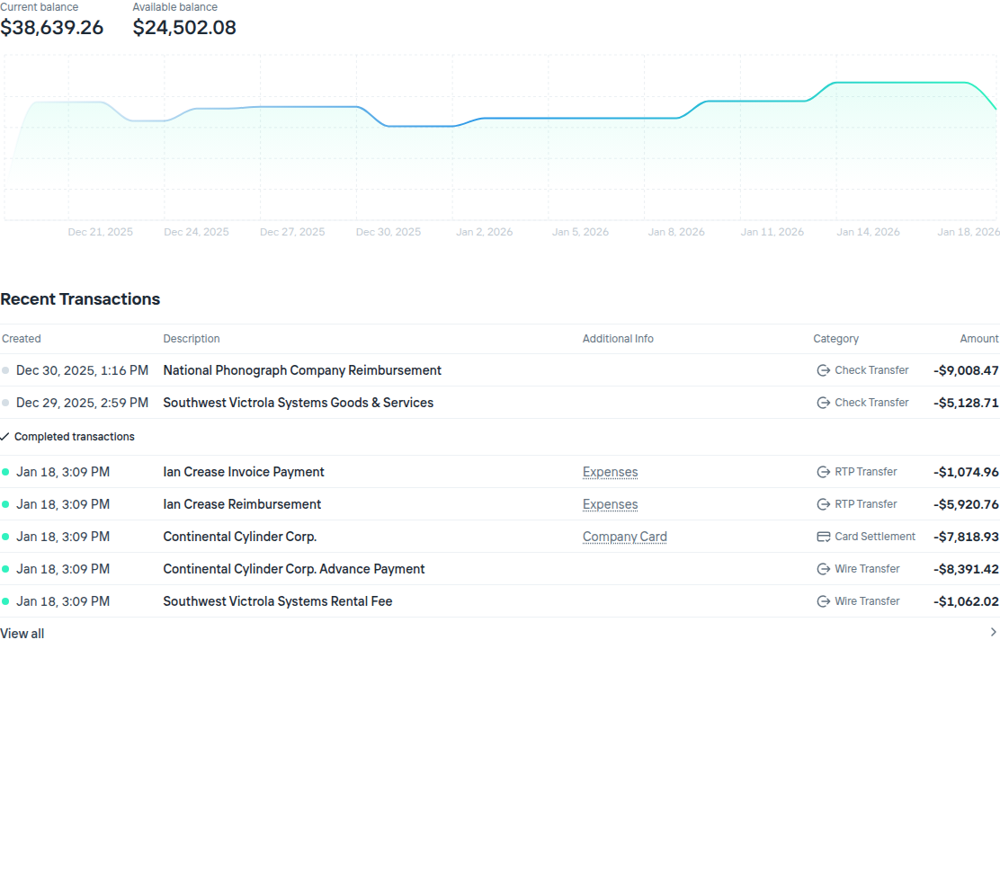
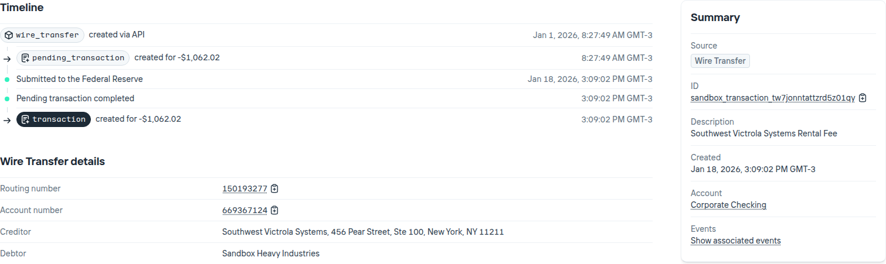

#+TITLE: eduardo's website title
#+bibliography: ./refs.bib
#+options: broken-links:mark toc:nil
#+HUGO_BASE_DIR: ../
#+HUGO_PAIRED_SHORTCODES: alert image
#+AUTHOR: Eduardo Bellani

* Pages
:PROPERTIES:
:EXPORT_HUGO_SECTION: /
:END:

** Home
:PROPERTIES:
:EXPORT_TITLE: Agere sequitur esse
:EXPORT_FILE_NAME: _index
:EXPORT_HUGO_TYPE: homepage
:END:

# metadata for [[https://www.freecodecamp.org/news/what-is-open-graph-and-how-can-i-use-it-for-my-website/][open graph]] metadata
#+begin_description
eduardo's blog description
#+end_description

I'm Eduardo Bellani. This space is where I explore the intersections of
computer science, programming, classical philosophy (especially from a
moderate realist perspective), and leadership.

Over the past 15+ years, I've worked across the tech landscape --- as a
developer, engineering manager, director, and founder --- primarily in
research-driven environments and with a strong emphasis on functional
programming and relational theory. Much of my writing reflects a
critical stance toward mainstream industry practices, often questioning
received wisdom in both technology and management.

*Disclaimer*: The views expressed here are solely my own and do not
reflect those of any past or present employer.

* Blog                                                                :@blog:
:PROPERTIES:
:EXPORT_HUGO_SECTION: blog
:END:

** Yes, your company can scale with just regular PostgreSQL
:PROPERTIES:
:EXPORT_HUGO_CUSTOM_FRONT_MATTER: :slug all-you-need-is-postgresql
:EXPORT_FILE_NAME: all-you-need-is-postgresql
:CUSTOM_ID: all-you-need-is-postgresql
:EXPORT_DATE: 2025-12-04
:END:

#+TOC: headlines 2 local

*** Introduction

There is a deep cultural reflex in modern engineering: whenever a
problem appears, reach for a packaged solution instead of thinking from
first principles. The result is architectural cargo culting and lots of
missed opportunities. Some intentionally absurd-but-familiar examples:

#+begin_quote
We need an audit trail, let's use {temporal/event sourcing DBMS}

Our application is slow, let's cache that using {in-memory key-value database}
#+end_quote

And since a relational database like PostgreSQL is still considered
mandatory,thanks mostly to its unmatched reputation, companies end up
stacking product on top of product on top of Postgres. They inflate the
number of moving parts, operational risk, headcount demand, and overall
system entropy. Complexity[fn:1] grows, not because the problems demand it,
but because someone reached for a tool they saw in a conference talk.

In this post, I'll walk through a set of common misconceptions that
drive teams to introduce new infrastructure when they don't need to. All
of these can be solved with vanilla PostgreSQL 18 using standard
extensions available on RDS, with no special infrastructure and no
distributed-systems cosplay.

The goal in this article is not to argue that specialized systems are
never appropriate, but to show that the default assumption for your data
problems should be that *my company can do fine with just PostgreSQL*.

*** The setup

Here is a list of arguments that people put forth to reach for other
tools besides Postgres, based on my experience:

- I'll need auditing and reconstructing state
- Write throughput is too low
- The transactional queries are too slow
- The analytical queries are too slow
- My app will be coupled to the Database
- The Database schema is too rigid for my growing business
- I need to notify other systems of changes on the fly

To address these, I'm going to use a variation of the /Drosophila
melanogaster/ of the database field: [[https://en.wikipedia.org/wiki/Suppliers_and_Parts_database][the classic Supplier and Parts]]
database[cite:@10.5555/861613]. I'll update it to be more in line with
the usual problematic tables: Financial Transaction and their
originating transfers.

For the rest of this article we will be constructing a database design
based on modern Postgres that will achieve the general goals listed
above and specific business requirements. Here is a requirements snippet
from a very popular banking API company:

#+begin_quote
Transactions: are immutable records of financial interactions with
Increase. You can think of them as the line items on your bank
statement. A Transaction with a positive amount means there's more money
in your account. A Transaction with a negative amount means there's less
money in your account. You can't directly create a Transaction, and they
never change after they are made. Anything that causes money to move
around your Increase account results in a Transaction - initiated or
received transfers, card payments, earned interest, and more.

Transfers: which includes ACH Transfers, Wire Transfers, etc - are the
most common way to initiate money movement over external networks with
Increase. Transfers are one-to-many with Transactions, which they create
as side-effects. Unlike Transactions, Transfers are stateful and
transition through a lifecycle of different statuses as they move across
the network.

Pending Transactions: represent potential future credits or debits of
money into your account and are a separate resource from Transactions
(despite their similar name). Notably, while Transactions are immutable,
Pending Transactions are not, as they don't guarantee the movement of
money. For example, Pending Transactions are created for card
authorizations (which can mutate or timeout) and also when placing a
hold on an account (which can be removed). Pending Transactions do not
affect your current balance (which is the balance you earn interest on),
but do affect your available balance (which is the amount you're able to
move out of Increase).  [cite:@increase_transactions_and_transfers]
#+end_quote

Below are 2 screenshots from increase's sandbox dashboard that showcase
the requirements:

#+caption: Increase account dashboard
#+attr_html: :width 150%

#+caption: Increase details
#+attr_html: :width 150%

From these 2 images, here is a list of requirements (functional and not)
that I have extracted, which I consider to be common in financial
systems like increase:

<<full_list>>
1. <<act>>Accounts are defined by immutable routing numbers and account numbers
   and have a status that can vary. 
2. <<acct_discrimination>> Accounts are discriminated between external
   and managed, and one account must be one or the other
   exclusively. Transfers are made only between external and managed
   accounts.
3. <<lst>>Transactions and transfers are listed, paginated by their
   respective creation times.
4. <<blc>>Current and available balance are shown, both their present and
   historical daily values
5. <<trf>>Transfers behave like a state machine where the progression
   between states are exposed to the user. The user can see the full
   state history of a transfer and some of these states are linked to
   pending/settled transactions.
6. <<txn>> The user can also see the details of a transaction, and see
   the transfer that generated it.
7. <<perf>> We should maximize write throughput of transactions and
   transfers. Transfers are editable, and so we should be able to update
   them fast too.

*** Laying the foundation

In this section we build the core tables[fn:2] and the role necessary to
restraint updates and achieve the immutability mentioned on the
requirements (requirement [[act]] for example).

**** The foudation: schemas and user roles for modularity

Modularity, defined by the capacity to have a many-to-many relation
between implementations and
interfaces[cite:@koppel23:_modul_matter_most_masses_acces], is crucial
for software development[cite:@yourdon1979structured]. Part of the base
tools we have for that on SQL are schemas and roles. In particular, a
proper role[fn:3] can be used for defining very precise interfaces on top of
database objects[cite:@swart19:_row_level_secur].

#+name: the_schema_and_roles
#+begin_src sql
  create schema finance;

  create role finance;
  grant usage on schema finance to finance;
  alter default privileges in schema finance
    grant select, insert, update, delete on tables to finance;
  
  alter default privileges in schema finance
    grant usage, select on sequences to finance;
  
#+end_src

**** Domains 

Database domains are usually scoffed at by practitioners, but that is a
big mistake. Properly seen, they are

#+begin_quote
an application of the abstract data type to database management. [cite:@pascal2019domains]
#+end_quote

As such, domains are the core building blocks for logical design.

#+name: the_domains
#+begin_src sql :tangle only_postgres_code.sql :comments link
  create domain finance.routing_number as text
  check (value ~ '^[0-9]{9}$');

  create domain finance.account_number as text
    check (value ~ '^[0-9]{12}$');

  create domain finance.transfer_status as text
    check(value in ('pending',
    	          'returned',
    		  'completed'));
#+end_src

The ~transfer_status~ in particular is crucial, since it represents the
valid states that a state machine can have.

**** Accounts, managed and external

Managed Accounts are the accounts that are owned by the our system. When
receiving a transfer, we control only one side of the transfer, and that
is the managed account side.

Managed accounts can be deactivated and reactivated. This falls neatly
within the set of temporal features introduced in SQL
2011[cite:@10.1145/2380776.2380786], in particular application time,
recently introduced in Postgres 18[cite:@postgresql_temporal_pk]. This
feature allows us to represent accounts going in and out of activity
without overlapping.[fn:4]

#+name: the_account
#+begin_src sql :tangle only_postgres_code.sql :comments link
  -- To use temporal constraints, you need to install the btree_gist extension, which provides the necessary operator classes for creating GiST indexes on scalar data types:
  create extension btree_gist;

  create table finance.managed_active_account(
    routing_number  finance.routing_number not null,
    account_number  finance.account_number not null,
    account_name    text not null,
    account_active_period tstzrange not null default tstzrange(now(), 'infinity', '[)'),
    primary key (routing_number,
                 account_number,
                 account_active_period without overlaps)
  );

  comment on table finance.managed_active_account is
    'Managed Accounts are what transactions are performed against. Think of your bank account. They store money, receive transfers, and send payments. They earn interest and have depository insurance. This relation holds the accounts that are active. No transfer may be created for accounts in the period that they were inactive.';

  create table finance.external_account(
    routing_number  finance.routing_number not null,
    account_number  finance.account_number not null,
    account_name    text not null,
    primary key (routing_number, account_number)
  );

  comment on table finance.external_account is
    'External accounts represent counterparty accounts at other institutions. They are the other side of a transfer. Unlike managed accounts, they have no temporal active period since we do not control their lifecycle.';
#+end_src

And below we finish the accounts by making sure a managed account and an
external account can't be the same. We need to use ~alter table~ instead
of adding these ~check~ constraints on the table definitions because of
the circular dependency (one table depends on the other, and vice
versa).

#+name: the_account_constraints
#+begin_src sql :tangle only_postgres_code.sql :comments link
  -- Ensure managed and external accounts never share the same identity
  create or replace function finance.not_external_account(
    p_routing_number finance.routing_number,
    p_account_number finance.account_number
  )
    returns boolean language sql stable as $$
    select not exists (
      select 1
        from finance.external_account
       where routing_number = p_routing_number
         and account_number = p_account_number
    );
  $$;

  create or replace function finance.not_managed_account(
    p_routing_number finance.routing_number,
    p_account_number finance.account_number
  )
    returns boolean language sql stable as $$
    select not exists (
      select 1
        from finance.managed_active_account
       where routing_number = p_routing_number
         and account_number = p_account_number
    );
  $$;

  alter table finance.managed_active_account
    add constraint managed_not_external
    check (finance.not_external_account(routing_number, account_number));

  alter table finance.external_account
    add constraint external_not_managed
  check (finance.not_managed_account(routing_number, account_number));
  #+end_src

**** Transfers, can change over a state machine while respecting temporal constraints

Below are the transfers, which represents the movement of money between
managed accounts and external accounts. It can be seen as a state
machine progressing over the transfer_status domain ~pending ->
(completed | returned)~.

Another crucial point here is the ~period~ keyword in the references
section. This makes a transfer period be consistent with active
accounts, implementing a core financial safety requirement declaratively
in the most deepest level one can.

#+name: laying_foundation_table_transfer
#+begin_src sql :tangle only_postgres_code.sql :comments link
  create table finance.transfer (
    transfer_created_at         timestamptz not null default now(),
    transfer_period             tstzrange not null default tstzrange(now(), 'infinity', '[)'),
    account_number              finance.account_number not null,
    routing_number              finance.routing_number not null,
    counterparty_account_number finance.account_number not null,
    counterparty_routing_number finance.routing_number not null,
    amount                      bigint not null,
    status                      finance.transfer_status not null default 'pending',
    -- Natural order: account identity, then time, then counterparty
    -- This enables efficient time-range queries on account transfers
    primary key (
      routing_number,
      account_number,
      transfer_created_at,
      counterparty_routing_number,
      counterparty_account_number
    ),
    -- temporal foreign key: ensure counterparty account exists during transfer period
    foreign key (
      counterparty_routing_number,
      counterparty_account_number,
      period transfer_period
    ) references finance.account (
      routing_number,
      account_number,
      period account_active_period
    ),
    -- temporal foreign key: ensure source account exists during transfer period
    foreign key (
      routing_number,
      account_number,
      period transfer_period
    ) references finance.account (
      routing_number,
      account_number,
      period account_active_period
    ),
    -- ensure account and counterparty are different
    check (
      (account_number, routing_number) <> (counterparty_account_number, counterparty_routing_number)
    )
  );

  comment on table finance.transfer is
    'Transfers represent money movement between accounts. Status follows state machine: pending -> (completed | returned). Period closes on terminal state.';

  revoke update on finance.transfer from finance;
  grant update (status) on finance.transfer to finance;
#+end_src

**** Transactions, the immutable events

Contrasted with the above, below we have transactions, which represent
changes in the balances(current and available) of an account and are
therefore immutable[fn:5].

#+name: laying_foundation_table_txn
#+begin_src sql :tangle only_postgres_code.sql :comments link
  create table finance.settled_transaction (
    transaction_created_at      timestamptz not null default now(),
    account_number              finance.account_number not null,
    routing_number              finance.routing_number not null,
    counterparty_account_number finance.account_number not null,
    counterparty_routing_number finance.routing_number not null,
    amount                      bigint not null,
    transfer_period             tstzrange not null,
    primary key (
      account_number,
      routing_number,
      transaction_created_at
    ),
    -- regular foreign key to transfer identity (not temporal)
    foreign key (
      routing_number,
      account_number,
      transfer_created_at,
      counterparty_routing_number,
      counterparty_account_number
    )
    references finance.transfer (
      routing_number,
      account_number,
      transfer_created_at,
      counterparty_routing_number,
      counterparty_account_number
    ) on update cascade,
    -- check that transaction occurred within the transfer's period
    check (transfer_period @> transaction_created_at)
  );

  comment on column finance.settled_transaction.transfer_period is
    'Snapshot of the transfer period at transaction creation time. Updated via cascade when transfer period closes.';

  comment on table finance.settled_transaction is
    'Implements settled transactions, such transactions affect your available balance (which is the amount you''re able to move out of your account), and consenquently also affect your current balance  (which is the balance you earn interest on). They are immutable events, so no history table is needed and no one should have update permissions. A settled transaction is never created for a pending transfer.';

  revoke update, delete on finance.settled_transaction from finance;

  create table finance.pending_transaction (
    like finance.settled_transaction including all,
    -- regular foreign key to transfer identity (not temporal)
    foreign key (
      routing_number,
      account_number,
      transfer_created_at,
      counterparty_routing_number,
      counterparty_account_number
    )
    references finance.transfer (
      routing_number,
      account_number,
      transfer_created_at,
      counterparty_routing_number,
      counterparty_account_number
    ) on update cascade,
    -- check that transaction occurred within the transfer's period
    check (transfer_period @> transaction_created_at)
  );

  comment on table finance.pending_transaction is 'Pending transactions represent potential future credits or debits of money into your account and are a separate resource from settled transactions (despite their similar name). Pending Transactions do not affect your current balance (which is the balance you earn interest on), but do affect your available balance (which is the amount you''re able to move out of your account). What changes in terms of logical design are the constraints and the interpretation of the data. The columns are the same between pending and settled transactions.';

  revoke update, delete on finance.pending_transaction from finance;

  -- Trigger to populate transfer_period on transaction insert
  create or replace function finance.set_transaction_transfer_period()
    returns trigger language plpgsql as $$
  declare
    v_transfer_period tstzrange;
  begin
    -- fetch current transfer period
    select transfer_period into v_transfer_period
      from finance.transfer
     where routing_number              = NEW.routing_number
       and account_number              = NEW.account_number
       and transfer_created_at         = NEW.transfer_created_at
       and counterparty_routing_number = NEW.counterparty_routing_number
       and counterparty_account_number = NEW.counterparty_account_number;
    
    if not found then
      raise exception 'Transfer not found for transaction';
    end if;
    
    -- verify transaction is within transfer period
    if not (v_transfer_period @> NEW.transaction_created_at) then
      raise exception 'Transaction created_at % is outside transfer period %',
        NEW.transaction_created_at, v_transfer_period;
    end if;
    
    NEW.transfer_period := v_transfer_period;
    return NEW;
  end;
  $$;

  create trigger settled_transaction_set_period
    before insert on finance.settled_transaction
    for each row
    execute function finance.set_transaction_transfer_period();

  create trigger pending_transaction_set_period
    before insert on finance.pending_transaction
    for each row
    execute function finance.set_transaction_transfer_period();

  -- Trigger to cascade transfer period changes to transactions
  create or replace function finance.cascade_transfer_period_to_transactions()
    returns trigger language plpgsql as $$
  begin
    -- when transfer period changes, update all related transactions
    if OLD.transfer_period <> NEW.transfer_period then
      
      update finance.settled_transaction
         set transfer_period = NEW.transfer_period
       where routing_number              = NEW.routing_number
         and account_number              = NEW.account_number
         and transfer_created_at         = NEW.transfer_created_at
         and counterparty_routing_number = NEW.counterparty_routing_number
         and counterparty_account_number = NEW.counterparty_account_number;
      
      update finance.pending_transaction
         set transfer_period = NEW.transfer_period
       where routing_number              = NEW.routing_number
         and account_number              = NEW.account_number
         and transfer_created_at         = NEW.transfer_created_at
         and counterparty_routing_number = NEW.counterparty_routing_number
         and counterparty_account_number = NEW.counterparty_account_number;
    end if;
    
    return NEW;
  end;
  $$;

  create trigger transfer_cascade_period
    after update of transfer_period on finance.transfer
    for each row
    when (OLD.transfer_period <> NEW.transfer_period)
    execute function finance.cascade_transfer_period_to_transactions();
#+end_src

*** On maintaining business rules via meaningful constraints

#+begin_quote
It is impossible to design and interrogate a database sensibly, and
ensure semantic consistency of results ... it is intended to represent
without ... DBMS knowledge of the meaning assigned to the
database...[cite:@pascal2026meaning]
#+end_quote

In our case, transactions need to be created only when the transfer is
in the right state of the state machine, as indicated in requirement [[trf]].

In the absence of SQL's ~assert~[fn:6] we need to rely on constraint
triggers, and if possible maintain them as declarative as
possible[fn:7]:

#+name: constraints
#+begin_src sql :tangle only_postgres_code.sql :comments link
  create or replace function finance.is_pending_transfer(
    p_routing_number finance.routing_number,
    p_account_number finance.account_number,
    p_transfer_created_at timestamptz,
    p_counterparty_routing_number finance.routing_number,
    p_counterparty_account_number finance.account_number
  )
    returns boolean language sql stable as $$
    select exists (
      select 1
        from finance.transfer t
       where t.routing_number              = p_routing_number
         and t.account_number              = p_account_number
         and t.transfer_created_at         = p_transfer_created_at
         and t.counterparty_routing_number = p_counterparty_routing_number
         and t.counterparty_account_number = p_counterparty_account_number
         and t.status                      = 'pending'
    );
  $$;

  create or replace function finance.ensure_pending_transfer()
    returns trigger language plpgsql as $$
  begin
    if not finance.is_pending_transfer(
      NEW.routing_number,
      NEW.account_number,
      NEW.transfer_created_at,
      NEW.counterparty_routing_number,
      NEW.counterparty_account_number
    ) then
      raise exception
        'Must reference a pending transfer (%, %, %, %, %)',
        NEW.routing_number, NEW.account_number, NEW.transfer_created_at,
        NEW.counterparty_routing_number, NEW.counterparty_account_number;
    end if;
    return NEW;
  end;
  $$;

  create or replace function finance.ensure_non_pending_transfer()
    returns trigger language plpgsql as $$
  begin
    if finance.is_pending_transfer(
      NEW.routing_number,
      NEW.account_number,
      NEW.transfer_created_at,
      NEW.counterparty_routing_number,
      NEW.counterparty_account_number
    ) then
      raise exception
        'Cannot reference a pending transfer (%, %, %, %, %)',
        NEW.routing_number, NEW.account_number, NEW.transfer_created_at,
        NEW.counterparty_routing_number, NEW.counterparty_account_number;
    end if;
    return NEW;
  end;
  $$;

  create constraint trigger pending_transaction_requires_pending_transfer
    after insert on finance.pending_transaction
    deferrable initially deferred
    for each row
    execute function finance.ensure_pending_transfer();

  create constraint trigger settled_transaction_requires_non_pending_transfer
    after insert on finance.settled_transaction
    deferrable initially deferred
    for each row
    execute function finance.ensure_non_pending_transfer();

#+end_src

*** On temporal referential constraints

PostgreSQL 18 introduces native support for SQL:2011 temporal
referential constraints. This native constraint ensures that a
transfer can only reference an active account that existed during the
transfer's validity period.

This works through the PERIOD feature in foreign key constraints.
Transfers use temporal foreign keys to ensure both the source and
counterparty accounts are active during the transfer period.

Transactions, however, reference transfers by identity (not temporally)
since there is only one transfer per account pair. Each transaction
stores a snapshot of the transfer's period at creation time, which gets
cascaded when the transfer period closes. This design correctly models
that transactions point to a single transfer entity while maintaining
temporal validity.

*** On a transfer state machine

#+name: state_machine
#+begin_src sql :tangle only_postgres_code.sql :comments link
  create or replace function finance.enforce_transfer_state_machine()
    returns trigger language plpgsql as $$
  begin
    if OLD.status = NEW.status then
      return NEW;
    end if;
    
    if OLD.status = 'pending' then
      if NEW.status not in ('completed', 'returned') then
        raise exception 'Invalid state transition: pending can only transition to completed or returned, not %', NEW.status;
      end if;
      NEW.transfer_period := tstzrange(lower(OLD.transfer_period), now(), '[)');
      
    elsif OLD.status in ('completed', 'returned') then
      raise exception 'Invalid state transition: % is a terminal state and cannot transition to %', OLD.status, NEW.status;
    end if;
    
    return NEW;
  end;
  $$;

  create trigger transfer_enforce_state_machine
    before update of status on finance.transfer
    for each row
    when (OLD.status <> NEW.status)
    execute function finance.enforce_transfer_state_machine();
#+end_src

*** On auditing and reconstructing state

In order to implement feature [[trf]], we need system-time temporal
tables[fn:8]. PostgreSQL supports several approaches for temporal tables.
For simplicity and portability (including RDS), we use the temporal_tables
extension [cite:@nearform_temporal_tables].

The extension automatically writes old versions of each row to a history
table on every ~UPDATE~ or ~DELETE~. Together with a tstzrange period,
this gives you a full history suitable for ~AS OF~ queries and state
reconstruction. We create a focused history table that only tracks what
we need: the transfer identity, status, and system-time period.

#+begin_src sql :tangle "only_postgres_code.sql" :comments yes
  -- Add system-time period column to transfer table
  alter table finance.transfer add column if not exists sys_period tstzrange default tstzrange(current_timestamp, null);
  alter table finance.transfer alter column sys_period set not null;

  -- Focused history table - only what we need for status transitions
  create table if not exists finance.transfer_status_log (
    routing_number              finance.routing_number not null,
    account_number              finance.account_number not null,
    transfer_created_at         timestamptz not null,
    counterparty_routing_number finance.routing_number not null,
    counterparty_account_number finance.account_number not null,
    transfer_period             tstzrange not null,
    status                      finance.transfer_status not null,
    sys_period                  tstzrange not null
  );

  comment on table finance.transfer_status_log is 
    'Automatic log of all transfer status transitions via temporal_tables extension. Shows complete state machine history.';

  create index on finance.transfer_status_log (sys_period);
  create index on finance.transfer_status_log (status);
  create index on finance.transfer_status_log (routing_number, account_number, transfer_created_at, counterparty_routing_number, counterparty_account_number);

  -- Use temporal_tables versioning procedure
  create trigger transfer_save_status_history
    before insert or update or delete
    on finance.transfer
    for each row
    execute procedure versioning('sys_period', 'finance.transfer_status_log', true);
#+end_src

Once applied, ~finance.transfer_status_log~ will contain every past version
of every transfer's status, from which you can reconstruct the state machine
history over time. You can query the complete status history of all transfers
by doing something like[fn:9]:

#+begin_src sql :tangle "only_postgres_code.sql" :comments yes
  select * from finance.transfer
  UNION ALL
  select * from finance.transfer_status_log;
#+end_src

*** On capacity planning

As can be seen on the [[laying_foundation][foundational code block]], we have 5 core tables

1. ~finance.transfer~
2. ~finance.transfer_status_log~
3. ~finance.pending_transaction~
4. ~finance.settled_transaction~

    Taking ~finance.transfer~ as a
reference, we have this total (ignoring alignment issues
[cite:@thomas2018rocksandsand]):

| Name                           | Type        | Size(bytes) |
|--------------------------------+-------------+-------------|
| transfer_created_at            | timestamptz |           8 |
| account_number                 | text(12)    |          13 |
| routing_number                 | text(9)     |          10 |
| counterparty_account_number    | text(12)    |          13 |
| counterparty_routing_number    | text(9)     |          10 |
| amount                         | bigint      |           8 |
| status                         | text(10)    |          11 |
|--------------------------------+-------------+-------------|
| Total (plus 24 for row header) |             |          97 |
#+TBLFM: @>$>=vsum(@I..@II)+24

So, around 100 bytes per row. Suppose we want 3 days of transfers and 1
day of transactions, that would be 6 (3 ~finance.transfer~ + 3
~finance.transfer_status_log~) + 2 (1 ~finance.pending_transaction~ + 1
~finance.settled_transaction~).

Assuming 10k accounts each having 100 transfer/pending/settled per day,
that would necessitate ~7.5 GB of RAM. For a mid/large bank like Nubank
with 50 million accounts: ~38GB. For a global payment processor like
VISA: ~700GB.

As for indexes:
#+begin_quote
index entry has an overhead of 8 bytes. Add the average size of your
indexed data (in the internal binary format).[cite:@StackOverflowAlbe2020indexsize]
#+end_quote

Given that in this design we are using a single index for each table
(the btree backing the primary key), you can add 100% for the index
size, doubling the amounts above. That gives us 15GB, 76GB, and 1.4TB
respectively.

These fit comfortably in modern database servers (AWS RDS db.r6g.4xlarge
has 128GB RAM, db.r6g.16xlarge has 512GB).

*The point*: You don't need partitioning, sharding, or distributed
databases. You need appropriately sized hardware and good index design.

*** On write throughput
:PROPERTIES:
:CUSTOM_ID: on-write-throughput
:END:

If you want to maintain semantic enforcement of your data (which in our
model is done via fkeys and constraint triggers) about the best thing
you can do to optimize write throughput is to lower the write
amplification, specifically to use indexes in a smart way. After all,
~indexes, if not carefully chosen, can kill performance in a write-heavy
application~[cite:@gerogiannakis_postgres_index_queries_2019]

**** Enabling HOT Updates for Transfers

By keeping ~transfer_period~ out of the primary key, we enable Heap-Only
Tuple (HOT) updates when transfer status changes. This is critical because
status transitions (pending → completed/returned) are frequent operations.

When a transfer's status changes, the ~transfer_period~ also closes, but
since neither column is part of the primary key index, PostgreSQL can
perform a HOT update: the new tuple version is written to the same page
(if space permits), and the index doesn't need updating.

Configure the table for HOT:

#+begin_src sql
  alter table finance.transfer set (fillfactor = 90);
#+end_src

This reserves 10% free space per page, allowing updated tuples to fit on
the same page. Combined with no indexes on ~status~ or ~transfer_period~,
status updates become HOT-eligible, providing:

- 2-3x faster updates compared to non-HOT updates
- No index bloat from status changes
- Better cache locality (updates stay on same page)

The trade-off is minimal: each transaction insert performs a primary key
lookup on ~finance.transfer~ to fetch the current ~transfer_period~. This
is a single B-tree traversal on hot data (recent transfers stay in
~shared_buffers~), which PostgreSQL handles trivially even at 10k+
transactions/second.

**** Primary Key Column Order

The primary key order reflects the dominant access pattern:

1. ~routing_number, account_number~ - identifies the account (most selective)
2. ~transfer_created_at~ - enables efficient time-range queries on account transfers
3. ~counterparty_routing_number, counterparty_account_number~ - completes the transfer identity

This order optimizes for the common query pattern:

#+begin_src sql
  -- Get recent transfers for an account
  SELECT * FROM finance.transfer 
   WHERE routing_number = ?
     AND account_number = ?
     AND transfer_created_at > now() - interval '7 days';
#+end_src

The index can perform exact matches on the first two columns, then an efficient
range scan on ~transfer_created_at~. Partition pruning eliminates old partitions
before the index scan begins.

For point lookups (updating a specific transfer), all five columns are specified,
resulting in a direct index lookup with partition routing:

#+begin_src sql
  UPDATE finance.transfer
     SET status = 'completed'
   WHERE routing_number = '123456789'
     AND account_number = '000000000001'
     AND transfer_created_at = '2025-01-15 10:30:00'
     AND counterparty_routing_number = '987654321'
     AND counterparty_account_number = '000000000002';
#+end_src

**** Optional: Partitioning by Creation Time

For systems with regulatory retention requirements or very high transfer
volumes, partitioning by ~transfer_created_at~ becomes viable. Since
~transfer_created_at~ is immutable and part of the primary key, we can
partition without breaking temporal foreign keys:

#+begin_src sql
  create table finance.transfer (
    transfer_created_at         timestamptz not null default now(),
    transfer_period             tstzrange not null default tstzrange(now(), 'infinity', '[)'),
    account_number              finance.account_number not null,
    routing_number              finance.routing_number not null,
    counterparty_account_number finance.account_number not null,
    counterparty_routing_number finance.routing_number not null,
    amount                      bigint not null,
    status                      finance.transfer_status not null default 'pending',
    
    primary key (
      routing_number,
      account_number,
      transfer_created_at,
      counterparty_routing_number,
      counterparty_account_number
    ),
    -- temporal foreign keys and constraints as before...
  ) partition by range (transfer_created_at);

  -- Use pg_partman for automatic partition management
  select partman.create_parent(
    p_parent_table := 'finance.transfer',
    p_control := 'transfer_created_at',
    p_type := 'native',
    p_interval := 'daily',
    p_premake := 7  -- create 7 days ahead
  );
#+end_src

Benefits:
- Partition pruning for time-range queries ("transfers from last 7 days")
- Old partitions become read-only (no bloat, minimal VACUUM overhead)
- Instant archival: detach old partitions to separate tablespaces
- Compliance: ~DROP TABLE~ old partitions for retention policies

Daily partitions work well for systems with 100k+ transfers/day. The
combination of HOT updates (for recent transfers) and partitioning (for
historical data) provides excellent write throughput and maintenance
characteristics.

**** Why No Partitioning for Transactions?

A common reflex is to partition high-volume tables, but partitioning adds
operational complexity and isn't always necessary:

**For transactions (append-only):**
- B-tree indexes on sequential timestamps have excellent locality
- Only the rightmost leaf pages are hot (recent inserts)
- These hot pages stay in shared_buffers naturally
- Old data is cold and rarely accessed
- Partitioning would add complexity without meaningful benefit

**For transfers (updated frequently):**
- Updates are concentrated on recent transfers (last few days)
- HOT updates (via fillfactor=90) keep index bloat minimal
- The working set (recently created/updated transfers) fits in memory
- Partitioning would complicate the temporal foreign key cascade logic

**When you DO need partitioning:**
- Regulatory requirements to drop old data (partition DROP is instant)
- Table size exceeds available memory by 10x+ AND queries span the full time range
- You need to move old data to different tablespaces/storage tiers

For most companies, even at VISA scale (~700GB for our model), modern servers
with 1TB+ RAM make partitioning unnecessary. The operational complexity
(partition maintenance, backup complexity, constraint limitations) outweighs
the benefits.

**** Unused indexes

A common problem is to have a bunch of unused indexes for critical
tables, since they are not visible directly and experiments can be
forgotten. So, make sure all indexes are being used (see
[cite:@gerogiannakis_postgres_index_queries_2019][cite:@postgresql_pg_stat_all_indexes] for a solution based on
PostgreSQL internal statistics):

#+begin_src sql
  SELECT schemaname, relname, indexrelname, idx_scan, idx_tup_read, idx_tup_fetch FROM pg_stat_user_indexes where schemaname='finance' ORDER BY idx_scan;

   schemaname │         relname          │              indexrelname               │ idx_scan │ idx_tup_read │ idx_tup_fetch
  ════════════╪══════════════════════════╪═════════════════════════════════════════╪══════════╪══════════════╪═══════════════
   finance    │ settled_transaction      │ settled_transaction_pkey                │        0 │            0 │             0
   finance    │ transfer_status_log      │ transfer_status_log_sys_period_idx      │        0 │            0 │             0
   finance    │ account                  │ account_pkey                            │      100 │           80 │            60
   finance    │ pending_transaction      │ pending_transaction_pkey                │  1220000 │       120000 │        120000
   finance    │ transfer                 │ transfer_pkey                           │  2210002 │      1110002 │       1110000
#+end_src

- idx_scan :: How many times the index has been scanned (used). This can
  be either directly by a application query e.g.

  #+begin_src sql
    select * from finance.transfer where
    (transfer_created_at, transaction_account, counterparty_account) =
    ('2025-11-25 18:04:26.298329+00'::timestamptz, 'acc_8', 'acc_15');
  #+end_src

  or indirectly due to a JOIN. For example, the primary key index
  transfer_pkey has been scanned over 2210002 times.

- idx_tup_read :: This is the number of index entries returned as a result
  of an index scan. An easy-to-understand example is the primary key
  (e.g. ~select * from finance.transfer where (transfer_created_at,
  transaction_account, counterparty_account) = ('2025-11-25
  18:04:26.298329+00'::timestamptz, 'acc_8', 'acc_15');~). If there is
  such transfer, then idx_tup_read will increase by 1. Modifying slightly
  the query

    #+begin_src sql
      select * from finance.transfer
       where (transfer_created_at, transaction_account, counterparty_account) in
             (('2025-11-25 18:04:26.298329+00'::timestamptz, 'acc_8', 'acc_15'),
             ('2025-11-25 01:39:36.594342+00'::timestamptz, 'acc_11', 'acc_9'));
    #+end_src
   idx_tup_read will increase by 2 (if both transfers exist). In both of
   these queries, idx_scan will increase by 1.

- idx_tup_fetch :: These are the number of rows fetched from the table
  as a result of an index scan.  This is increased as a result of both
  positive and false positive results.  For example, if both ids exist,
  the query
    #+begin_src sql
      select * from finance.transfer
       where (transfer_created_at, transaction_account, counterparty_account) in
             (('2025-11-25 18:04:26.298329+00'::timestamptz, 'acc_8', 'acc_15'),
             ('2025-11-25 01:39:36.594342+00'::timestamptz, 'acc_11', 'acc_9'))
       and transfer_status='completed';
    #+end_src
   will increase idx_tup_fetch by 2 even if only one tuple is returned
  to the client. The reason is that the tuples will need to be loaded
  from disk to examine the value of ‘transfer_status’.

*** TODO Transactional Queries
Here are the transactional queries that I assume will compose the vast
majority of such application cycle:

1. Insert transfers/transactions
2. Paginate over transfers/transactions
3. Update a transfer's state
4. Get all transactions for a transfer

*** TODO Analytical Queries
Here are the analytical queries that I assume will compose the vast majority of
such application cycle:

~ALTER DATABASE X SET default_transaction_isolation = 'serializable';~

1. Get balance at time X for account Y

*** COMMENT Appendix: Code Generating test data
:PROPERTIES:
:CUSTOM_ID: pg_all_you_need_code
:END:

If you want to play around with the design here, run

#+begin_src sql :tangle "only_postgres_code.sql" :comments yes
   -- tests

  create or replace function finance.generate_pending_activity(
    accounts_count int,
    days int,
    avg_transfers_per_day int
  )
  returns void
  language plpgsql
  as $$
  declare
    start_ts timestamptz := now() - (days || ' days')::interval;
    end_ts   timestamptz := now();
    accs     text[];
    t_count bigint;
  begin
    with s as (
      select ('acc_' || gs::text) as name
      from generate_series(1, accounts_count) gs
    )
    insert into finance.account(account_name)
    select name from s
    on conflict do nothing;
    select array_agg(account_name) into accs
    from finance.account;
    insert into finance.transfer (
      transfer_valid_period,
      transfer_start_date,
      transaction_account,
      counterparty_account,
      amount,
      transfer_status
    )
    select
      tstzrange(ts, 'infinity', '[)'),
      ts,
      accs[(random() * (array_length(accs, 1) - 1) + 1)::int],
      accs[(random() * (array_length(accs, 1) - 1) + 1)::int],
      (10 + floor(random() * 10000))::bigint,
      'pending'::finance.transfer_status
      from (
        select start_ts + (random() * extract(epoch from (end_ts - start_ts))) * interval '1 second' as ts
        from generate_series(1, days * avg_transfers_per_day)
      ) sub on conflict do nothing;
    select count(*) into t_count from finance.transfer;
    raise notice '%', t_count;
    insert into finance.pending_transaction(
      transaction_created_at,
      transfer_created_at,
      transaction_account,
      counterparty_account,
      amount
    )
    select
      lower(t.sys_period),        -- system-time when row was created
      t.transfer_created_at,
      t.transaction_account,
      t.counterparty_account,
      t.amount
    from finance.transfer t
    where upper(t.sys_period) is null
      and t.transfer_status = 'pending' on conflict do nothing;
    return;
  end;
  $$;

  create or replace function finance.complete_pending_activity(
    completion_percent int
  )
  returns void
  language plpgsql
  as $$
  declare
    total_pending int;
    target_count  int;
  begin
    -- Compute how many pending transfers exist
    select count(*) into total_pending
    from finance.transfer
    where upper(sys_period) is null
      and transfer_status = 'pending';
    if total_pending = 0 then
      return;
    end if;
    -- Determine how many to complete
    target_count := ceil(total_pending * completion_percent / 100.0);
    ---------------------------------------------------------------------
    -- 1. Random sample of pending transfers
    ---------------------------------------------------------------------
    with to_complete as (
      select t.routing_number,
             t.account_number,
             t.transfer_created_at,
             t.counterparty_routing_number,
             t.counterparty_account_number
      from finance.transfer t
      where upper(t.sys_period) is null
        and t.transfer_status = 'pending'
      order by random()
      limit target_count
    )
    ---------------------------------------------------------------------
    -- 2. Mark selected transfers as completed (status != pending).
    --    Your bitemporal trigger should automatically close old sys_period
    --    and insert a new system-time row.
    ---------------------------------------------------------------------
    update finance.transfer t
       set transfer_status = 'completed'
    from to_complete c
    where t.routing_number              = c.routing_number
      and t.account_number              = c.account_number
      and t.transfer_created_at         = c.transfer_created_at
      and t.counterparty_routing_number = c.counterparty_routing_number
      and t.counterparty_account_number = c.counterparty_account_number
      and upper(t.sys_period) is null
      and t.transfer_status = 'pending';
    ---------------------------------------------------------------------
    -- 3. Insert settled transactions corresponding to these now-completed
    --    transfers. Use the new version of the transfer (status != pending).
    ---------------------------------------------------------------------
    insert into finance.settled_transaction (
      transaction_created_at,
      transfer_created_at,
      transaction_account,
      counterparty_account,
      amount
    )
    select
      now(),                     -- transaction occurs now
      t.transfer_created_at,
      t.transaction_account,
      t.counterparty_account,
      t.amount
    from finance.transfer t
    where upper(t.sys_period) is null
      and t.transfer_status = 'completed' on conflict do nothing;  -- ensure we use the new version
    return;
  end;
  $$;
#+end_src

#+print_bibliography:

** Index
:PROPERTIES:
:EXPORT_TITLE: blog section title
:EXPORT_FILE_NAME: _index
:END:
#+begin_description
this is the description of the blog section
#+end_description

* Footnotes

[fn:1] Complexity here is defined as the quantity of interacting parts of a whole

[fn:2] A note on the code snippets: we will show code as we progress on the article, but the full code suite can be found on the [[#pg_all_you_need_code][Appendix]] for ease of copy.

[fn:3] On oracle there are further complications. See [cite:@cybertec_schema_pg_oracle]

[fn:4] A good overview on the features for PostgresSQL 18 can be found on [cite:@neon_temporal_fk]

[fn:5] For a refresh on what these kinds of balances are, see [[*The setup][the description in the setup section]]

[fn:6] (which is the case for Postgres[cite:@postgresql2026unsupported] but not for Oracle[cite:@oracle2026assertion])

[fn:7] Such constraints are almost never created at the data level, exposing applications to the risk of failing audits and worse.

[fn:8] Temporal tables can be used for several interesting features:
      #+begin_quote
    - Auditing all data changes and performing data forensics when necessary
    - Reconstructing state of the data as of any time in the past
    - Calculating trends over time
    - Maintaining a slowly changing dimension for decision support applications
    - Recovering from accidental data changes and application errors
      Auditing all data changes and performing data forensics when necessary [cite:@microsoft24:_tempor]
      #+end_quote

[fn:9] You can see a full tutorial on this library on  [cite:@clarkdave2015_temporal_tables]

[fn:10] DO NOT manage your partitions by hand: Use pg_partman.

[fn:11] Have you noticed that the second paragraph supports what the ancients did, in refeering to Plato and Aristotle?

[fn:12] From the portuguese, translated by this author.

[fn:13] Recently I had a conversation on linkedin: https://www.linkedin.com/feed/update/urn:li:ugcPost:7316402764975075328?commentUrn=urn%3Ali%3Acomment%3A%28ugcPost%3A7316402764975075328%2C7316457084038930432%29&dashCommentUrn=urn%3Ali%3Afsd_comment%3A%287316457084038930432%2Curn%3Ali%3AugcPost%3A7316402764975075328%29

[fn:14] Including a claim of cost reductions of over 90%!

[fn:15] I like the terms superordinate, coordinates and subordinates, but
they are not in common usage

[fn:16] https://trends.google.com/trends/explore?date=all&geo=US&q=microservices

[fn:17] In a certain sense, all externally facing APIs face this. Microservices just make this problem worse by making everything ~external~ and not part of the same checkable runtime.

[fn:18] (schemas are synonymous to models in this context)

[fn:19] As listed in [[https://www.youtube.com/watch?v=IZBdv2yznmI][The Ultimate History Lesson]]

[fn:20] You will probably see me return to this topic in other posts.

[fn:21] I got the idea of such table from a similar table found on
chapter 25 of  [cite:@10.5555/861613]

[fn:22] The definitions come from [cite:@fallacies_iep], but the examples
are adapted to this contex
